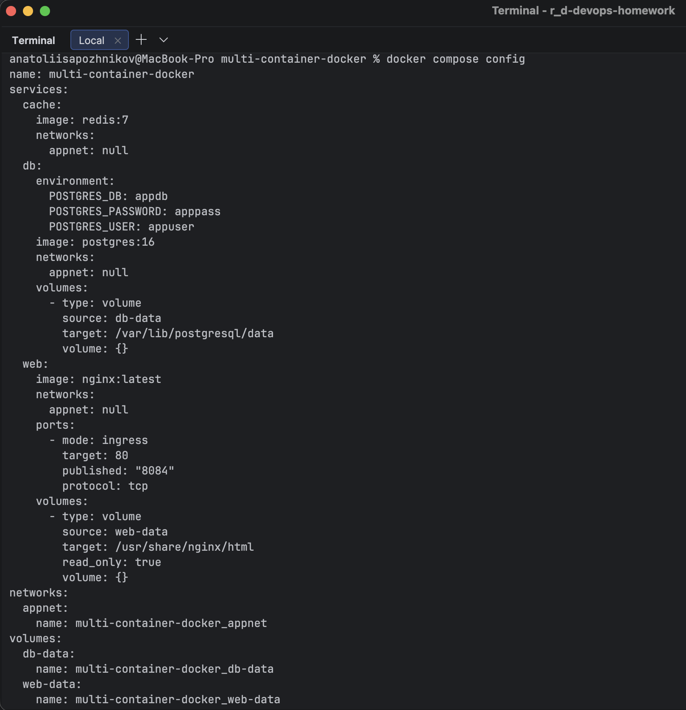
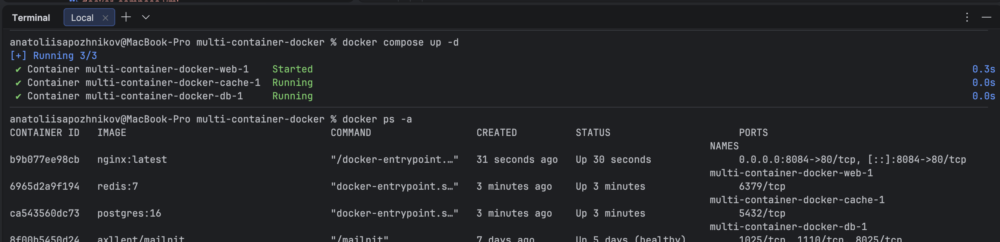
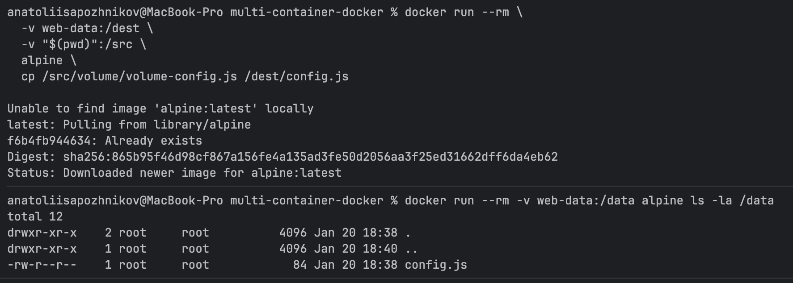
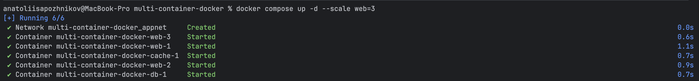
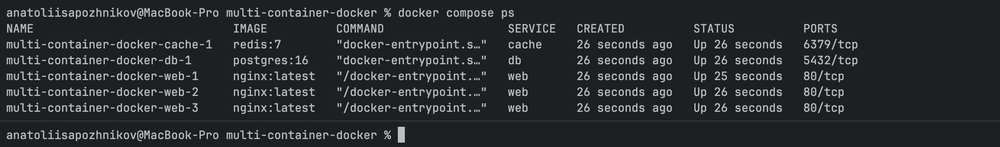

# N11 — Docker Compose: Multi-container Application (nginx, PostgreSQL, Redis)

This homework demonstrates building, running, inspecting, and scaling a **multi-container application** using **Docker Compose**.
The setup includes a web server (**nginx**), a database (**PostgreSQL**), and a cache (**Redis**) connected via a shared Docker network, with persistent data stored in Docker volumes.

---

## Environment Overview

* Host OS: macOS (Docker Desktop)
* Docker Compose v2
* Containers:

    * **web**: nginx
    * **db**: PostgreSQL 16
    * **cache**: Redis 7

---

## Project Structure

```text
multi-container-docker/
├─ docker-compose.yml
├─ web/
│  └─ index.html
├─ volume/
│  └─ volume-config.js
└─ nginx-conf/
   └─ default.conf

```

---

## docker-compose.yml Configuration

The Compose file defines three services, two named volumes, and a shared bridge network.

Key design choices:

* **Named volumes** are used for PostgreSQL data and JS configuration storage (I understand in my example secrets are exposed; It was just a practice)
* **Bind mounts** are used for live development of web files
* All services are connected to a single custom network `appnet`
* The `web` service does **not** publish host ports in the final state to allow scaling

P.S. I have some practice with setting up traefic, so did not add it to expose reachable ports after scaling.



---

## Step 1: Starting the Multi-container Application

The application was started in detached mode using Docker Compose:

```bash
docker compose up -d
```

The status of running containers was verified using:

```bash
docker compose ps
```



This confirmed that all three services (`web`, `db`, `cache`) were running successfully.

---

## Step 2: Web Service Content and Volume Usage

### Static HTML

A simple HTML page was created in `web/index.html` and bind-mounted into the nginx container.
This allows instant updates during development without rebuilding images.

### JS Configuration via Named Volume

A JavaScript configuration file (`volume-config.js`) was copied into a **named Docker volume**.
That volume is mounted into nginx under a subdirectory of the web root.

This demonstrates:

* How named volumes persist data independently of containers
* How multiple mounts can coexist when mounted to different paths



The browser successfully loads the configuration at runtime:


---

## Step 3: Inspecting Networks and Volumes

### Docker Network

A custom bridge network `multi-container-docker_appnet` was created automatically by Docker Compose.
All services (`web`, `db`, `cache`) are attached to this network and communicate internally using Docker DNS.

The list of available Docker networks was inspected using:

```bash
docker network ls
```

Result:

```text
NETWORK ID     NAME                            DRIVER    SCOPE
8dd215b54a9b   3-jenkins_jenkins               bridge    local
66fd550c83cd   bridge                          bridge    local
0f9a0d772e8b   drupal10_default                bridge    local
061f44e18f7a   host                            host      local
076643eb459a   how2robot_default               bridge    local
80660c177d02   multi-container-docker_appnet   bridge    local
bdd7dcd30906   none                            null      local
a293fa462dcd   trainings-tracker_default       bridge    local
```

This confirms that Docker Compose created a dedicated bridge network specifically for this project.

---

The detailed network configuration was then inspected using:

```bash
docker network inspect multi-container-docker_appnet
```

Result (trimmed to relevant parts):

```json
{
  "Name": "multi-container-docker_appnet",
  "Id": "80660c177d0276e8b64a1295dbc1cfb57cedfd4d37b54d10806793282283c34a",
  "Driver": "bridge",
  "IPAM": {
    "Config": [
      {
        "Subnet": "172.21.0.0/16",
        "Gateway": "172.21.0.1"
      }
    ]
  },
  "Containers": {
    "3044c2e0dec0994ddcff6640706520effcc0574dd38334f2475e77076cce569e": {
      "Name": "multi-container-docker-web-1",
      "IPv4Address": "172.21.0.4/16"
    },
    "6965d2a9f1941ecc7dcae257d57cc911f374c7e2876b2ddf3e031c9c1e7f4bff": {
      "Name": "multi-container-docker-cache-1",
      "IPv4Address": "172.21.0.3/16"
    },
    "ca543560dc733c09e353fb1c3abb3f1f9590ace9ab28dc18ad6299475a791baa": {
      "Name": "multi-container-docker-db-1",
      "IPv4Address": "172.21.0.2/16"
    }
  }
}
```

From this output it is clear that:

* All three services are attached to the same Docker bridge network
* Each container received a unique internal IP address
* Containers can communicate directly using service names via Docker DNS

This confirms that the Docker network was created correctly and that inter-service communication works as expected.


### Docker Volumes

Two named volumes were created:

* `db-data` — persistent PostgreSQL data
* `web-data` — persistent JS configuration storage

These volumes remain intact across container restarts.

---

## Step 4: Connecting to PostgreSQL via docker exec

The PostgreSQL container was accessed directly using `docker exec` to verify that the database service is running correctly and accepts connections.

The following command was used:

```bash
docker exec -it multi-container-docker-db-1 psql -U appuser -d appdb
```

Result:

```text
psql (16.11 (Debian 16.11-1.pgdg13+1))
Type "help" for help.

appdb=#
```

This confirms that:

* The PostgreSQL container is running
* Authentication works with the configured credentials
* The database `appdb` exists and is accessible

---

Inside the PostgreSQL shell, connection details were inspected:

```sql
\conninfo
```

Result:

```text
You are connected to database "appdb" as user "appuser" via socket in "/var/run/postgresql" at port "5432".
```

This confirms:

* The active database name
* The authenticated user
* The PostgreSQL server socket and port inside the container

---

The list of tables was checked next:

```sql
\dt
```

Result:

```text
Did not find any relations.
```

This indicates that:

* The database is freshly initialized
* No application tables have been created yet

The PostgreSQL session was then exited:

```sql
\q
```

---

### Notes on Data Persistence

At this stage, the absence of tables does **not** by itself prove volume persistence.
Volume persistence is demonstrated by the fact that:

* The PostgreSQL data directory is mounted to a named Docker volume (`db-data`)
* Container recreation does not remove the database or credentials

Persistence would be observable after creating data, recreating the container, and verifying that the data still exists.

This step specifically confirms **correct database initialization and accessibility**, not persistence behavior.

---

## Step 5: Scaling the Web Service

To demonstrate horizontal scaling, the web service was scaled to **three replicas**:

```bash
docker compose up -d --scale web=3
```



Container status after scaling:



Three separate nginx containers (`web-1`, `web-2`, `web-3`) are running concurrently.

---

## Step 6: Verifying Load Distribution

Because the `web` service does not publish host ports, it is accessed **internally** via the Docker network.
This approach is required when scaling a service, as multiple containers cannot bind the same host port.

---

### Updated nginx configuration for request identification

To make it possible to identify which container handled a request, the nginx configuration for the `web` service was updated to include the container hostname in the HTTP response headers:

```nginx
add_header X-Container-Host $hostname always;
```

This configuration was mounted into the container via:

```yaml
- ./nginx-conf/default.conf:/etc/nginx/conf.d/default.conf:ro
```

After updating the configuration, the web service was recreated and scaled:

```bash
docker compose up -d --force-recreate --scale web=3
```

---

### Sending internal requests using a temporary container

To test load distribution, a temporary Alpine container was started on the same Docker network:

```bash
docker run --rm --network multi-container-docker_appnet alpine sh
```

Inside the container, `curl` was installed and multiple HTTP requests were sent to the `web` service:

```bash
apk add --no-cache curl
for i in 1 2 3 4 5 6 7 8 9 10; do
  echo -n "Hit $i -> "
  curl -sI http://web/ | tr -d '\r' | awk -F': ' '/^X-Container-Host:/ {print $2}'
done
```

Result:

```text
Hit  -> 7670a62e9dad
Hit  -> 7670a62e9dad
Hit  -> 7670a62e9dad
Hit  -> 7670a62e9dad
Hit  -> 7c721c8b9b05
Hit  -> 9a638c17a362
Hit  -> 7670a62e9dad
Hit  -> 7670a62e9dad
Hit  -> 7670a62e9dad
Hit  -> 7c721c8b9b05
```

From this result, we can confirm there are 3 unique container hostnames in the response headers, so the load has been distributed across all replicas. 

---

### Observed behavior

From the output above it is clear that:

* Requests were handled by **different container instances**
* Multiple unique container hostnames appeared in responses
* All requests were sent to the same service name (`web`)

This confirms:

* Docker DNS resolves the `web` service name to multiple container IPs
* Requests are distributed across replicas in a round-robin–like manner
* All scaled containers are actively serving traffic

This proves that the `web` service is correctly scaled and load distribution works as expected inside the Docker network.

---

## Issues Encountered and Solutions

### Named Volume Confusion

* A manually created volume (`web-data`) conflicted with Compose-scoped volume names
* Resulted in copying files into the wrong volume
* Solution: always reference the **Compose-scoped volume name** or use `docker compose run`

---

## Key Takeaways

* Named volumes persist data independently of containers
* Bind mounts are ideal for live development
* Services without published ports can still scale and communicate internally
* Docker DNS provides service discovery and basic load distribution

---

## Conclusion

In this homework, we successfully:

* Built a multi-container application using Docker Compose
* Configured nginx, PostgreSQL, and Redis services
* Used named volumes and bind mounts correctly
* Inspected Docker networks and volumes
* Connected to PostgreSQL using `docker exec`
* Scaled the web service to multiple replicas
* Verified internal load distribution
