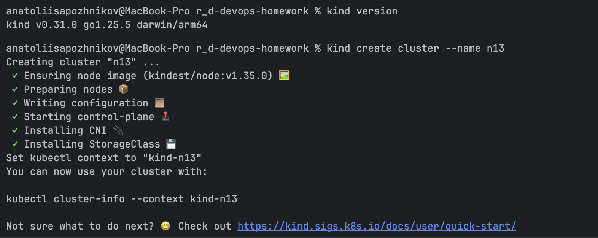
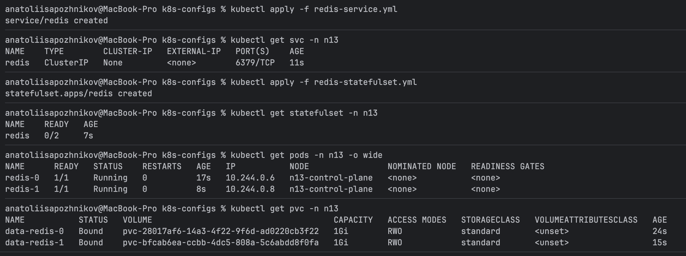

# N13 — Kubernetes: StatefulSet (Redis) and DaemonSet (Falco)

This homework demonstrates core Kubernetes workload concepts using a local cluster.
The focus is on understanding **why different Kubernetes abstractions exist** and how they are used for stateful applications and node-level services.

The work is divided into two tasks:

1. Running Redis using a **StatefulSet** with persistent storage
2. Deploying **Falco** as a **DaemonSet** for runtime security monitoring

A local Kubernetes cluster was created using **kind** (Kubernetes in Docker).

---

## Environment Overview

- Host OS: macOS  
- Kubernetes distribution: kind  
- kubectl version: v1.32.2  
- Kubernetes version (node): v1.35.0  
- Container runtime: containerd  

---

## Project Structure

```text
k8s-configs/
├─ redis-service.yml
├─ redis-statefulset.yml
├─ falco-daemonset.yml
│
├─ screenshots/
│  ├─ kind-create-cluster.png
│  └─ redis-configs-applied.png
│
└─ README.md
```

## Kubernetes Cluster Setup
A local Kubernetes cluster was created using kind, which runs Kubernetes nodes as Docker containers.

```bash
kind create cluster --name n13
```

Cluster verification:

```bash
kubectl get nodes -o wide
```

Result:

```text
NAME                STATUS   ROLES           VERSION   CONTAINER-RUNTIME
n13-control-plane   Ready    control-plane   v1.35.0   containerd://2.2.0
```



## Namespace Preparation
A dedicated namespace was created to isolate all homework resources:

```bash
kubectl create namespace n13
kubectl config set-context --current --namespace=n13
```

Note:
Namespaces are mainly an organizational and scoping mechanism. They help keep resources grouped and make cleanup and inspection easier.

## Task 1 — Redis StatefulSet with Persistent Storage
### Goal
Deploy Redis as a stateful workload with:
- stable pod identities
- persistent storage per pod
- predictable internal networking

### What is a Service (svc)?
Pods in Kubernetes are ephemeral — their IP addresses can change.
A Service provides a stable network entry point.

The command:

```bash
kubectl get svc
```
uses `svc` as a short alias for `service`.
These commands are equivalent:

```bash
kubectl get svc
kubectl get service
kubectl get services
```

### Redis Headless Service
File: `redis-service.yml`

```yaml
apiVersion: v1
kind: Service
metadata:
  name: redis
  namespace: n13
spec:
  clusterIP: None
  selector:
    app: redis
  ports:
    - port: 6379
```
This is a headless Service.

Note:
Setting `clusterIP: None` disables load balancing and virtual IPs.
Instead, Kubernetes DNS exposes each pod individually.
This behavior is required for StatefulSet workloads.

Applied with:

```bash
kubectl apply -f redis-service.yml
```

Verification:

```bash
kubectl get svc -n n13
```

Result:

```text
NAME    TYPE        CLUSTER-IP
redis   ClusterIP   None
```

### What is a StatefulSet?
A StatefulSet is used when pod identity matters.

It provides:
- stable pod names (`redis-0`, `redis-1`)
- ordered creation and deletion
- stable storage association

Unlike Deployments, StatefulSet pods keep their identity across restarts.

### Redis StatefulSet
File: `redis-statefulset.yml`

Key characteristics:
- 2 replicas
- stable pod names
- one persistent volume per pod
- append-only Redis mode enabled

Applied with:

```bash
kubectl apply -f redis-statefulset.yml
```

Verification:

```bash
kubectl get pods -n n13 -o wide
```

Result:

```text
NAME      READY   STATUS    IP
redis-0   1/1     Running   10.244.0.9
redis-1   1/1     Running   10.244.0.8
```



### What is a PVC?
A PersistentVolumeClaim (PVC) is a request for storage.

It allows a pod to request disk space without knowing how or where the storage is physically provided.

In this setup, PVCs are created automatically using `volumeClaimTemplates`.

Verification:

```bash
kubectl get pvc -n n13
```

Result:

```text
NAME           STATUS   CAPACITY   STORAGECLASS
data-redis-0   Bound    1Gi        standard
data-redis-1   Bound    1Gi        standard
```

Note:
Each Redis pod has its own volume.
Persistence here means data survives pod restarts — it does not mean data is shared between replicas.

### Data Persistence Verification
Write data to `redis-0`:

```bash
kubectl exec redis-0 -- redis-cli SET homework-test "hello-from-redis-0"
kubectl exec redis-0 -- redis-cli GET homework-test
```

Delete the pod:

```bash
kubectl delete pod redis-0
```

After recreation:

```bash
kubectl exec redis-0 -- redis-cli GET homework-test
```

Result:

```text
hello-from-redis-0
```

This confirms persistent storage works correctly.

### Pod-to-Pod Communication (DNS)
Each Redis pod is reachable via a stable DNS name:

```text
redis-0.redis.n13.svc.cluster.local
redis-1.redis.n13.svc.cluster.local
```

Verification:

```bash
kubectl exec redis-0 -- ping -c 1 redis-1.redis.n13.svc.cluster.local
```

Result:

```text
PING redis-1.redis.n13.svc.cluster.local (10.244.0.8): 56 data bytes
64 bytes from 10.244.0.8: seq=0 ttl=63 time=1.212 ms

--- redis-1.redis.n13.svc.cluster.local ping statistics ---
1 packets transmitted, 1 packets received, 0% packet loss
round-trip min/avg/max = 1.212/1.212/1.212 ms
```

Note:
This is what pod interaction typically means in Kubernetes: DNS-based discovery and connectivity, not automatic data replication.

## Task 2 — Falco Security Monitoring via DaemonSet
### Goal
Deploy Falco on every node to monitor runtime security events.

### What is a DaemonSet?
A DaemonSet ensures that one pod runs on every node in the cluster.

It is commonly used for:
- logging agents
- monitoring tools
- security software

### What is Falco?
Falco is a runtime security tool that monitors Linux system calls.
He detects suspicious behavior such as:
- spawning a shell inside a container
- executing binaries not included in the base image
- unexpected file or network access

### Falco DaemonSet
File: `falco-daemonset.yml`

Key configuration:
- runs in `kube-system`
- privileged container
- access to host directories:
  - `/proc`
  - `/boot`
  - `/lib/modules`
  - `/usr`
  - `/var/run/docker.sock`
- CPU and memory limits applied

Applied with:

```bash
kubectl apply -f falco-daemonset.yml
```

Verification:

```bash
kubectl get pods -l app=falco -n kube-system -o wide
```

Result:

```text
NAME          READY   STATUS    NODE
falco-vwdjq   1/1     Running   n13-control-plane
```

### Falco Log Verification
Logs were inspected using:

```bash
kubectl logs -n kube-system -l app=falco
```

Falco initialized successfully and started monitoring system calls.

### Triggering Security Events
A test pod was created:

```bash
kubectl run falco-trigger-test --image=alpine:3.20 --restart=Never -- sleep 3600
```

A shell was executed and additional binaries were installed inside the container.

Falco generated multiple alerts, including:

```text
Notice   A shell was spawned in a container with an attached terminal
Critical Executing binary not part of base image
```

These alerts confirm that Falco is actively detecting runtime security events.

The test pod was deleted after verification.

## Resource Cleanup Verification
Final check of the resources before and after deleting the test pod.

Current pods and services:

```bash
kubectl get pods -n n13 -o wide
kubectl get svc -n n13
kubectl get pvc -n n13
```

Result:

```text
NAME                 READY   STATUS    RESTARTS   AGE     IP            NODE
falco-trigger-test   1/1     Running   0          7m55s   10.244.0.11   n13-control-plane
redis-0              1/1     Running   0          25m     10.244.0.9    n13-control-plane
redis-1              1/1     Running   0          28m     10.244.0.8    n13-control-plane

NAME    TYPE        CLUSTER-IP   PORT(S)    AGE
redis   ClusterIP   None         6379/TCP   31m

NAME           STATUS   VOLUME                                     CAPACITY   AGE
data-redis-0   Bound    pvc-28017af6-14a3-4f22-9f6d-ad0220cb3f22   1Gi        29m
data-redis-1   Bound    pvc-bfcab6ea-ccbb-4dc5-808a-5c6abdd8f0fa   1Gi        28m
```

Deleting the test pod:

```bash
kubectl delete pod -n n13 falco-trigger-test
```

Verification of deletion:

```bash
kubectl get pods -n n13
```

Result:

```text
pod "falco-trigger-test" deleted

NAME                 READY   STATUS        RESTARTS   AGE
falco-trigger-test   1/1     Terminating   0          9m26s
redis-0              1/1     Running       0          26m
redis-1              1/1     Running       0          30m
```

Final state:

```bash
kubectl get pods -n n13
```

Result:

```text
NAME      READY   STATUS    RESTARTS   AGE
redis-0   1/1     Running   0          51m
redis-1   1/1     Running   0          55m
```

## Conclusion
In this homework, the following was achieved:
- A local Kubernetes cluster was created using kind
- Redis was deployed using a StatefulSet with persistent storage
- Stable pod identities, DNS, and data persistence were verified
- The purpose of Services, PVCs, StatefulSets, and DaemonSets was explored
- Falco was deployed as a DaemonSet for node-level security monitoring
- Runtime security alerts were successfully generated and observed

This work demonstrates fundamental Kubernetes concepts required for operating stateful workloads and cluster-wide system services.
