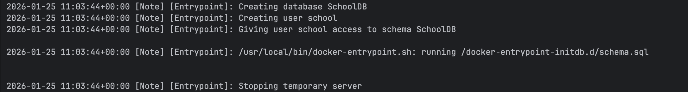
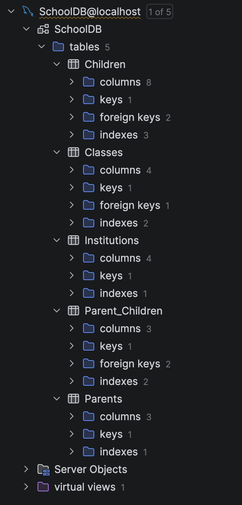
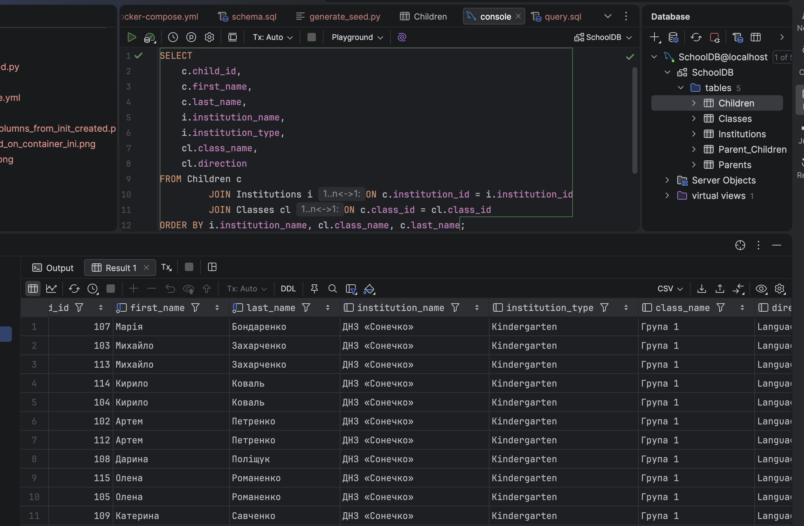
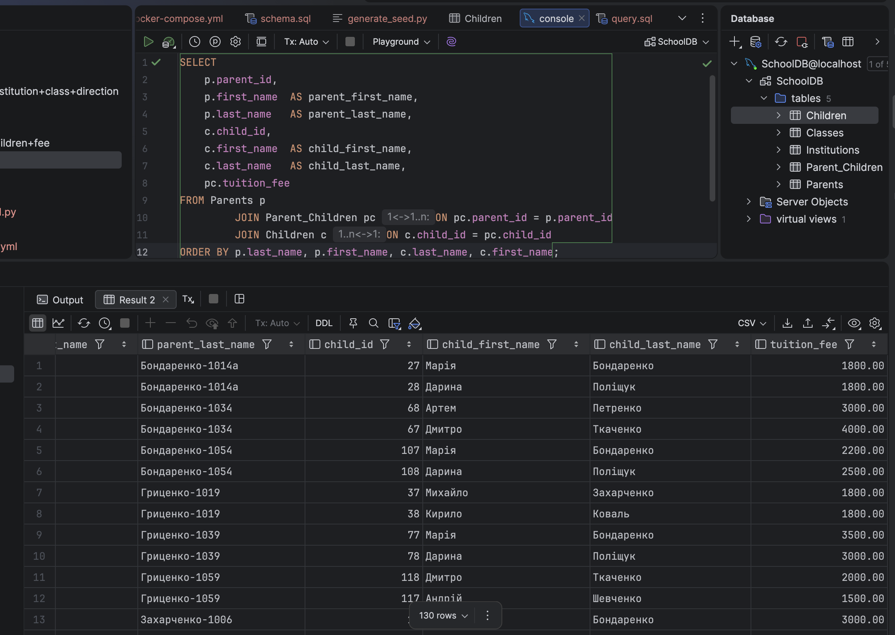
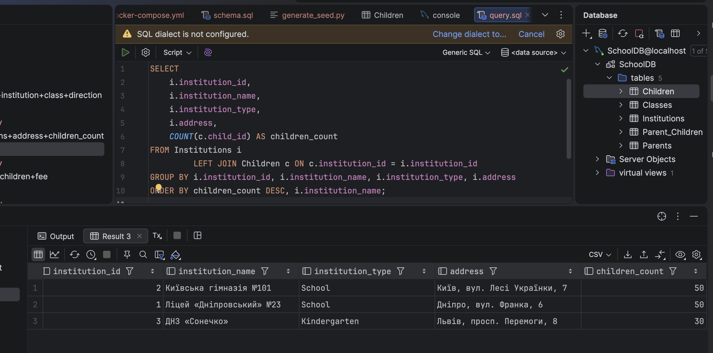
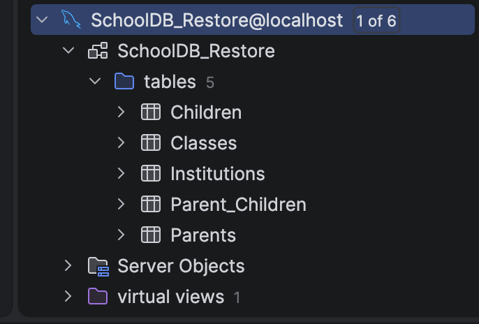

# N14 — MySQL: SchoolDB (Related Tables, Seeding, Backup/Restore, Anonymization)

This homework demonstrates how to create a MySQL database with multiple related tables, enforce relationships using **FOREIGN KEY**, generate realistic data, run required queries, and verify data integrity using **backup/restore**.
An additional part covers **anonymization** of personal and financial data.

---

## Environment Overview

- Host OS: macOS (Docker Desktop)
- MySQL: **8.0**
- Containerized DB via Docker Compose
- Initialization via `/docker-entrypoint-initdb.d`
- Seeding via Python generator (creates `seed.sql`)
- Anonymization via SQL script

---

## Project Structure

```text
14-SQL/db_related/
├─ docker-compose.yml
├─ schooldb_backup.sql
├─ init/
│  └─ schema.sql
├─ seeding/
│  ├─ generate_seed.py
│  └─ seed.sql
├─ anonymization/
│  └─ anonymize.sql
├─ queries/
│  ├─ all_children+institution+class+direction/
│  │  ├─ query.sql
│  │  └─ result.csv
│  ├─ all_parents+children+fee/
│  │  ├─ query.sql
│  │  └─ result.csv
│  └─ all_institutions+address+children_count/
│     ├─ query.sql
│     └─ result.csv
└─ screenshots/
   ├─ init_file_executed_on_container_ini.png
   ├─ all_tables_and_columns_from_init_created.png
   ├─ seed_executed.png
   ├─ all_children+institution_class_direction.png
   ├─ all_parents+children+fee.png
   ├─ all_institutions+address+children_count.png
   └─ SchoolDB_Restore_present.png
```

---

## Step 1: Start MySQL with Docker Compose

Start the database:

```bash
docker compose up -d
docker compose ps
```

Result:

```text
NAME             IMAGE       COMMAND                  SERVICE   CREATED          STATUS         PORTS
schooldb-mysql   mysql:8.0   "docker-entrypoint.s…"   mysql     43 seconds ago   Up 7 seconds   0.0.0.0:3306->3306/tcp, [::]:3306->3306/tcp
```

---

## Step 2: Automatic DB + Tables Initialization

Initialization SQL is placed into `init/schema.sql` and mounted into the container at:

- `./init` → `/docker-entrypoint-initdb.d`

Docker Compose mount:

```yaml
volumes:
  - r_d-sql-mysql_data:/var/lib/mysql
  - ./init:/docker-entrypoint-initdb.d
```

### Why this matters
The official MySQL Docker image executes `/docker-entrypoint-initdb.d/*` **only when the data volume is empty**.
This allows automatic DB creation on the first run and prevents accidental re-initialization on restarts.

### Demonstration (fresh initialization)

```bash
docker compose down -v
docker compose up -d
docker logs schooldb-mysql --tail=200
```

Result (relevant part):

```text
2026-01-25 11:03:44+00:00 [Note] [Entrypoint]: Creating database SchoolDB
2026-01-25 11:03:44+00:00 [Note] [Entrypoint]: Creating user school
2026-01-25 11:03:44+00:00 [Note] [Entrypoint]: Giving user school access to schema SchoolDB
2026-01-25 11:03:44+00:00 [Note] [Entrypoint]: /usr/local/bin/docker-entrypoint.sh: running /docker-entrypoint-initdb.d/schema.sql
```



### Verify created tables

```bash
docker exec -i schooldb-mysql mysql -uroot -proot -e "SHOW DATABASES; USE SchoolDB; SHOW TABLES;"
```

Result:

```text
Database
SchoolDB
information_schema
mysql
performance_schema
sys
Tables_in_SchoolDB
Children
Classes
Institutions
Parent_Children
Parents
```



---

## Step 3: Schema Design (Many Children → One Parent via Link Table)

A link table is used to support **one parent → multiple children** (and also allows multiple parents per child if needed):

- `Parents` has no `child_id`
- `Parent_Children` stores:
  - `parent_id`
  - `child_id`
  - `tuition_fee` (fee is treated as per-child in this model)

Relationship:

```text
Parents (1) → Parent_Children (N) ← (1) Children
```

---

## Step 4: Seeding Large Realistic Dataset

### Requirements implemented
- 2 schools + 1 kindergarten
- 10 classes per school (20 total) + 2 classes in kindergarten (2 total)
- 5 children per school class (100 children) + 15 per kindergarten class (30 children)
- Total children: 130
- Parents: 65
- Links: 130

### Generate seed.sql

```bash
python3 seeding/generate_seed.py
```

Result:

```text
Generated seed.sql
Institutions: 3
Classes: 22
Children: 130
Parents: 65
Links: 130
```

### UTF-8 issue discovered (Cyrillic corruption)

While inserting Cyrillic data, the database session was using `latin1`, which caused corrupted output in the IDE.

Verification:

```bash
docker exec -i schooldb-mysql mysql -uroot -proot -e "
SHOW VARIABLES LIKE 'character_set%';
SHOW VARIABLES LIKE 'collation%';
"
```

Result (important lines):

```text
character_set_client    latin1
character_set_connection        latin1
character_set_results   latin1
character_set_server    utf8mb4
character_set_database  utf8mb4
```

Fix:
- The generator was updated to include UTF-8 session setup in `seed.sql`:

```sql
SET NAMES utf8mb4;
SET character_set_client = utf8mb4;
SET character_set_connection = utf8mb4;
SET character_set_results = utf8mb4;
```

### Apply seeding

```bash
docker exec -i schooldb-mysql mysql -uroot -proot < seeding/seed.sql
```


### Verify counts + uniqueness

```bash
docker exec -i schooldb-mysql mysql -uroot -proot -e "
USE SchoolDB;
SELECT COUNT(*) AS total FROM Children;
SELECT COUNT(DISTINCT first_name, last_name, birth_date) AS unique_rows FROM Children;
"
```

Result:

```text
total
130
unique_rows
130
```

---

## Step 5: Required Queries

Query files are stored under `queries/` with exported results as `result.csv`.

---

### Query 1 — All children with institution and class direction

```sql
SELECT
  c.child_id,
  c.first_name,
  c.last_name,
  i.institution_name,
  i.institution_type,
  cl.class_name,
  cl.direction
FROM Children c
JOIN Institutions i ON c.institution_id = i.institution_id
JOIN Classes cl ON c.class_id = cl.class_id
ORDER BY i.institution_name, cl.class_name, c.last_name;
```



---

### Query 2 — Parents and their children with tuition fee (link table)

```sql
SELECT
  p.parent_id,
  p.first_name  AS parent_first_name,
  p.last_name   AS parent_last_name,
  c.child_id,
  c.first_name  AS child_first_name,
  c.last_name   AS child_last_name,
  pc.tuition_fee
FROM Parents p
JOIN Parent_Children pc ON pc.parent_id = p.parent_id
JOIN Children c ON c.child_id = pc.child_id
ORDER BY p.last_name, p.first_name, c.last_name, c.first_name;
```



---

### Query 3 — Institutions with address and children count

```sql
SELECT
  i.institution_id,
  i.institution_name,
  i.institution_type,
  i.address,
  COUNT(c.child_id) AS children_count
FROM Institutions i
LEFT JOIN Children c ON c.institution_id = i.institution_id
GROUP BY i.institution_id, i.institution_name, i.institution_type, i.address
ORDER BY children_count DESC, i.institution_name;
```



---

## Step 6: Backup and Restore (Data Integrity Verification)

### Create backup (dump)

```bash
docker exec -i schooldb-mysql mysqldump --default-character-set=utf8mb4 -uroot -proot   --routines --triggers --single-transaction --databases SchoolDB > schooldb_backup.sql
```

Verify dump file:

```bash
ls -lh schooldb_backup.sql
head -n 5 schooldb_backup.sql
```

Result:

```text
-rw-r--r--@ 1 anatoliisapozhnikov  staff    20K Jan 25 13:07 schooldb_backup.sql
-- MySQL dump 10.13  Distrib 8.0.45, for Linux (aarch64)
--
-- Host: localhost    Database: SchoolDB
-- ------------------------------------------------------
-- Server version       8.0.45
```

### Restore into a new database: SchoolDB_Restore

Create new database:

```bash
docker exec -i schooldb-mysql mysql -uroot -proot -e "CREATE DATABASE IF NOT EXISTS SchoolDB_Restore CHARACTER SET utf8mb4 COLLATE utf8mb4_0900_ai_ci;"
```

Restore dump into `SchoolDB_Restore` (replace DB name in the dump on-the-fly):

```bash
sed 's/`SchoolDB`/`SchoolDB_Restore`/g' schooldb_backup.sql | docker exec -i schooldb-mysql mysql --default-character-set=utf8mb4 -uroot -proot
```

### Verify row counts match

```bash
docker exec -i schooldb-mysql mysql -uroot -proot -e "
SELECT 'SchoolDB' AS db, (SELECT COUNT(*) FROM SchoolDB.Institutions) AS institutions,
                     (SELECT COUNT(*) FROM SchoolDB.Classes) AS classes,
                     (SELECT COUNT(*) FROM SchoolDB.Children) AS children,
                     (SELECT COUNT(*) FROM SchoolDB.Parents) AS parents,
                     (SELECT COUNT(*) FROM SchoolDB.Parent_Children) AS links
UNION ALL
SELECT 'SchoolDB_Restore' AS db, (SELECT COUNT(*) FROM SchoolDB_Restore.Institutions),
                             (SELECT COUNT(*) FROM SchoolDB_Restore.Classes),
                             (SELECT COUNT(*) FROM SchoolDB_Restore.Children),
                             (SELECT COUNT(*) FROM SchoolDB_Restore.Parents),
                             (SELECT COUNT(*) FROM SchoolDB_Restore.Parent_Children);
"
```

Result:

```text
db      institutions    classes children        parents links
SchoolDB        3       22      130     65      130
SchoolDB_Restore        3       22      130     65      130
```



### FK integrity check (should fail)

```bash
docker exec -i schooldb-mysql mysql -uroot -proot -e "
USE SchoolDB_Restore;
INSERT INTO Children
(first_name, last_name, birth_date, year_of_entry, age, institution_id, class_id)
VALUES
('Тест', 'Невалідний', '2012-01-01', 2022, 13, 99999, 99999);
"
```

Result:

```text
ERROR 1452 (23000) at line 3: Cannot add or update a child row: a foreign key constraint fails (`SchoolDB_Restore`.`Children`, CONSTRAINT `fk_children_institution` FOREIGN KEY (`institution_id`) REFERENCES `Institutions` (`institution_id`) ON DELETE RESTRICT ON UPDATE CASCADE)
```

This confirms referential integrity is preserved after restore.

---

## Step 7: Anonymization

Anonymization was applied to the restored database (`SchoolDB_Restore`) to keep original data intact.

File:
- `anonymization/anonymize.sql`

Run anonymization:

```bash
docker exec -i schooldb-mysql mysql --default-character-set=utf8mb4 -uroot -proot < anonymization/anonymize.sql
```

Verification:

```bash
docker exec -i schooldb-mysql mysql --default-character-set=utf8mb4 -uroot -proot -e "
USE SchoolDB_Restore;

SELECT child_id, first_name, last_name FROM Children LIMIT 5;
SELECT parent_id, first_name, last_name FROM Parents LIMIT 5;
SELECT institution_id, institution_name, address FROM Institutions ORDER BY institution_id;
SELECT parent_id, child_id, tuition_fee FROM Parent_Children LIMIT 10;
"
```

Result:

```text
child_id        first_name      last_name
1       Child   Anonymous
2       Child   Anonymous
3       Child   Anonymous
4       Child   Anonymous
5       Child   Anonymous

parent_id       first_name      last_name
1       Parent1 Anon
2       Parent2 Anon
3       Parent3 Anon
4       Parent4 Anon
5       Parent5 Anon

institution_id  institution_name        address
1       Institution1    UA, Address 1
2       Institution2    UA, Address 2
3       Institution3    UA, Address 3

parent_id       child_id        tuition_fee
1       1       2800.00
1       2       2000.00
2       3       2800.00
2       4       2000.00
3       5       2800.00
3       6       2000.00
4       7       2800.00
4       8       2000.00
5       9       2800.00
5       10      2000.00
```

---

## Conclusion

In this homework, the following was implemented and verified:

- MySQL database `SchoolDB` created in Docker
- Multiple related tables created with **FOREIGN KEY**
- Link table model used for parent-child relationships
- Large realistic dataset generated and inserted (130 children)
- Required JOIN and aggregation queries executed and exported
- Full backup created and restored into `SchoolDB_Restore`
- Data integrity verified via matching row counts and FK failure test
- Personal and financial data anonymized with verification output
