# N18 — AWS Basics: VPC, Subnets, EC2, and Elastic IP

This homework demonstrates the creation of a fundamental AWS infrastructure using the AWS Management Console.
The setup includes a custom Virtual Private Cloud (VPC), public and private subnets, routing configuration via an Internet Gateway, security groups for access control, and a running EC2 instance with a static Elastic IP.

---

## Environment Overview

*   **Cloud Provider:** AWS
*   **Region:** eu-north-1 (Stockholm)
*   **Instance OS:** Amazon Linux 2
*   **Instance Type:** t3.micro
*   **Access Method:** SSH using RSA key (.pem)

---

## Step 1: Creating the VPC

A custom Virtual Private Cloud (VPC) was created to provide an isolated virtual network environment.

**Configuration:**
*   **Name:** `anat-vpc`
*   **IPv4 CIDR block:** `10.10.0.0/16`

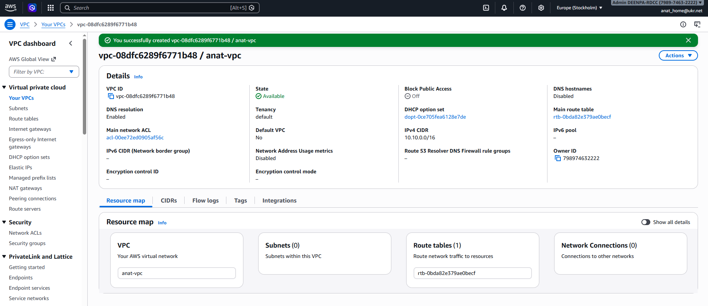

---

## Step 2: Creating Subnets

Two subnets were created within the VPC to logically separate public-facing and private internal resources.

### Public Subnet
*   **Name:** `anat-public-subnet`
*   **CIDR:** `10.10.1.0/24`
*   **Purpose:** To host resources that require direct internet access (e.g., the EC2 instance).

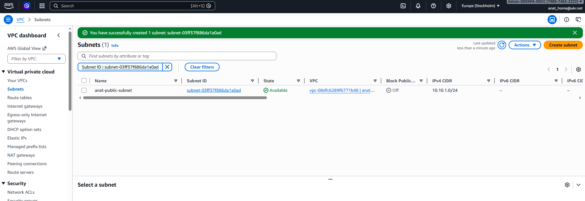

### Private Subnet
*   **Name:** `anat-private-subnet`
*   **CIDR:** `10.10.2.0/24`
*   **Purpose:** Reserved for internal services without direct internet exposure.

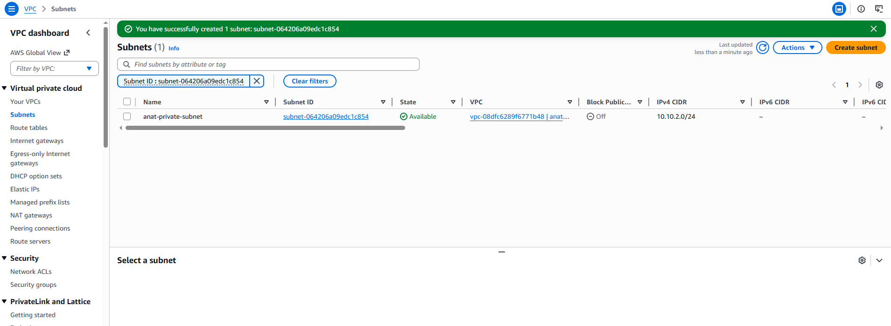

---

## Step 3: Internet Gateway Configuration

An Internet Gateway (IGW) was created and attached to the VPC to enable communication between the VPC and the public internet.

*   **Gateway Name:** `anat-igw`

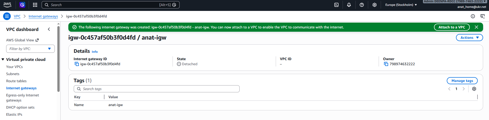

The gateway was then explicitly attached to `anat-vpc`.

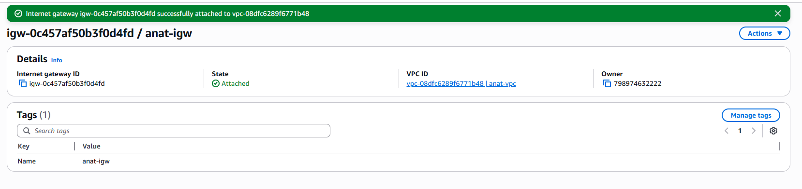

---

## Step 4: Route Table Configuration

The VPC's main route table was updated to route all outbound traffic (0.0.0.0/0) through the newly created Internet Gateway.

**Routes:**
*   `10.10.0.0/16` → local (Traffic within the VPC)
*   `0.0.0.0/0` → `anat-igw` (External traffic via IGW)

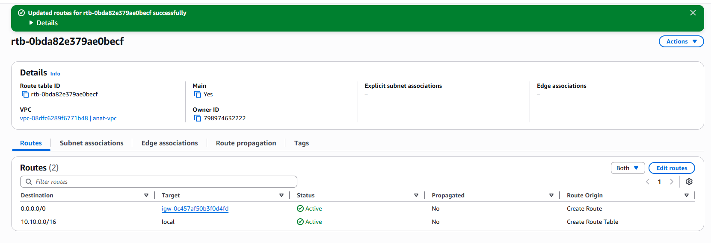

---

## Step 5: Public Subnet Settings

To ensure instances launched in the public subnet are reachable, the **Auto-assign public IPv4 address** setting was enabled.

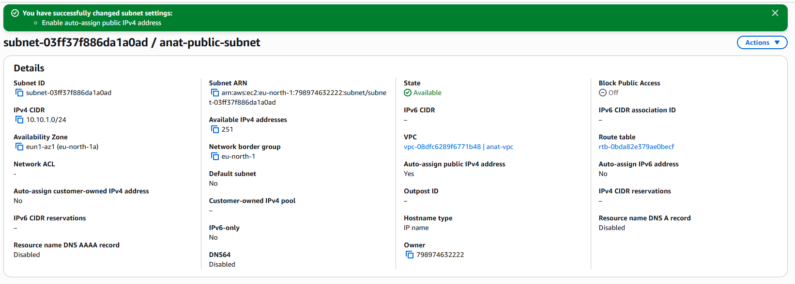

---

## Step 6: Launching the EC2 Instance

An EC2 instance was launched using the Amazon Linux 2 AMI.

### 1. AMI Selection
The **Amazon Linux 2 AMI** (HVM, SSD Volume Type) was selected.

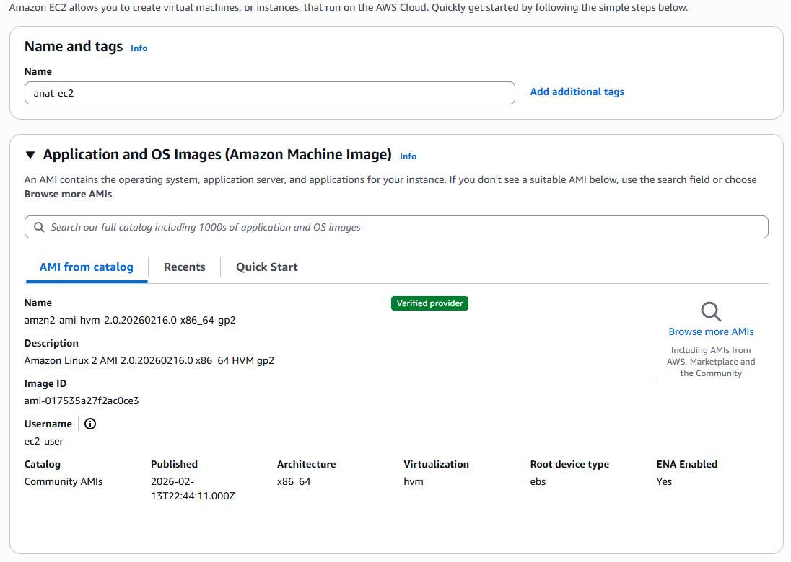

### 2. Instance Type and Key Pair
*   **Type:** `t3.micro` (Free tier eligible)
*   **Key Name:** `anat-key` (RSA, .pem format)

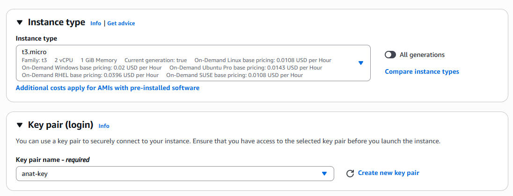

### 3. Network Settings
The instance was placed in the `anat-vpc` and `anat-public-subnet`.

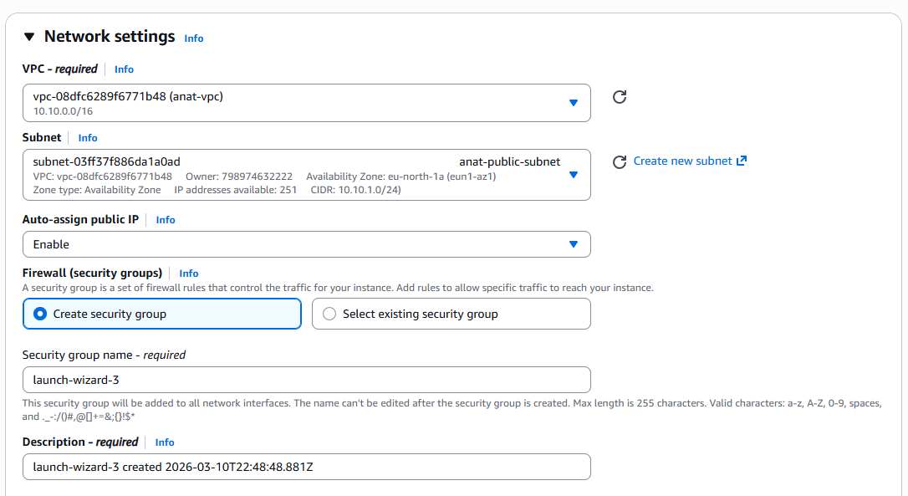

### 4. Security Group Rules
A new security group (`anat-sg`) was created with the following inbound rules:
*   **SSH (Port 22):** Allowed from any source (0.0.0.0/0)
*   **HTTP (Port 80):** Allowed from any source (0.0.0.0/0)

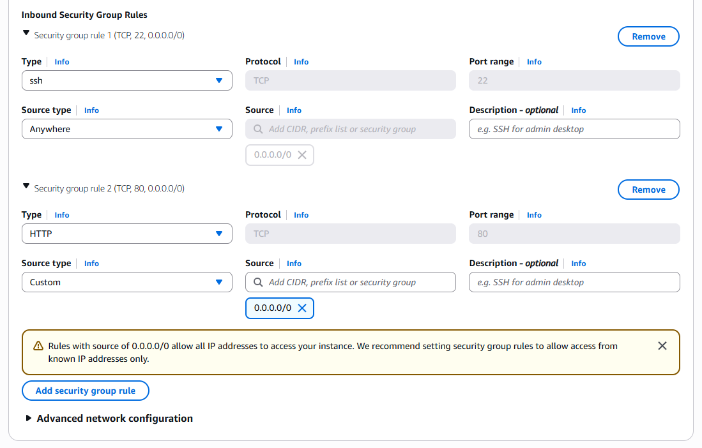

### 5. Launch Completion
The instance was successfully launched and reached the "Running" state.

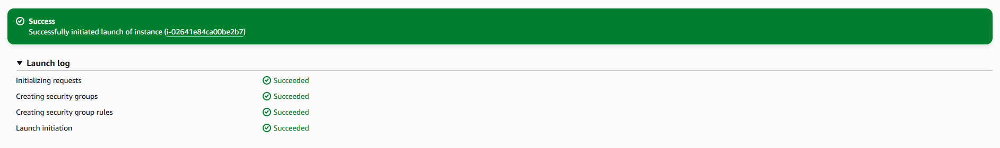

---

## Step 7: Elastic IP Configuration

An Elastic IP was allocated and associated with the EC2 instance to provide a persistent, static public IP address.

*   **Elastic IP:** `13.63.116.14`
*   **Associated Instance:** `i-02641e84ca00be2b7`

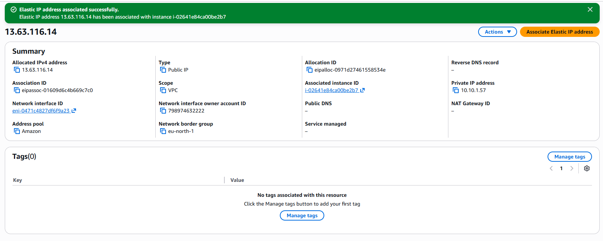

---

## Step 8: Verifying SSH Connectivity

The EC2 instance was accessed from a local terminal via SSH using the private RSA key.

**Command:**
```powershell
ssh -i anat-key.pem ec2-user@13.63.116.14
```

Successful connection confirms that the routing, security group rules, and instance configuration are working as expected.

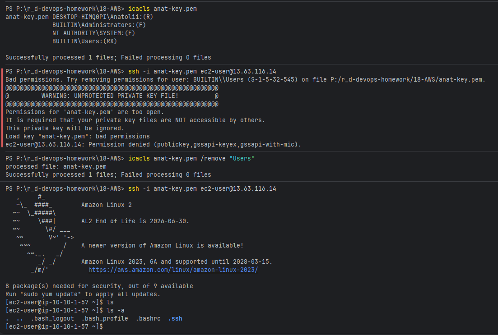
