# N19 — Kubernetes on AWS EKS

This homework demonstrates creating and operating a **Kubernetes cluster in AWS using EKS** and deploying several Kubernetes resources.
The setup includes configuring an EKS cluster with worker nodes, deploying an nginx-based static website with ConfigMap configuration, exposing services via LoadBalancer, and exploring persistent storage concepts.

**Note:** This homework was not completed in full. The following tasks were not finished:
- **PersistentVolumeClaim with dynamic storage provisioning** — I encountered issues with EBS CSI driver configuration and storage class setup. After blindly following AI instructions to troubleshoot the failing storage provisioning without understanding the root cause, I decided to stop at that moment.
- **Test application deployment** — Deploying httpd/nginx with 2 replicas and ClusterIP service
- **Namespace workloads** — Creating a `dev` namespace with 5 busybox replicas running `sleep 3600`

---

## Environment Overview

*   **Cloud Provider:** AWS
*   **Region:** eu-north-1 (Stockholm)
*   **Kubernetes Platform:** Amazon EKS
*   **Node Type:** t3.medium
*   **Node Count:** 2 worker nodes
*   **Access Method:** AWS CloudShell + kubectl

**Note:** All `kubectl` commands were executed in AWS CloudShell, not from a local machine.

---

## Step 1: Creating the EKS Cluster

An Amazon EKS cluster was created using the AWS Management Console to provide a managed Kubernetes control plane.

**Configuration:**
*   **Cluster Name:** `anat-eks`
*   **Kubernetes Version:** Latest available
*   **VPC:** `anat-vpc`
*   **Subnets:** `anat-public-subnet` + `anat-public-subnet-1b`

### 1.1. Initial Cluster Setup

The cluster creation process was initiated through the EKS console:

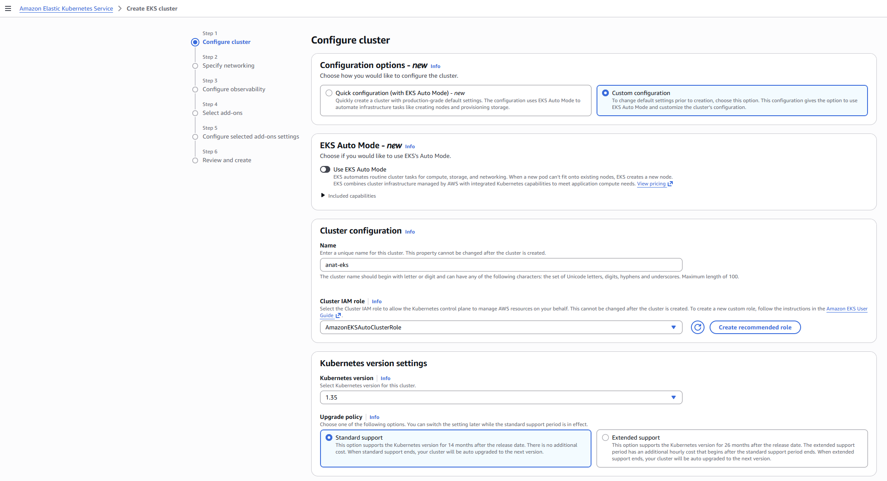

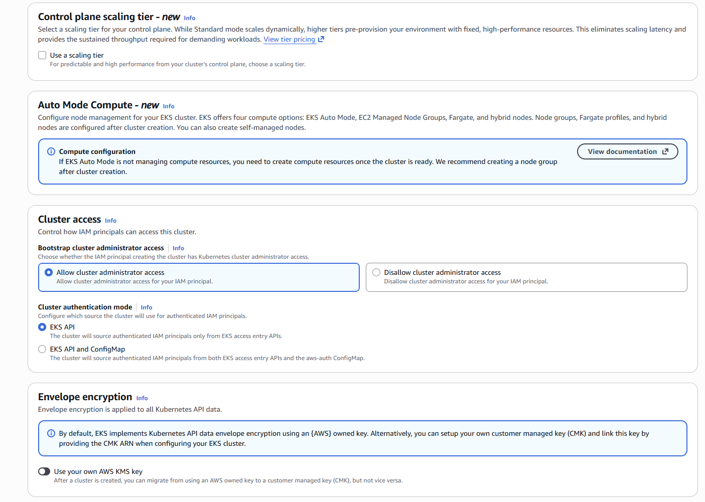

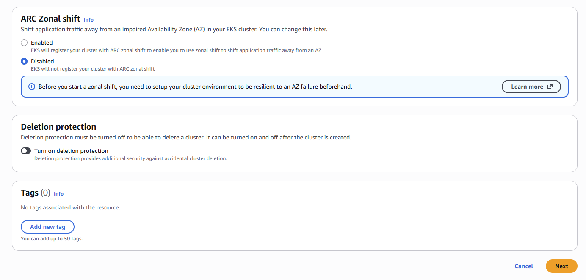

### 1.2. Networking Configuration

The cluster was configured to use the existing VPC infrastructure with multiple availability zones for high availability:

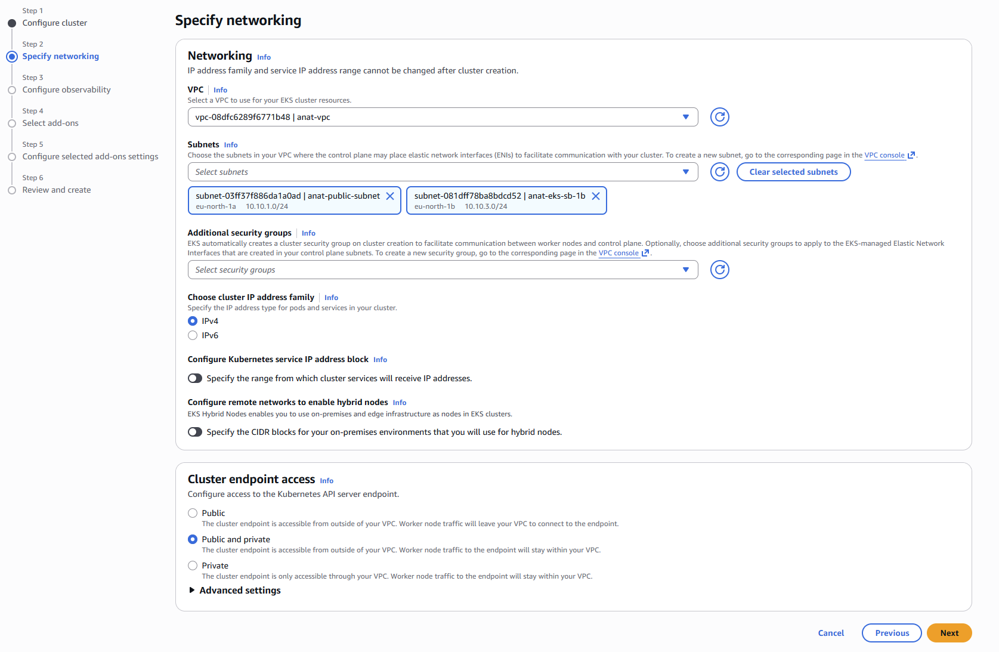

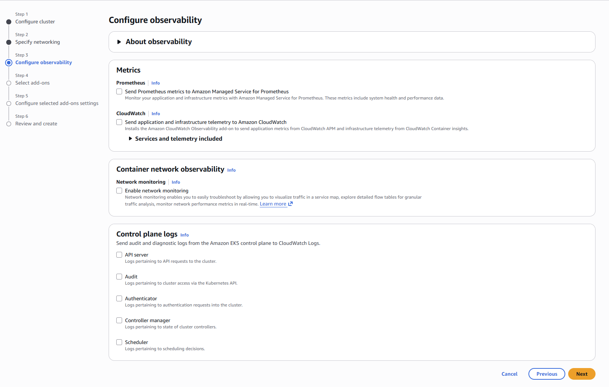

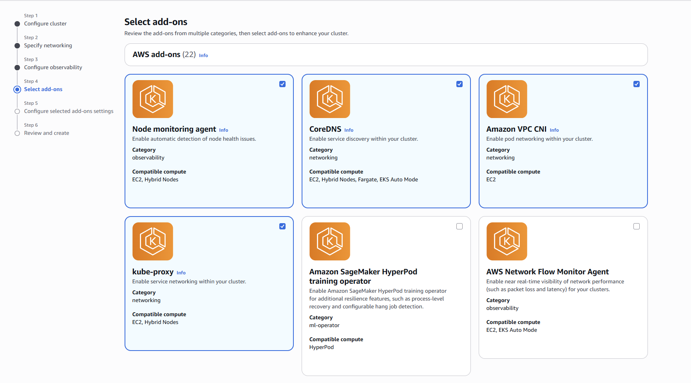

### 1.3. Cluster Review and Creation

Final configuration was reviewed before cluster creation:

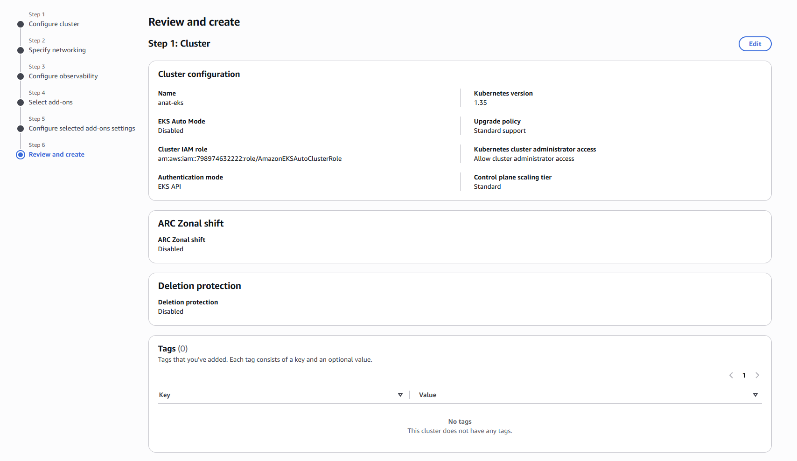

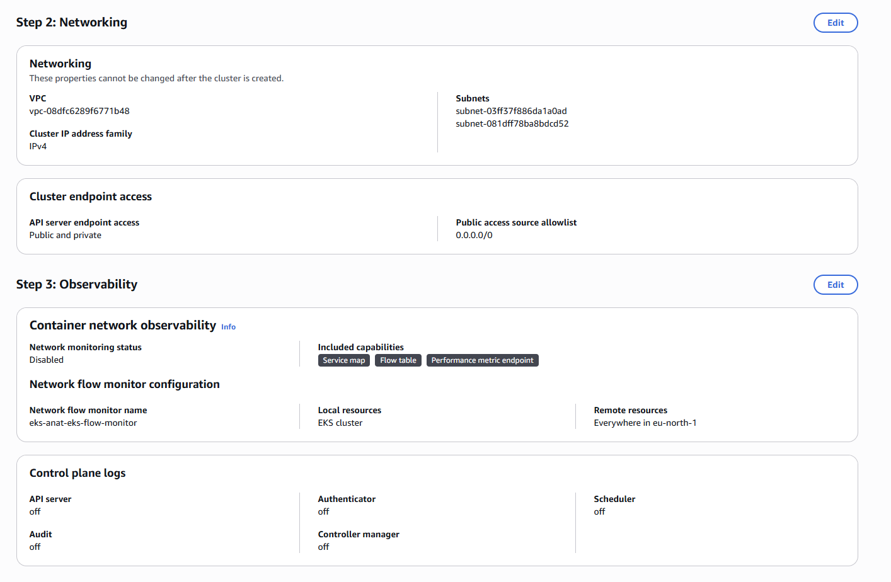

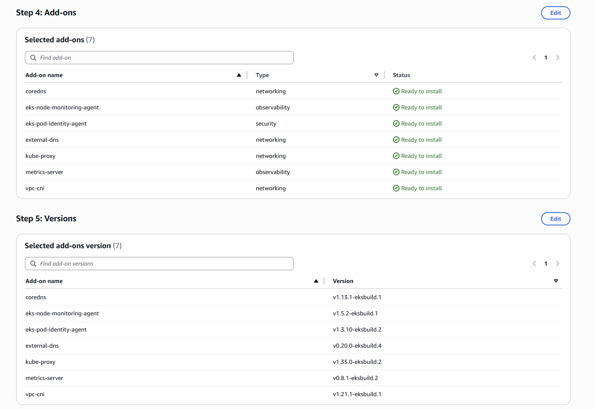

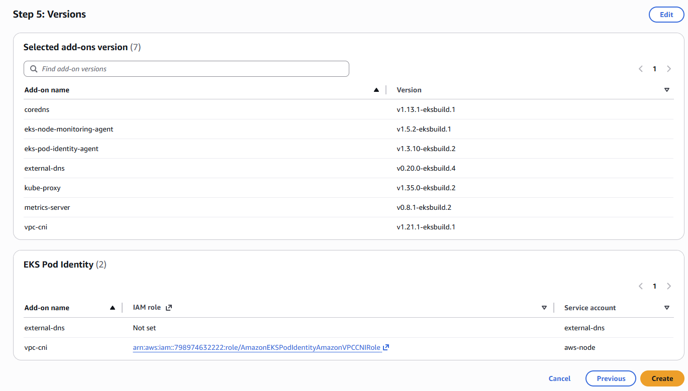

---

## Step 2: Adding Worker Nodes via Node Group

After the control plane was ready, a managed node group was created to add worker nodes to the cluster.

**Node Group Configuration:**
*   **Node Group Name:** `anat-workers`
*   **Instance Type:** t3.medium
*   **Desired Nodes:** 2
*   **Minimum Nodes:** 2
*   **Maximum Nodes:** 2
*   **AMI Type:** Amazon Linux 2023

### 2.1. Node Group Creation Process

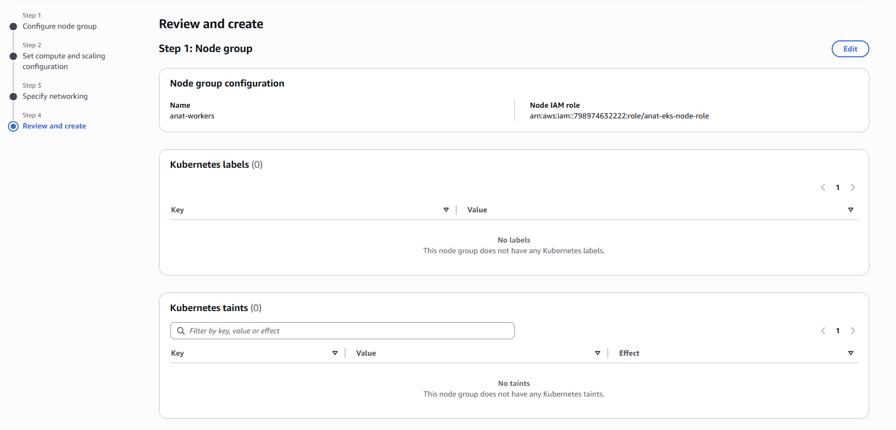

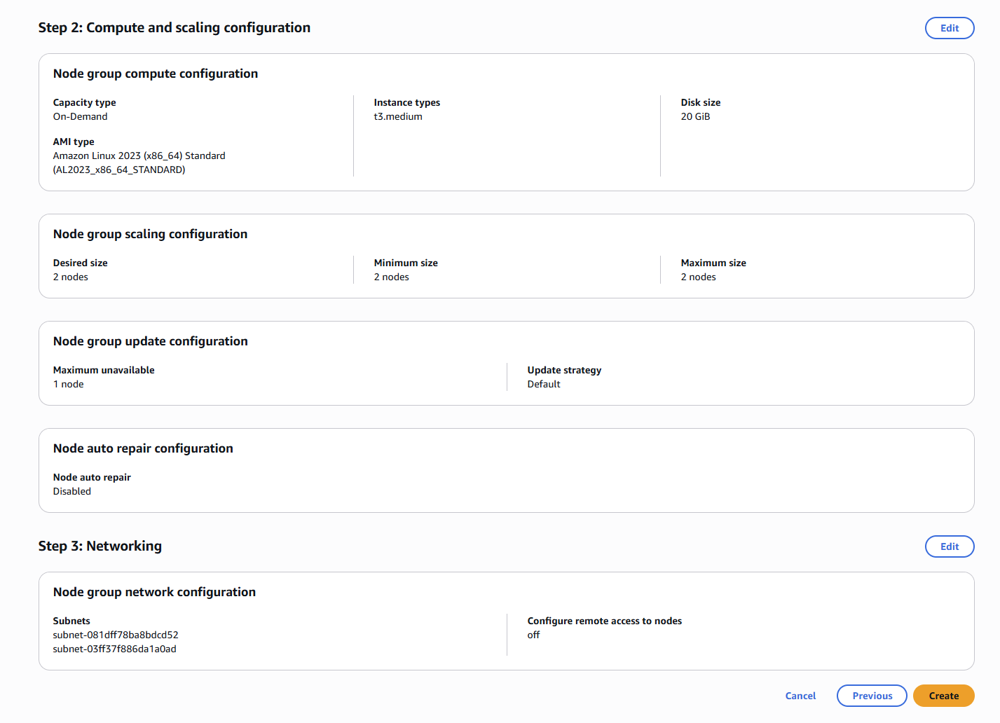

After the node group was created, two worker nodes were successfully provisioned and joined the cluster.

---

## Step 3: Connecting kubectl to the Cluster

The kubectl configuration was set up using AWS CloudShell to manage the cluster.
I have only Windows PC available at the moment and after ~1h of issues with installing aws/kubectl and VB/WSL on Windows, I tried to use the CloudShell because of lack of time to solve the issues.

**Command used:**
```bash
aws eks update-kubeconfig --region eu-north-1 --name anat-eks
```

**Cluster connectivity verification:**
```bash
kubectl get nodes
```

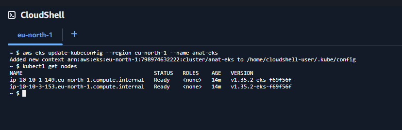

This confirmed that:
*   kubectl is correctly configured
*   Both worker nodes are in `Ready` status
*   The cluster is ready to accept workloads

---

## Step 4: Deploying a Static Website

A static website was deployed using nginx with configuration managed via ConfigMap.

### 4.1. Creating the ConfigMap

The website content was stored in a ConfigMap for easy configuration management.

**File:** `website-config.yaml`
```yaml
apiVersion: v1
kind: ConfigMap
metadata:
  name: website-config
data:
  index.html: |
    <!DOCTYPE html>
    <html>
    <head>
      <title>EKS Static Website</title>
    </head>
    <body>
      <h1>Hello from EKS!</h1>
      <p>This website is served by nginx in Kubernetes.</p>
    </body>
    </html>
```

**Apply:**
```bash
kubectl apply -f website-config.yaml
```

**Verification:**
```bash
kubectl get configmap
```

---

### 4.2. Creating the nginx Deployment

The nginx container was configured to mount the HTML file from the ConfigMap.

**File:** `nginx-deployment.yaml`
```yaml
apiVersion: apps/v1
kind: Deployment
metadata:
  name: nginx-site
spec:
  replicas: 1
  selector:
    matchLabels:
      app: nginx-site
  template:
    metadata:
      labels:
        app: nginx-site
    spec:
      containers:
        - name: nginx
          image: nginx
          ports:
            - containerPort: 80
          volumeMounts:
            - name: web-content
              mountPath: /usr/share/nginx/html/index.html
              subPath: index.html
      volumes:
        - name: web-content
          configMap:
            name: website-config
```

**Deploy:**
```bash
kubectl apply -f nginx-deployment.yaml
```

**Verification:**
```bash
kubectl get deployments
kubectl get pods
```

---

## Step 5: Exposing the Website via LoadBalancer

The website was made publicly accessible using a LoadBalancer Service, which automatically provisions an AWS Elastic Load Balancer.

**File:** `nginx-service.yaml`
```yaml
apiVersion: v1
kind: Service
metadata:
  name: nginx-service
spec:
  type: LoadBalancer
  selector:
    app: nginx-site
  ports:
    - port: 80
      targetPort: 80
```

**Apply:**
```bash
kubectl apply -f nginx-service.yaml
```

**Verification:**
```bash
kubectl get svc
```

**Example result:**
```text
NAME            TYPE           CLUSTER-IP      EXTERNAL-IP
nginx-service   LoadBalancer   172.20.x.x      xxxxxxxxx.elb.amazonaws.com
```

The website was then accessed publicly via the LoadBalancer DNS:

```bash
curl http://<load-balancer-dns>
```

**Result:**
```html
<h1>Hello from EKS!</h1>
```

This confirms:
*   The LoadBalancer service successfully provisioned an AWS ELB
*   The nginx deployment is serving traffic
*   The ConfigMap content is being served correctly

---

## Step 6: Attempting PersistentVolumeClaim Configuration (Incomplete)

An attempt was made to create a PersistentVolumeClaim to use dynamic storage provisioning with AWS EBS.

**File:** `pvc.yaml`
```yaml
apiVersion: v1
kind: PersistentVolumeClaim
metadata:
  name: ebs-claim
spec:
  storageClassName: gp2
  accessModes:
    - ReadWriteOnce
  resources:
    requests:
      storage: 1Gi
```

**Apply:**
```bash
kubectl apply -f pvc.yaml
```

**Verification:**
```bash
kubectl get pvc
```

**Result:**
```text
STATUS: Pending
```

### Issue Encountered

The PVC remained in `Pending` status because the cluster did not have the AWS EBS CSI driver properly installed and configured. Dynamic EBS volume provisioning requires:
*   The EBS CSI driver addon
*   Proper IAM roles and permissions
*   A valid StorageClass configuration

After encountering repeated failures and attempting to troubleshoot by blindly following AI-generated instructions without fully understanding the underlying issue with the storage class and CSI driver configuration, I decided to stop working on this task.

**Note:** In a properly configured EKS cluster, the PVC would automatically provision an AWS EBS volume and bind it to a Pod for persistent storage.

This task was **not completed** as part of this homework.

---

## Step 7: Running a Kubernetes Job

A simple Kubernetes Job was created to execute a one-time task and verify that the cluster can run batch workloads.

**Command used:**
```bash
kubectl create job hello-job --image=busybox -- echo "Hello from EKS!"
```

**Verification:**
```bash
kubectl get jobs
kubectl get pods
```

**Result:**
```text
hello-job   Complete   1/1
```

**Logs confirmed execution:**
```bash
kubectl logs job/hello-job
```

**Output:**
```text
Hello from EKS!
```

This confirms:
*   Kubernetes Jobs work correctly in the cluster
*   Pods are being scheduled and executed successfully
*   Container logs are accessible

---

## Step 8: Cleanup

After completing the exercises, all Kubernetes resources were deleted to prevent unnecessary charges.

**Commands used:**
```bash
kubectl delete service nginx-service
kubectl delete deployment nginx-site
kubectl delete job hello-job
kubectl delete pod storage-test
kubectl delete pvc ebs-claim
```

**Verification:**
```bash
kubectl get all
kubectl get pvc
```

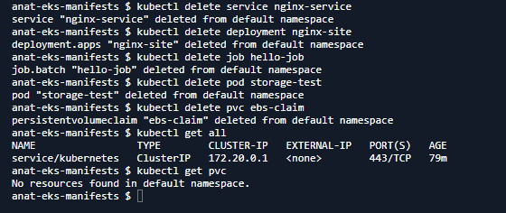

**Result:**
```text
service/kubernetes   ClusterIP   172.20.0.1
```

Only the default Kubernetes service remained, confirming all created resources were removed.

---

### AWS Infrastructure Cleanup

After cleaning up the Kubernetes resources, the AWS infrastructure was deleted through the console:

1. **Node Group Deletion**

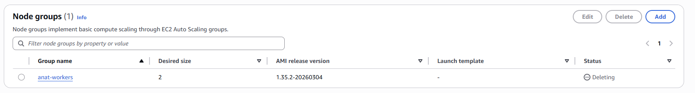

The node group was deleted first, which terminated the EC2 worker instances.

2. **EKS Cluster Deletion**

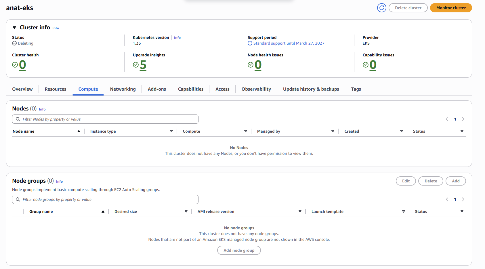

After the node group was fully deleted, the EKS cluster itself was removed.

3. **Load Balancer Cleanup**

The AWS Elastic Load Balancer created by the LoadBalancer service was automatically removed when the service was deleted.

This cleanup process ensures:
*   No unnecessary AWS resources continue running
*   No ongoing charges are incurred
*   The environment is returned to its initial state

---

## Key Takeaways

This homework demonstrated:

*   Creating and configuring an Amazon EKS cluster via the AWS Console
*   Adding managed node groups with EC2 worker instances
*   Connecting to Kubernetes using kubectl from AWS CloudShell
*   Deploying workloads using Deployment resources
*   Managing application configuration with ConfigMap
*   Exposing services publicly with LoadBalancer (automatic AWS ELB provisioning)
*   Running one-time batch tasks using Kubernetes Jobs
*   Understanding the challenges of persistent storage configuration in EKS
*   Properly cleaning up Kubernetes and AWS resources

---

## Challenges and Incomplete Tasks

The following tasks were **not completed**:

1. **PersistentVolumeClaim with dynamic storage provisioning**
   - Encountered issues with EBS CSI driver installation and configuration
   - After blindly following AI instructions without understanding the root cause, decided to stop

2. **Test application deployment**
   - Deploying httpd/nginx with 2 replicas and ClusterIP service

3. **Namespace workloads**
   - Creating a `dev` namespace with 5 busybox replicas running `sleep 3600`
