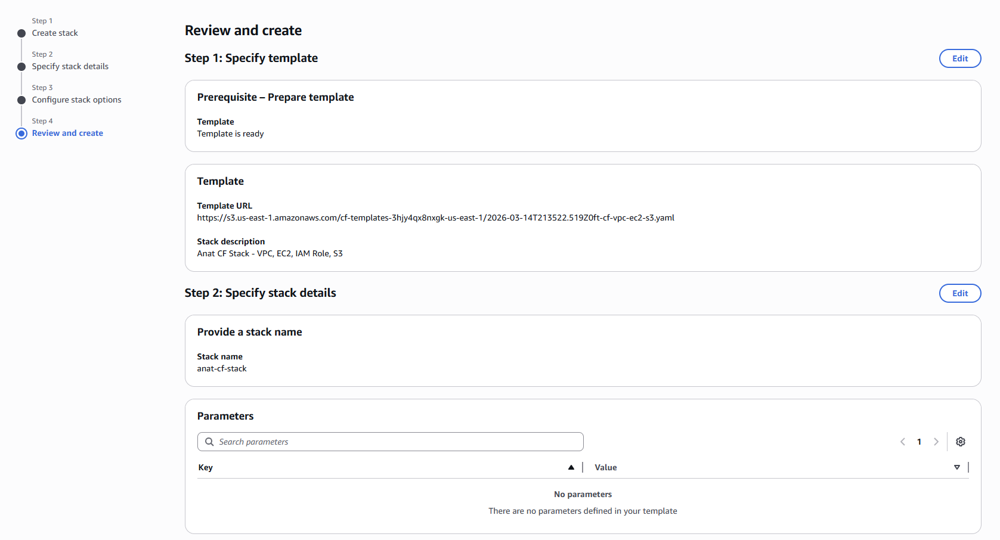
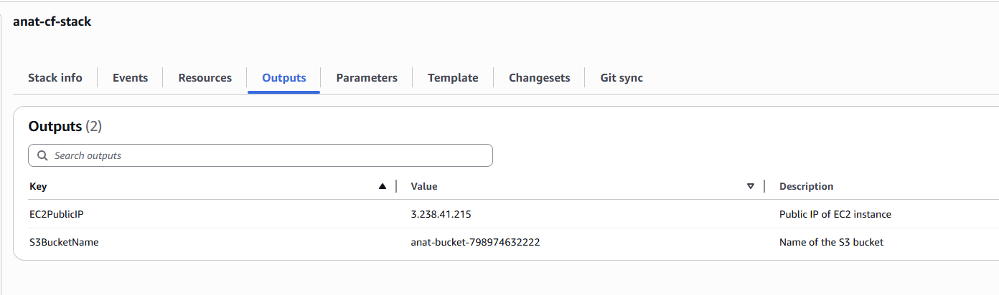
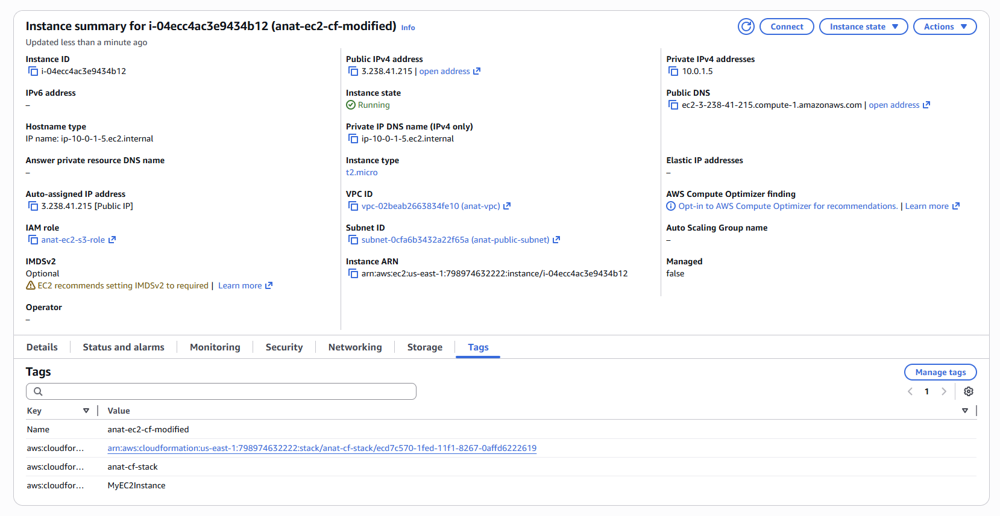
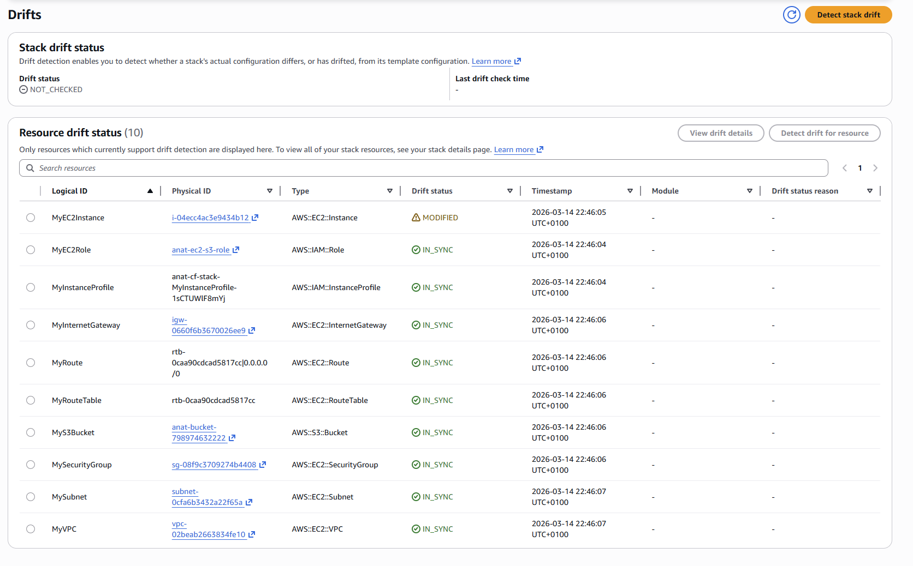
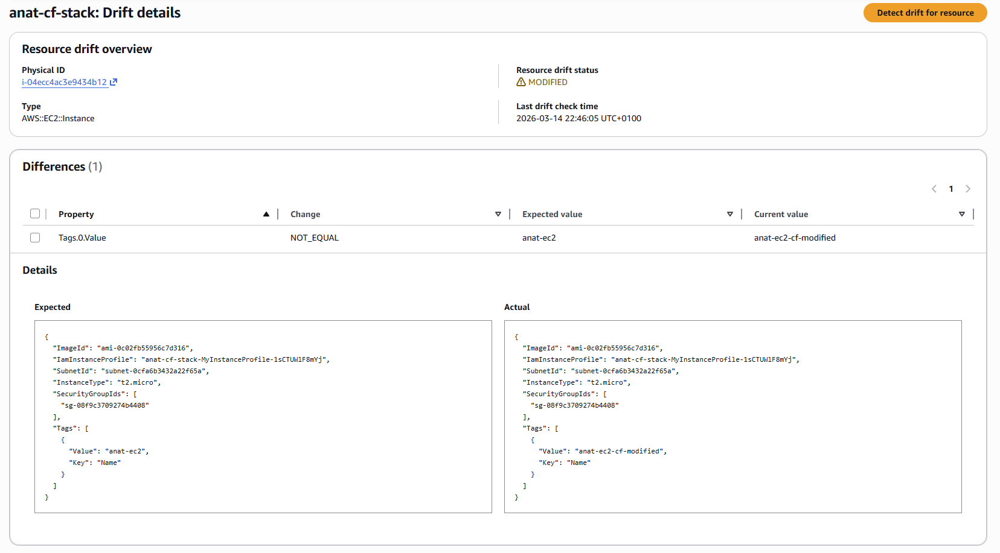

# N20 — AWS CloudFormation: VPC, EC2, IAM Role, and S3

This homework demonstrates the creation of AWS infrastructure using **AWS CloudFormation** — an Infrastructure as Code (IaC) service.
The setup includes a custom VPC with a public subnet, an EC2 instance with an attached IAM role, and a private S3 bucket with versioning — all defined in a single YAML template and deployed as a CloudFormation stack.

---

## Environment Overview

* **Cloud Provider:** AWS
* **Region:** us-east-1 (N. Virginia)
* **IaC Tool:** AWS CloudFormation
* **Template Format:** YAML
* **Instance OS:** Amazon Linux 2
* **Instance Type:** t2.micro
* **Stack Name:** `anat-cf-stack`

---

## CloudFormation Template Overview

The template `cf-vpc-ec2-s3.yaml` defines the following resources:

* **VPC** — `10.0.0.0/16` CIDR block with DNS support enabled
* **Public Subnet** — `10.0.1.0/24` in `us-east-1a` with auto-assigned public IPs
* **Internet Gateway** — attached to the VPC for internet access
* **Route Table** — routes all outbound traffic (`0.0.0.0/0`) through the IGW
* **IAM Role** — `anat-ec2-s3-role` with `AmazonS3ReadOnlyAccess` managed policy
* **IAM Instance Profile** — wraps the IAM role for EC2 attachment
* **Security Group** — attached to the EC2 instance
* **EC2 Instance** — `t2.micro`, Amazon Linux 2, placed in the public subnet with the IAM role attached
* **S3 Bucket** — private bucket named `anat-bucket-{AccountId}` with versioning enabled and public access blocked
* **S3 Bucket Policy** — allows the EC2 IAM role to perform `s3:GetObject`
* **Outputs** — exposes EC2 public IP and S3 bucket name

---

## Step 1: Creating the CloudFormation Stack

The template was uploaded via the AWS CloudFormation console using **Create stack → Upload a template file**.

**Stack configuration:**
* **Stack name:** `anat-cf-stack`
* **Template file:** `cf-vpc-ec2-s3.yaml`
* **IAM role:** none (test account has sufficient permissions)
* **Failure behavior:** Roll back all stack resources

The stack reached `CREATE_COMPLETE` status, confirming all resources were provisioned successfully.

---

## Step 2: Verifying Outputs

After the stack was created, the **Outputs** tab confirmed both expected values were exported:

| Key | Value | Description |
|---|---|---|
| `EC2PublicIP` | `3.238.41.215` | Public IP of the EC2 instance |
| `S3BucketName` | `anat-bucket-798974632222` | Name of the created S3 bucket |

---

## Step 3: Manual Resource Modification (Drift Setup)

To demonstrate drift detection, the EC2 instance tag was manually changed directly in the AWS Console — outside of CloudFormation.

The `Name` tag of the EC2 instance was updated:
* **Before:** `anat-ec2`
* **After:** `anat-ec2-cf-modified`

This simulates a situation where a team member manually modifies infrastructure instead of going through IaC.

---

## Step 4: Detecting Drift

Drift detection was triggered via **Stack actions → Detect drift** in the CloudFormation console.

The results showed that out of 10 resources, **1 resource was drifted**:

| Resource | Type | Drift Status |
|---|---|---|
| `MyEC2Instance` | `AWS::EC2::Instance` | ⚠️ MODIFIED |
| All others | Various | ✅ IN_SYNC |

---

## Step 5: Inspecting Drift Details

The drift details page showed a clear side-by-side comparison of the expected vs actual configuration:

| Property | Change | Expected Value | Current Value |
|---|---|---|---|
| `Tags.0.Value` | NOT_EQUAL | `anat-ec2` | `anat-ec2-cf-modified` |

The full JSON diff confirmed that the only difference between the template definition and the actual resource state was the manually changed `Name` tag.

---
