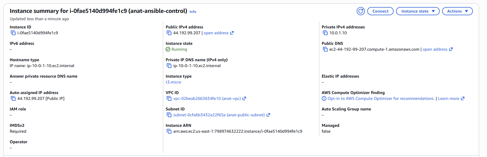
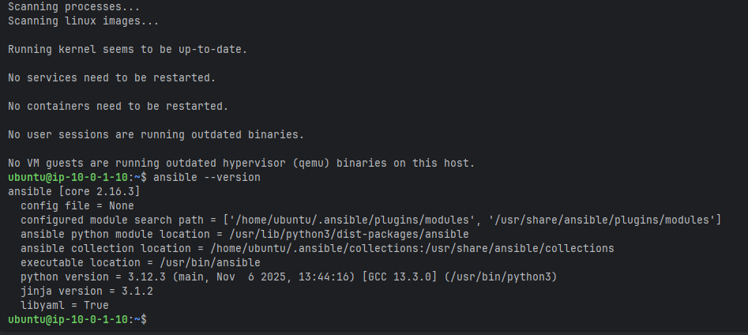
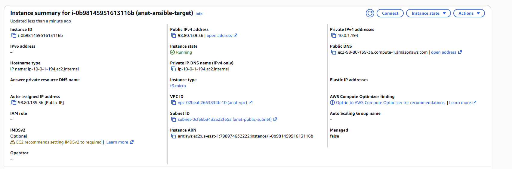
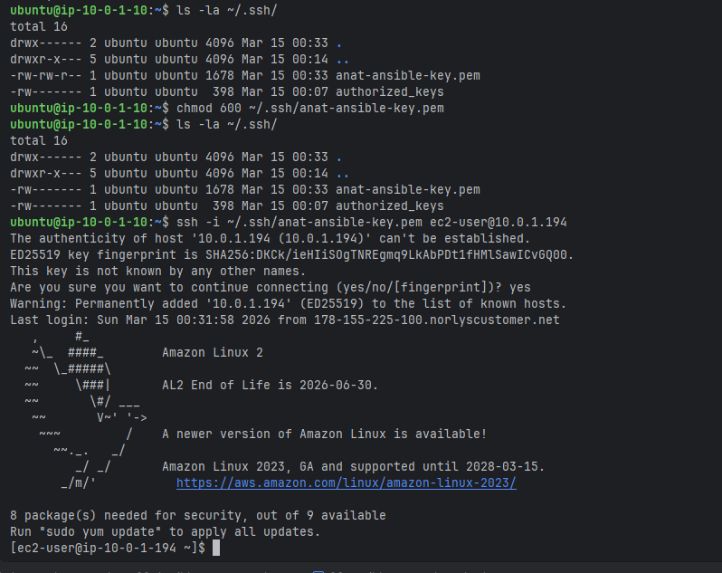
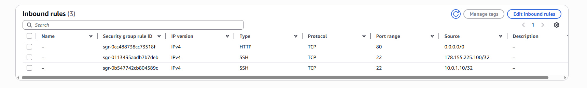
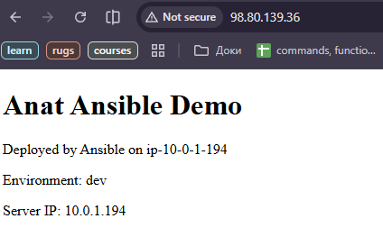

# N22 — Advanced Ansible: Roles, Dynamic Inventory, and Vault

This homework demonstrates advanced Ansible usage including role-based infrastructure configuration, templates, dynamic AWS inventory, and secrets management with Ansible Vault.
The setup provisions a target EC2 instance with baseline packages, firewall rules, and a running Nginx web server — all managed from a dedicated Ansible control node.

---

## Environment Overview

* **Cloud Provider:** AWS
* **Region:** us-east-1 (N. Virginia)
* **Control Node:** Ubuntu 24.04 LTS, t3.micro (`anat-ansible-control`, `10.0.1.10`)
* **Target Node:** Amazon Linux 2, t3.micro (`anat-ansible-target`, `10.0.1.194`)
* **Ansible Version:** 2.16.3
* **VPC:** `anat-vpc`

---

## Project Structure

```text
22-Ansible/
├── .gitignore
├── anat-ansible-key.pem
├── README.md
├── control-instance-setup-copy/
│   ├── site.yml
│   ├── baseline.yml
│   ├── nginx.yml
│   ├── inventory/
│   │   ├── hosts.ini
│   │   └── aws_ec2.yml
│   ├── group_vars/
│   │   └── all/
│   │       └── vault.yml
│   ├── host_vars/
│   └── roles/
│       ├── baseline/
│       │   ├── tasks/
│       │   ├── handlers/
│       │   ├── templates/
│       │   ├── defaults/
│       │   └── vars/
│       ├── firewall/
│       │   ├── tasks/
│       │   ├── handlers/
│       │   ├── templates/
│       │   ├── defaults/
│       │   └── vars/
│       └── nginx/
│           ├── tasks/
│           ├── handlers/
│           ├── templates/
│           ├── defaults/
│           └── vars/
└── screenshots/
```

---

## Step 1: Launching the Control Node

A dedicated EC2 instance was launched to act as the Ansible control node — the machine from which all Ansible commands are executed.

**Configuration:**
* **Name:** `anat-ansible-control`
* **AMI:** Ubuntu Server 24.04 LTS
* **Instance type:** t3.micro
* **VPC:** `anat-vpc`
* **Subnet:** `anat-public-subnet`
* **Key pair:** `anat-ansible-key` (RSA, .pem)
* **Security group:** SSH (port 22) allowed from any IP

Ubuntu was chosen over Amazon Linux 2 because Ansible installs more cleanly via `apt` and is better supported on Debian-based systems.



---

## Step 2: Installing Ansible on the Control Node

After connecting to the control node via SSH, Ansible was installed using the system package manager.

**SSH connection from local machine:**
```powershell
ssh -i anat-ansible-key.pem ubuntu@44.192.99.207
```

**Installation:**
```bash
sudo apt update
sudo apt install -y ansible
```

**Verification:**
```bash
ansible --version
# ansible [core 2.16.3]
```



---

## Step 3: Launching the Target Node

A separate EC2 instance was launched to serve as the Ansible-managed target — the machine that will be configured by Ansible playbooks.

**Configuration:**
* **Name:** `anat-ansible-target`
* **AMI:** Amazon Linux 2
* **Instance type:** t3.micro
* **VPC:** `anat-vpc`
* **Subnet:** `anat-public-subnet`
* **Key pair:** `anat-ansible-key` (same key as control node for simplicity)
* **Security group:** SSH (port 22) from control node IP (`10.0.1.10/32`) and local machine IP

Using the same key pair for both instances allows the control node to SSH into the target without additional key management.



---

## Step 4: Configuring SSH Access Between Nodes

The private key was copied from the local machine to the control node so Ansible can use it to connect to the target.

**Copy key to control node:**
```powershell
scp -i anat-ansible-key.pem anat-ansible-key.pem ubuntu@44.192.99.207:~/.ssh/anat-ansible-key.pem
```

**Fix permissions on control node (SSH requires private keys to be readable only by owner):**
```bash
ubuntu@ip-10-0-1-10:~$ ls -la ~/.ssh/
total 16
drwx------ 2 ubuntu ubuntu 4096 Mar 15 00:33 .
drwxr-x--- 5 ubuntu ubuntu 4096 Mar 15 00:14 ..
-rw-rw-r-- 1 ubuntu ubuntu 1678 Mar 15 00:33 anat-ansible-key.pem
-rw------- 1 ubuntu ubuntu  398 Mar 15 00:07 authorized_keys
ubuntu@ip-10-0-1-10:~$ chmod 600 ~/.ssh/anat-ansible-key.pem
ubuntu@ip-10-0-1-10:~$ ls -la ~/.ssh/
total 16
drwx------ 2 ubuntu ubuntu 4096 Mar 15 00:33 .
drwxr-x--- 5 ubuntu ubuntu 4096 Mar 15 00:14 ..
-rw------- 1 ubuntu ubuntu 1678 Mar 15 00:33 anat-ansible-key.pem
-rw------- 1 ubuntu ubuntu  398 Mar 15 00:07 authorized_keys
```

**Generate public key from private key (needed for the baseline role):**
```bash
ssh-keygen -y -f ~/.ssh/anat-ansible-key.pem > ~/.ssh/anat-ansible-key.pem.pub
```

**Test SSH connection from control node to target:**
```bash
ssh -i ~/.ssh/anat-ansible-key.pem ec2-user@10.0.1.194
```

The private IP is used here because both instances are in the same VPC subnet — no need to route traffic over the internet.



---

## Step 5: Creating the Project Structure

The Ansible project directory structure was created on the control node following Ansible best practices for role-based organization.

*Note: structure was mostly found in some Ansible tutorials and discussed with AI*

```bash
mkdir -p ~/ansible/{roles,group_vars,host_vars}
mkdir -p ~/ansible/roles/{baseline,firewall,nginx}/{tasks,handlers,templates,vars,defaults}
mkdir -p ~/ansible/inventory
cd ~/ansible
```

Each role has dedicated subdirectories:
* `tasks/` — the actual steps to execute
* `handlers/` — actions triggered by notifications (e.g. restart nginx)
* `templates/` — Jinja2 template files
* `defaults/` — default variable values
* `vars/` — role-specific variables

---

## Step 6: Static Inventory

A static inventory file was created first to verify basic Ansible connectivity before moving to dynamic inventory.

**File: `inventory/hosts.ini`**
```ini
[webservers]
anat-ansible-target ansible_host=10.0.1.194 ansible_user=ec2-user ansible_ssh_private_key_file=~/.ssh/anat-ansible-key.pem ansible_python_interpreter=/usr/bin/python3.7
```

**Test connectivity:**
```bash
ansible -i inventory/hosts.ini webservers -m ping
# anat-ansible-target | SUCCESS => { "ping": "pong" }
```

The `ansible_python_interpreter` was set explicitly to suppress a warning about Python discovery on Amazon Linux 2.

---

## Step 7: Baseline Role

The baseline role handles fundamental server configuration — installing essential packages and setting up SSH key authorization.

**File: `roles/baseline/tasks/main.yml`**
```yaml
---
- name: Install baseline packages
  ansible.builtin.package:
    name:
      - vim
      - git
      - mc
    state: present

- name: Set up authorized SSH key
  ansible.posix.authorized_key:
    user: ec2-user
    state: present
    key: "{{ lookup('file', '~/.ssh/anat-ansible-key.pem.pub') }}"
```

* `ansible.builtin.package` — installs packages using the OS native package manager (yum on Amazon Linux 2)
* `ansible.posix.authorized_key` — adds the public key to `~/.ssh/authorized_keys` on the target, enabling passwordless SSH

Note: `ufw` was not included because it is not available on Amazon Linux 2. Firewall management is handled separately by the firewall role using `firewalld`.

---

## Step 8: Firewall Role

The firewall role installs and configures `firewalld` to allow only SSH and HTTP traffic, blocking everything else by default.

**File: `roles/firewall/tasks/main.yml`**
```yaml
---
- name: Install firewalld
  ansible.builtin.package:
    name: firewalld
    state: present

- name: Install python-firewall binding
  ansible.builtin.package:
    name: python-firewall
    state: present

- name: Start and enable firewalld
  ansible.builtin.service:
    name: firewalld
    state: started
    enabled: true

- name: Allow SSH through firewall
  ansible.builtin.command:
    cmd: firewall-cmd --permanent --add-service=ssh
  changed_when: true

- name: Allow HTTP through firewall
  ansible.builtin.command:
    cmd: firewall-cmd --permanent --add-service=http
  changed_when: true

- name: Reload firewalld
  ansible.builtin.command:
    cmd: firewall-cmd --reload
  changed_when: true
```

`ansible.posix.firewalld` module was not used because Amazon Linux 2 only provides Python 2 firewall bindings, which are incompatible with Ansible's Python 3 runtime. The `firewall-cmd` CLI approach works reliably across all Python versions.

---

## Step 9: Nginx Role

The nginx role installs Nginx and deploys configuration using Jinja2 templates, allowing dynamic values like hostname, environment, and server IP to be injected at deploy time.

**File: `roles/nginx/tasks/main.yml`**
```yaml
---
- name: Enable nginx via amazon-linux-extras
  ansible.builtin.command:
    cmd: amazon-linux-extras enable nginx1
  changed_when: true

- name: Install nginx
  ansible.builtin.package:
    name: nginx
    state: present

- name: Deploy nginx config from template
  ansible.builtin.template:
    src: nginx.conf.j2
    dest: /etc/nginx/nginx.conf
    owner: root
    group: root
    mode: '0644'
  notify: Restart nginx

- name: Deploy index.html from template
  ansible.builtin.template:
    src: index.html.j2
    dest: /usr/share/nginx/html/index.html
    owner: root
    group: root
    mode: '0644'

- name: Ensure nginx is started and enabled
  ansible.builtin.service:
    name: nginx
    state: started
    enabled: true
```

Nginx is not in the default Amazon Linux 2 repositories — `amazon-linux-extras enable nginx1` makes it available before installation.

The `notify: Restart nginx` directive triggers the handler only when the config file actually changes — avoiding unnecessary restarts.

**File: `roles/nginx/handlers/main.yml`**
```yaml
---
- name: Restart nginx
  ansible.builtin.service:
    name: nginx
    state: restarted
```

**File: `roles/nginx/templates/nginx.conf.j2`**
```jinja2
user nginx;
worker_processes auto;
error_log /var/log/nginx/error.log;
pid /run/nginx.pid;

events {
    worker_connections 1024;
}

http {
    server {
        listen       80;
        server_name  {{ ansible_hostname }};

        location / {
            root   /usr/share/nginx/html;
            index  index.html;
        }
    }
}
```

`{{ ansible_hostname }}` is an Ansible fact — automatically collected from the target host at runtime.

**File: `roles/nginx/templates/index.html.j2`**
```jinja2
<!DOCTYPE html>
<html>
<head>
    <title>{{ page_title }}</title>
</head>
<body>
    <h1>{{ page_title }}</h1>
    <p>Deployed by Ansible on {{ ansible_hostname }}</p>
    <p>Environment: {{ env }}</p>
    <p>Server IP: {{ ansible_default_ipv4.address }}</p>
</body>
</html>
```

**File: `roles/nginx/defaults/main.yml`**
```yaml
---
page_title: "Anat Ansible Demo"
env: "dev"
```

Default variables are defined here and can be overridden at the playbook or inventory level.

---

## Step 10: Playbooks

Three playbooks were created for different deployment scenarios.

**File: `site.yml`** — applies all roles (full server setup):
```yaml
---
- name: Apply all roles to webservers
  hosts: aws_ec2
  become: true
  roles:
    - baseline
    - firewall
    - nginx
```

**File: `baseline.yml`** — applies only baseline and firewall (for new server onboarding):
```yaml
---
- name: Apply baseline configuration
  hosts: webservers
  become: true
  roles:
    - baseline
    - firewall
```

**File: `nginx.yml`** — applies only nginx (for web server updates without touching system config):
```yaml
---
- name: Configure Nginx
  hosts: webservers
  become: true
  roles:
    - nginx
```

`become: true` is required because installing packages and managing services requires root privileges. Ansible uses `sudo` under the hood.

---

## Step 11: Ansible Vault

Ansible Vault was used to encrypt sensitive data so it can be safely stored in version control without exposing passwords in plain text.

**Create encrypted vault file:**
```bash
ansible-vault create group_vars/all/vault.yml
```

**File contents (before encryption): `group_vars/all/vault.yml`**
```yaml
---
vault_secret_password: "secretPass123"
vault_db_password: "dbPass123"
```

**Verify encryption:**
```bash
cat group_vars/all/vault.yml
# $ANSIBLE_VAULT;1.1;AES256
# 36343638313066313935353231623537...
```

**View decrypted contents:**
```bash
ansible-vault view group_vars/all/vault.yml
# Vault password: ****
```

The file is encrypted with AES256. Without the vault password, the contents are completely unreadable. Variables from the vault are automatically available to all playbooks and roles since the file is placed in `group_vars/all/`.

---

## Step 12: Dynamic Inventory

Dynamic inventory replaces the static `hosts.ini` file by querying the AWS API in real time to discover EC2 instances based on tags and filters.

**Installing required tools on the control node:**
```bash
# AWS CLI
pip3 install awscli --break-system-packages
export PATH=$HOME/.local/bin:$PATH
echo 'export PATH=$HOME/.local/bin:$PATH' >> ~/.bashrc

# AWS credentials
mkdir -p ~/.aws
nano ~/.aws/credentials
# [default]
# aws_access_key_id = ...
# aws_secret_access_key = ...
# region = us-east-1
```

**File: `inventory/aws_ec2.yml`**
```yaml
---
plugin: amazon.aws.aws_ec2
regions:
  - us-east-1
filters:
  tag:Name:
    - anat-ansible-target
keyed_groups:
  - key: tags.Name
    prefix: tag
hostnames:
  - private-ip-address
compose:
  ansible_user: "'ec2-user'"
  ansible_ssh_private_key_file: "'~/.ssh/anat-ansible-key.pem'"
```

* `plugin` — specifies the AWS EC2 dynamic inventory plugin
* `filters` — limits discovery to instances with `Name=anat-ansible-target` tag
* `keyed_groups` — creates inventory groups based on tag values
* `hostnames` — uses private IP for SSH (instances are in the same VPC)
* `compose` — injects connection variables for each discovered host

**Test dynamic inventory:**
```bash
ansible-inventory -i inventory/aws_ec2.yml --list --ask-vault-pass
```

Unlike static inventory, dynamic inventory automatically picks up new instances when they are launched with the matching tag — no manual file updates needed.

---

## Step 13: Running the Full Playbook with Dynamic Inventory

The final playbook run used dynamic inventory to discover and configure the target:

```bash
ansible-playbook -i inventory/aws_ec2.yml site.yml --ask-vault-pass
```

Result:
```
ok=13   changed=4    failed=0
```

All roles were applied successfully via dynamic inventory.

---

## Step 14: Verifying Nginx in the Browser

After opening HTTP (port 80) in the target's security group, the deployed page was verified in a browser.

The page correctly rendered all Jinja2 template variables:
* **Title:** Anat Ansible Demo (from `defaults/main.yml`)
* **Hostname:** ip-10-0-1-194 (Ansible fact)
* **Environment:** dev (from `defaults/main.yml`)
* **Server IP:** 10.0.1.194 (Ansible fact)





---

## Issues Encountered and Solutions

### `ufw` not available on Amazon Linux 2
* Amazon Linux 2 uses `yum` and does not have `ufw` in its repositories
* Solution: replaced `ufw` with `firewalld` and used `firewall-cmd` CLI commands directly

### `ansible.posix.firewalld` module failing
* The module requires Python firewall bindings, but Amazon Linux 2 only provides Python 2 bindings
* Solution: used `ansible.builtin.command` with `firewall-cmd` directly instead

### Nginx not found in default repos
* Nginx is not in the default Amazon Linux 2 package repositories
* Solution: enabled the `nginx1` extra via `amazon-linux-extras enable nginx1` before installation

### AWS CLI not in PATH after pip install
* pip installed `aws` to `~/.local/bin` which was not in PATH
* Solution: added `export PATH=$HOME/.local/bin:$PATH` to `~/.bashrc`