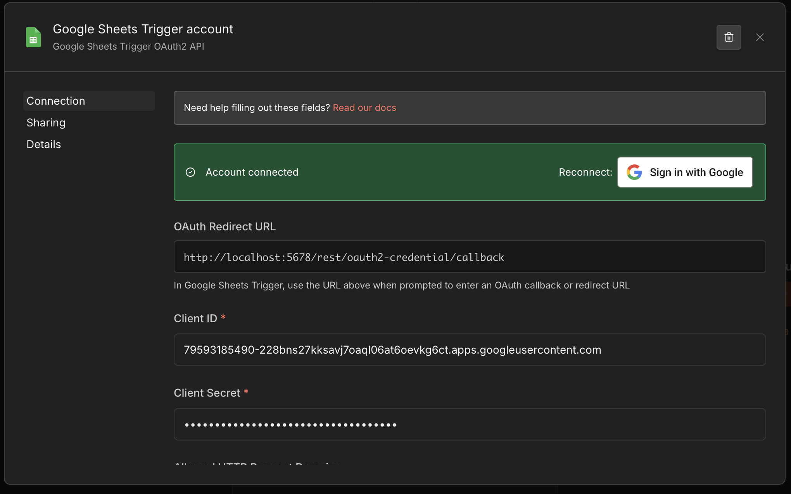
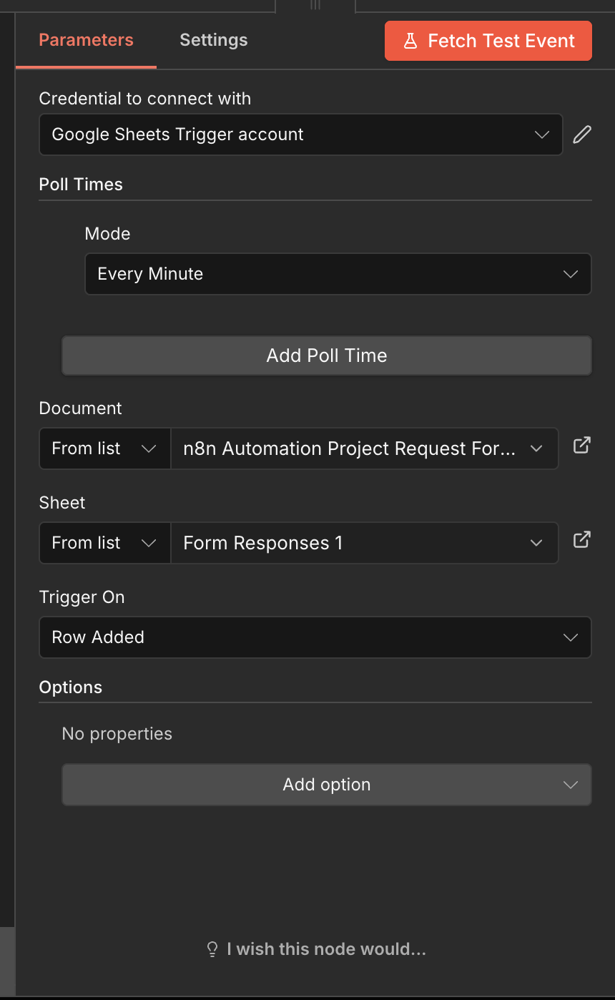
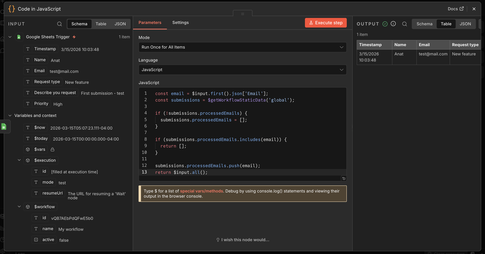
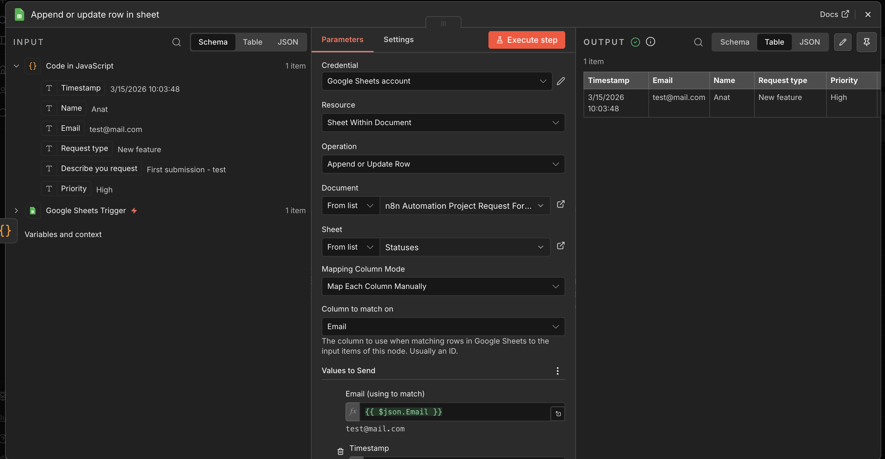
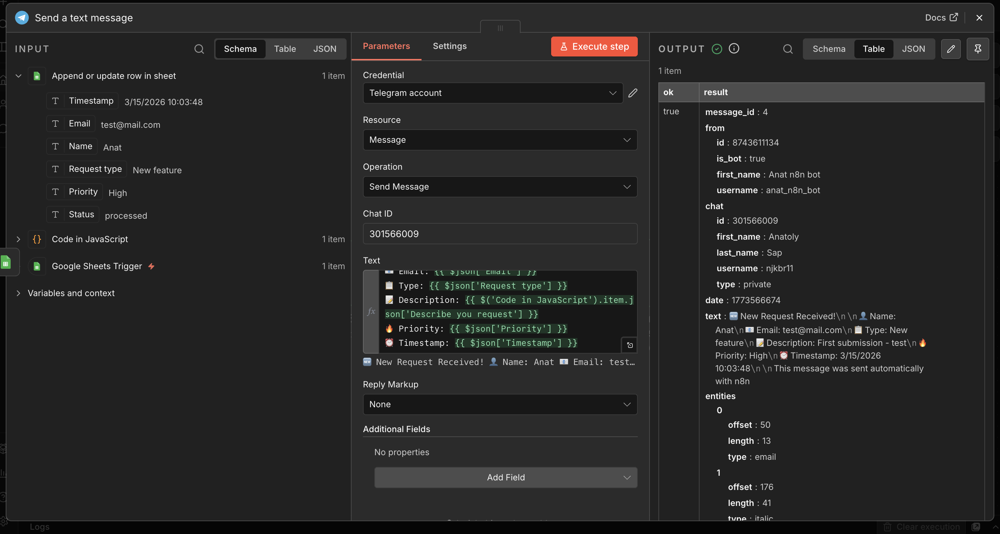
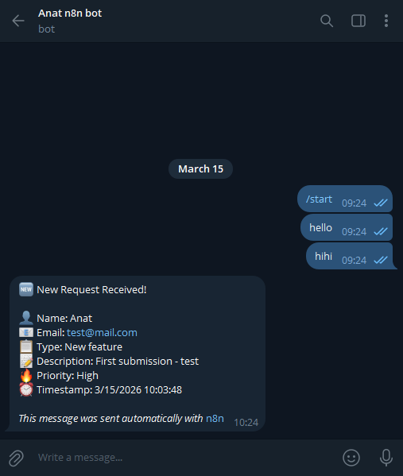

# N23 — Workflow Automation: Google Forms → n8n → Telegram

This homework demonstrates building an automated workflow using n8n that processes Google Form submissions and sends structured notifications to Telegram.
The setup includes a self-hosted n8n instance, Google Forms/Sheets integration, email deduplication, retry logic, and status tracking in a database.

---

## Environment Overview

* **Automation Tool:** n8n (self-hosted via Docker Compose)
* **Host:** macOS (Docker Desktop)
* **Trigger:** Google Sheets (connected to Google Form responses)
* **Notification:** Telegram Bot
* **Database:** Google Sheets ("Statuses" tab)

---

## Step 1: Deploying n8n with Docker Compose

n8n was deployed locally using Docker Compose as specified in the official n8n documentation.

**File: `n8n/docker-compose.yml`**
```yaml
version: '3.8'

services:
  n8n:
    image: n8nio/n8n
    restart: always
    ports:
      - "5678:5678"
    environment:
      - N8N_HOST=localhost
      - N8N_PORT=5678
      - N8N_PROTOCOL=http
      - WEBHOOK_URL=http://localhost:5678/
    volumes:
      - n8n_data:/home/node/.n8n

volumes:
  n8n_data:
```

**Start the container:**
```bash
docker compose up -d
```

n8n is then accessible at `http://localhost:5678`.

* `restart: always` — ensures n8n restarts automatically if the container crashes
* `n8n_data` volume — persists all workflows, credentials, and settings across container restarts

---

## Step 2: Creating the Telegram Bot

A Telegram bot was created via BotFather to receive automated notifications.

1. Opened Telegram and searched for `@BotFather`
2. Sent `/newbot` and followed the prompts to set a name and username
3. Received the **Bot Token** from BotFather
4. Started a chat with the bot and sent a message
5. Retrieved the **chat_id** by calling:

```
https://api.telegram.org/bot<TOKEN>/getUpdates
```

The `chat.id` field in the JSON response is used as the destination for all workflow notifications.

---

## Step 3: Creating the Google Form

A Google Form was created with the following fields:
* **Name** — short answer (required)
* **Email** — short answer (required)
* **Request type** — dropdown (Bug report, New feature, Support, Other)
* **Describe your request** — paragraph
* **Priority** — multiple choice (Low, Medium, High)

Form responses are automatically saved to a linked Google Spreadsheet, which serves as the workflow trigger source.

---

## Step 4: Connecting n8n to Google

Google OAuth credentials were configured in n8n to allow access to Google Sheets.

1. Created a Google Cloud project and enabled the Google Sheets API
2. Created OAuth 2.0 credentials (Client ID + Secret)
3. Added the n8n callback URL to the authorized redirect URIs
4. Connected the credentials in n8n under **Credentials → Google OAuth2**



---

## Step 5: Building the Workflow

The workflow consists of 4 nodes connected in sequence:

```
Google Sheets Trigger → Code in JavaScript → Append or Update Row → Send Telegram Message
```

### Node 1: Google Sheets Trigger

Monitors the Google Spreadsheet linked to the Google Form for new rows. Fires automatically whenever a form submission is received.

* **Event:** Row Added
* **Sheet:** Form responses sheet



### Node 2: Code in JavaScript (Deduplication)

Implements email-based deduplication using n8n's persistent workflow static data. If the same email submits the form more than once, the workflow stops and no duplicate Telegram message is sent.

```javascript
const email = $input.first().json['Email'];
const submissions = $getWorkflowStaticData('global');

if (!submissions.processedEmails) {
  submissions.processedEmails = [];
}

if (submissions.processedEmails.includes(email)) {
  return [];
}

submissions.processedEmails.push(email);
return $input.all();
```

* `$getWorkflowStaticData('global')` — retrieves persistent data that survives across workflow executions
* Returning `[]` — stops the workflow execution for duplicate emails
* `submissions.processedEmails.push(email)` — registers the email as processed for future checks



### Node 3: Append or Update Row in Sheet (Database)

Stores each processed submission in a dedicated "Statuses" Google Sheet tab, using Email as the unique key. If the same email appears again (bypassing the JS check), the existing row is updated rather than duplicated.

**Sheet:** `Statuses`
**Column to match on:** `Email`

**Values written:**
| Column | Value |
|---|---|
| Email | `{{ $json.Email }}` |
| Timestamp | `{{ $json.Timestamp }}` |
| Name | `{{ $json.Name }}` |
| Status | `processed` (fixed value) |
| Request type | `{{ $json['Request type'] }}` |
| Priority | `{{ $json.Priority }}` |

This sheet acts as the status database — every submission that passes deduplication is recorded here with its processing status.



### Node 4: Send a Text Message (Telegram)

Sends a structured notification to the Telegram bot with all submission details.

**Retry configuration (Settings tab):**
* **Retry On Fail:** Enabled
* **Tries:** 3
* **Wait between tries:** 5000ms

This ensures that temporary Telegram API failures do not result in lost notifications — n8n will automatically retry up to 3 times before marking the execution as failed.

**Message format:**
```
🆕 New Request Received!

👤 Name: {{ $json.Name }}
📧 Email: {{ $json.Email }}
📋 Type: {{ $json['Request type'] }}
📝 Description: {{ $json['Describe you request'] }}
🔥 Priority: {{ $json.Priority }}
⏰ Timestamp: {{ $json.Timestamp }}

This message was sent automatically with n8n
```



---

## Step 6: Verifying the Workflow

A test submission was made through the Google Form. The workflow triggered automatically and delivered the notification to Telegram with all fields correctly populated.



---

## Workflow Summary

| Requirement | Implementation |
|---|---|
| Trigger on form submission | Google Sheets Trigger node (rowAdded event) |
| Send Telegram notification | Telegram node with formatted message |
| Deduplication by email | JavaScript node with persistent static data |
| Retry on Telegram API failure | Retry On Fail (3 attempts, 5s interval) |
| Status storage in database | Google Sheets "Statuses" tab with Email as key |

---