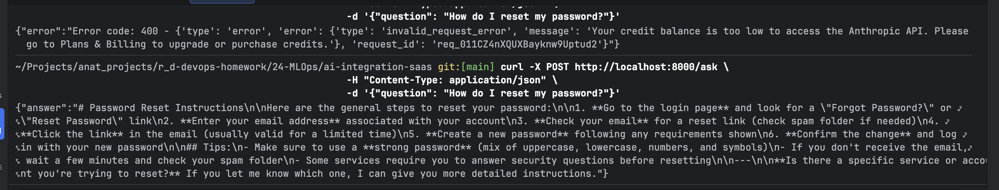
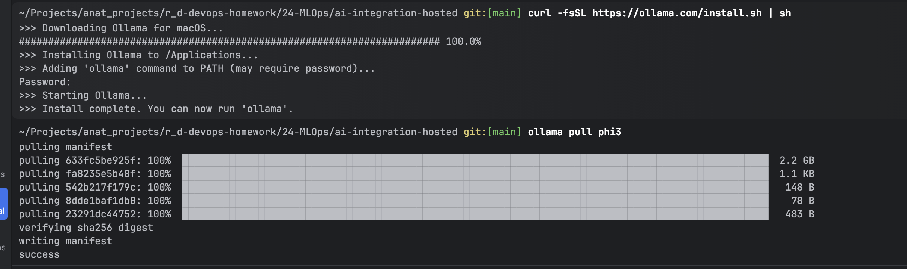
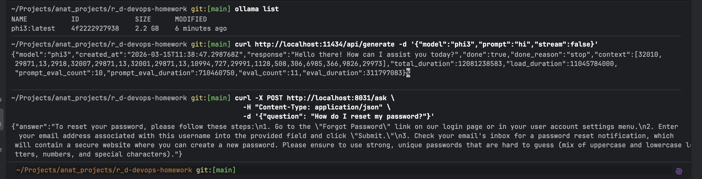

# N24 — AI Service for Customer Support: SaaS LLM vs Self-Hosted Model

This homework demonstrates building a simple AI-powered customer support service using two different architectures — a SaaS LLM API (Anthropic Claude) and a self-hosted model (Ollama + phi3) — both deployed in Docker containers and exposing identical REST API interfaces.

---

## Environment Overview

* **Host Machine:** macOS
* **Runtime:** Docker Desktop
* **SaaS Provider:** Anthropic Claude (claude-haiku-4-5)
* **Self-hosted Model:** Ollama with phi3 (2.2GB, CPU)
* **Framework:** Python + Flask
* **SaaS Service Port:** `8030`
* **Self-hosted Service Port:** `8031`

---

## Project Structure

```text
24-MLOps/
├── ai-integration-saas/
│   ├── app.py
│   ├── Dockerfile
│   ├── docker-compose.yml
│   ├── requirements.txt
│   ├── .env
│   └── .gitignore
├── ai-integration-hosted/
│   ├── app.py
│   ├── Dockerfile
│   ├── docker-compose.yml
│   └── requirements.txt
├── screenshots/
└── README.md
```

---

## API Interface

Both services expose the same endpoint interface:

**Request:**
```
POST /ask
Content-Type: application/json

{
  "question": "How do I reset my password?"
}
```

**Response:**
```json
{
  "answer": "To reset your password..."
}
```

**Health check:**
```
GET /health
```

---

## Part 1: SaaS LLM Integration (Anthropic Claude)

### How it works

The service receives a question via HTTP, forwards it to the Anthropic API using the official Python SDK, and returns the response. It includes retry logic with exponential backoff and request/response logging.

### File: `ai-integration-saas/app.py`

```python
import anthropic
import logging
import time
from flask import Flask, request, jsonify

logging.basicConfig(level=logging.INFO, format='%(asctime)s - %(levelname)s - %(message)s')
logger = logging.getLogger(__name__)

app = Flask(__name__)
client = anthropic.Anthropic()

SYSTEM_PROMPT = """You are a helpful customer support assistant. 
Answer questions clearly and concisely. 
If you don't know something, say so honestly."""

def ask_with_retry(question: str, max_retries: int = 3, timeout: int = 30) -> str:
    for attempt in range(max_retries):
        try:
            logger.info(f"Sending question to Claude (attempt {attempt + 1}): {question}")
            message = client.messages.create(
                model="claude-haiku-4-5-20251001",
                max_tokens=1024,
                timeout=timeout,
                system=SYSTEM_PROMPT,
                messages=[{"role": "user", "content": question}]
            )
            answer = message.content[0].text
            logger.info(f"Received answer: {answer[:100]}...")
            return answer
        except Exception as e:
            logger.warning(f"Attempt {attempt + 1} failed: {e}")
            if attempt < max_retries - 1:
                time.sleep(2 ** attempt)
            else:
                raise

@app.route('/ask', methods=['POST'])
def ask():
    data = request.get_json()
    if not data or 'question' not in data:
        return jsonify({"error": "Missing 'question' field"}), 400
    question = data['question']
    try:
        answer = ask_with_retry(question)
        return jsonify({"answer": answer})
    except Exception as e:
        logger.error(f"Failed to get answer: {e}")
        return jsonify({"error": str(e)}), 500

@app.route('/health', methods=['GET'])
def health():
    return jsonify({"status": "ok"})

if __name__ == '__main__':
    app.run(host='0.0.0.0', port=8030)
```

Key implementation details:
* `ask_with_retry()` retries up to 3 times with exponential backoff (1s, 2s, 4s) on failure
* `timeout=30` prevents hanging requests
* All requests and responses are logged with timestamps
* The system prompt sets the assistant's persona as a customer support agent

### File: `ai-integration-saas/requirements.txt`

```
flask==3.0.0
anthropic
```

### File: `ai-integration-saas/Dockerfile`

```dockerfile
FROM python:3.12-slim

WORKDIR /app

COPY requirements.txt .
RUN pip install --no-cache-dir -r requirements.txt

COPY app.py .

EXPOSE 8030

CMD ["python", "app.py"]
```

### File: `ai-integration-saas/docker-compose.yml`

```yaml
services:
  saas-llm:
    build: .
    ports:
      - "8030:8030"
    env_file:
      - .env
    restart: unless-stopped
```

The API key is loaded from `.env` via `env_file`.

### File: `ai-integration-saas/.env` (not committed)

```
ANTHROPIC_API_KEY=my_api_key
```

### File: `ai-integration-saas/.gitignore`

```
.env
```

### Deployment

```bash
cd ai-integration-saas
docker compose up --build
```

### Test

```bash
curl -X POST http://localhost:8030/ask \
  -H "Content-Type: application/json" \
  -d '{"question": "How do I reset my password?"}'
```



---

## Part 2: Self-Hosted Model (Ollama + phi3)

### How it works

Instead of calling an external API, the service sends requests to a locally running Ollama instance on the host machine. The Docker container reaches the host via `host.docker.internal`. The phi3 model runs entirely on CPU — no GPU or internet connection required after the initial model download.

### Installing Ollama and pulling the model

```bash
# Install Ollama on macOS
curl -fsSL https://ollama.com/install.sh | sh

# Pull the phi3 model (2.2GB)
ollama pull phi3
```



### File: `ai-integration-hosted/app.py`

```python
import requests
import logging
import time
from flask import Flask, request, jsonify

logging.basicConfig(level=logging.INFO, format='%(asctime)s - %(levelname)s - %(message)s')
logger = logging.getLogger(__name__)

app = Flask(__name__)

OLLAMA_URL = "http://host.docker.internal:11434/api/generate"
MODEL_NAME = "phi3"

SYSTEM_PROMPT = """You are a helpful customer support assistant.
Answer questions clearly and concisely.
If you don't know something, say so honestly."""

def ask_with_retry(question: str, max_retries: int = 3, timeout: int = 60) -> str:
    for attempt in range(max_retries):
        try:
            logger.info(f"Sending question to Ollama (attempt {attempt + 1}): {question}")
            response = requests.post(
                OLLAMA_URL,
                json={
                    "model": MODEL_NAME,
                    "prompt": f"{SYSTEM_PROMPT}\n\nUser: {question}\nAssistant:",
                    "stream": False
                },
                timeout=timeout
            )
            response.raise_for_status()
            answer = response.json()["response"]
            logger.info(f"Received answer: {answer[:100]}...")
            return answer
        except Exception as e:
            logger.warning(f"Attempt {attempt + 1} failed: {e}")
            if attempt < max_retries - 1:
                time.sleep(2 ** attempt)
            else:
                raise

@app.route('/ask', methods=['POST'])
def ask():
    data = request.get_json()
    if not data or 'question' not in data:
        return jsonify({"error": "Missing 'question' field"}), 400
    question = data['question']
    try:
        answer = ask_with_retry(question)
        return jsonify({"answer": answer})
    except Exception as e:
        logger.error(f"Failed to get answer: {e}")
        return jsonify({"error": str(e)}), 500

@app.route('/health', methods=['GET'])
def health():
    return jsonify({"status": "ok", "model": MODEL_NAME})

if __name__ == '__main__':
    app.run(host='0.0.0.0', port=8031)
```

Key differences from the SaaS version:
* Uses `requests` instead of the Anthropic SDK — communicates with Ollama's REST API
* `OLLAMA_URL` points to `host.docker.internal:11434` — the host machine's Ollama server
* Timeout is 60s instead of 30s — CPU inference is slower than a cloud API
* System prompt is manually prepended to the prompt string

### File: `ai-integration-hosted/requirements.txt`

```
flask==3.0.0
requests
```

### File: `ai-integration-hosted/Dockerfile`

```dockerfile
FROM python:3.12-slim

WORKDIR /app

COPY requirements.txt .
RUN pip install --no-cache-dir -r requirements.txt

COPY app.py .

EXPOSE 8031

CMD ["python", "app.py"]
```

### File: `ai-integration-hosted/docker-compose.yml`

```yaml
services:
  self-hosted-llm:
    build: .
    ports:
      - "8031:8031"
    extra_hosts:
      - "host.docker.internal:host-gateway"
    restart: unless-stopped
```

`extra_hosts` is required to allow the container to resolve `host.docker.internal` and reach Ollama running on the host machine.

### Deployment

```bash
cd ai-integration-hosted
docker compose up --build
```

### Test

```bash
curl -X POST http://localhost:8031/ask \
  -H "Content-Type: application/json" \
  -d '{"question": "How do I reset my password?"}'
```


