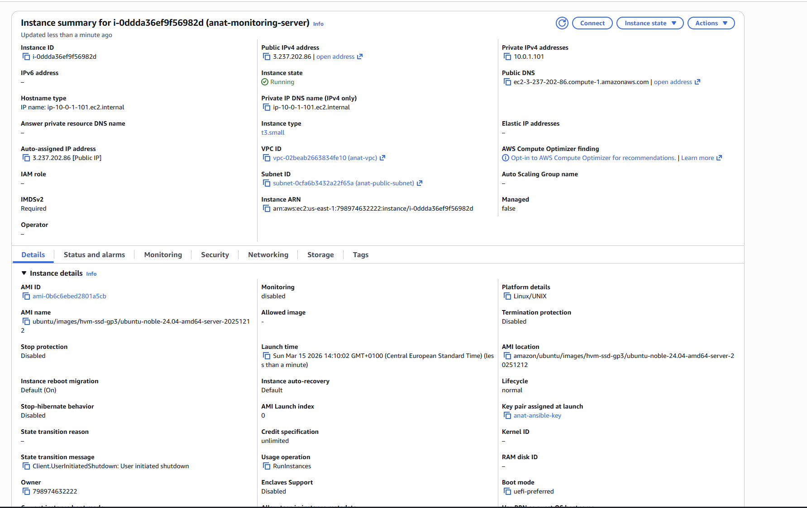
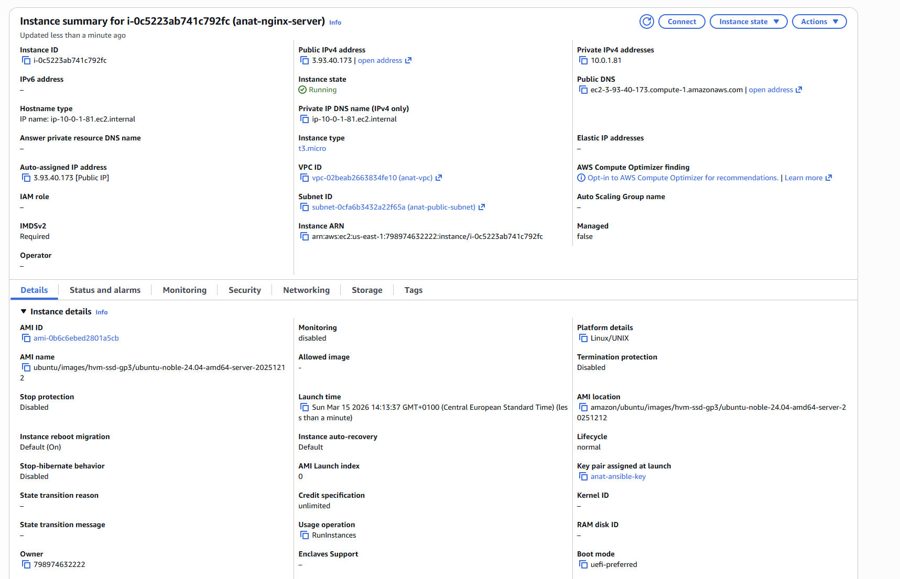
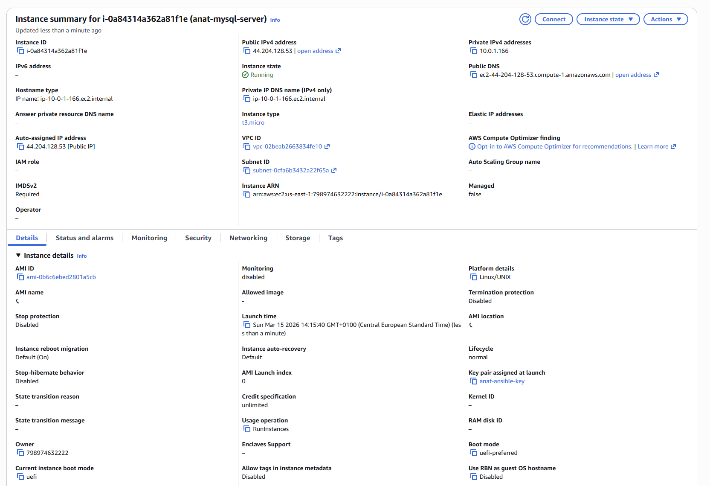
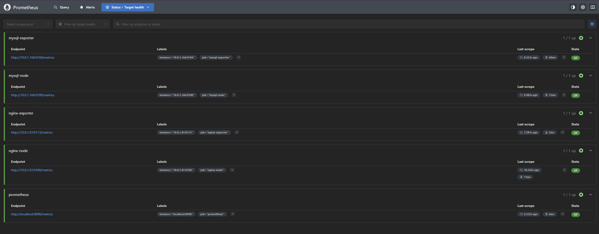
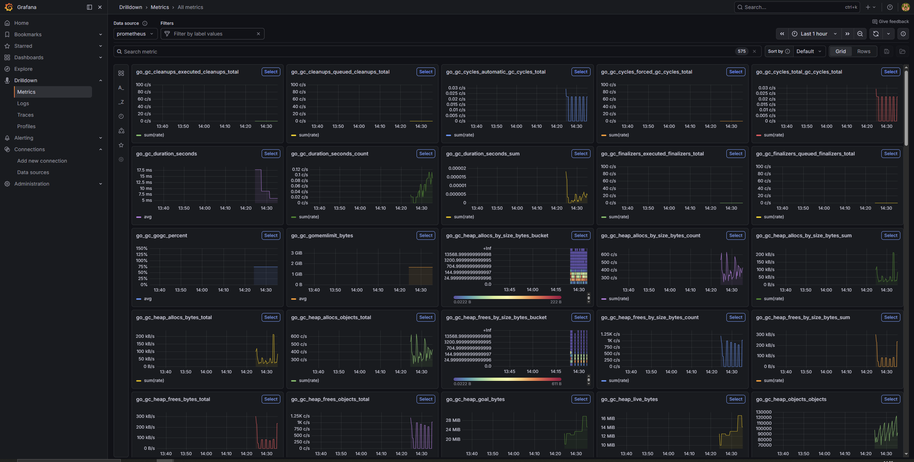
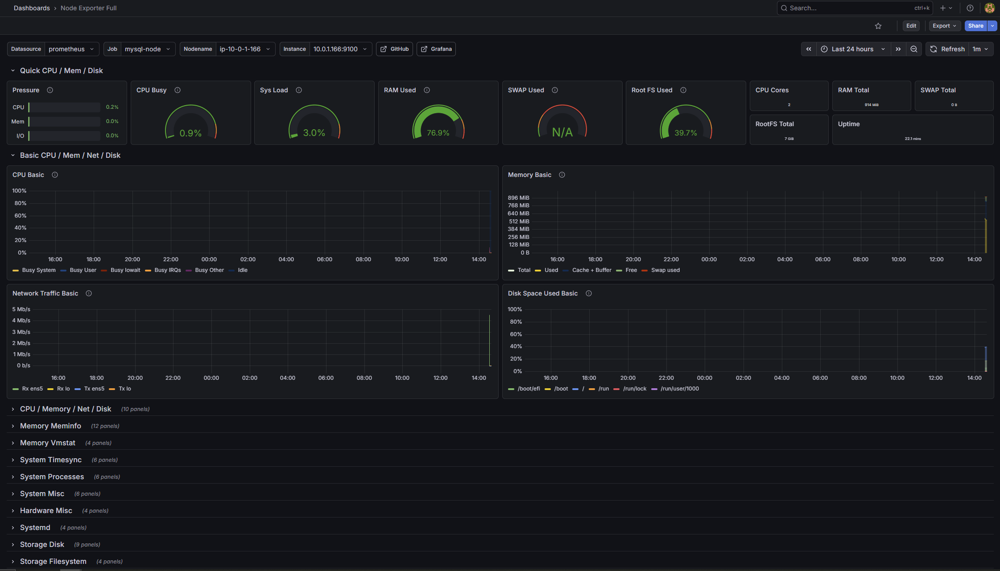
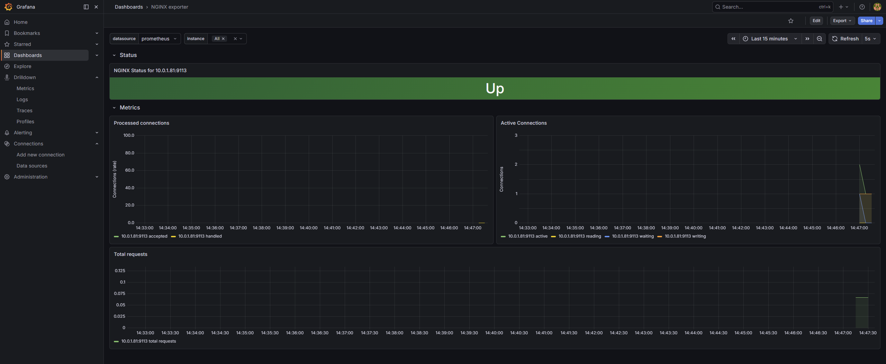
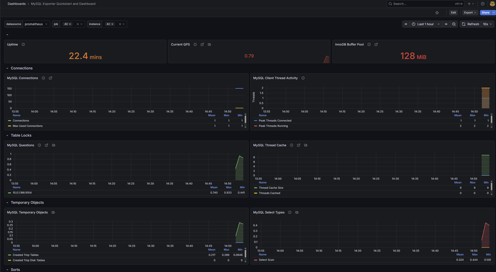
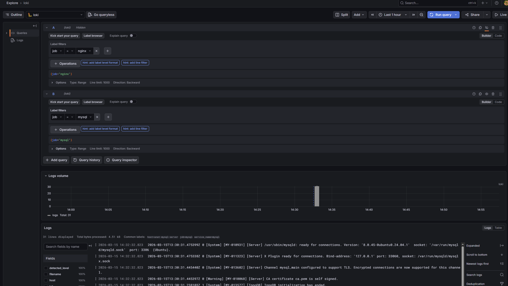

# N25 — Monitoring: Prometheus, Grafana, Loki, and Promtail

This homework demonstrates setting up a full observability stack for web and database servers using Prometheus for metrics collection, Grafana for visualization, and Loki with Promtail for log aggregation.
The setup monitors both an Nginx web server and a MySQL database server from a dedicated monitoring server, all deployed in the same AWS VPC.

---

## Environment Overview

* **Cloud Provider:** AWS
* **Region:** us-east-1 (N. Virginia)
* **VPC:** `anat-vpc`
* **Subnet:** `anat-public-subnet`

| Server | Instance Type | Public IP | Private IP | Role |
|---|---|---|---|---|
| `anat-monitoring-server` | t3.small | `3.237.202.86` | `10.0.1.101` | Prometheus + Grafana + Loki |
| `anat-nginx-server` | t3.micro | `3.93.40.173` | `10.0.1.81` | Nginx + Node Exporter + Promtail |
| `anat-mysql-server` | t3.micro | `44.204.128.53` | `10.0.1.166` | MySQL + Node Exporter + Promtail |

---

## Architecture Overview

```text
                        ┌─────────────────────────────┐
                        │     anat-monitoring-server  │
                        │                             │
                        │  Prometheus  :9090          │
                        │  Grafana     :3000          │
                        │  Loki        :3100          │
                        └────────────┬────────────────┘
                                     │
              ┌──────────────────────┼──────────────────────┐
              │                      │                      │
              ▼                      ▼                      ▼
   ┌──────────────────┐   ┌──────────────────┐   scrapes itself
   │ anat-nginx-server│   │ anat-mysql-server│
   │                  │   │                  │
   │ Nginx      :80   │   │ MySQL      :3306 │
   │ Node Exp.  :9100 │   │ Node Exp.  :9100 │
   │ Nginx Exp. :9113 │   │ MySQL Exp. :9104 │
   │ Promtail   :9080 │   │ Promtail   :9080 │
   └──────────────────┘   └──────────────────┘
```

---

## Project Structure

```text
25-Monitoring/
├── monitoring-server-settings/
│   ├── docker-compose.yml
│   └── config/
│       ├── prometheus.yml
│       └── loki-config.yml
└── screenshots/
```

---

## Step 1: Launching EC2 Instances

Three EC2 instances were launched in `anat-vpc`:

**Monitoring server** — t3.small, Ubuntu 24.04, with open ports:
* 22 (SSH), 9090 (Prometheus), 3000 (Grafana), 3100 (Loki)

**Nginx server** — t3.micro, Ubuntu 24.04, with open ports:
* 22 (SSH), 80 (HTTP), 9100 (Node Exporter), 9113 (Nginx Exporter)

**MySQL server** — t3.micro, Ubuntu 24.04, with open ports:
* 22 (SSH), 3306 (MySQL), 9100 (Node Exporter), 9104 (MySQL Exporter)

t3.small was used for the monitoring server because it runs multiple Docker containers simultaneously — t3.micro would cause memory pressure.







---

## Step 2: Setting Up the Monitoring Server

Docker and Docker Compose were installed on the monitoring server:

```bash
sudo apt update
sudo apt install -y docker.io docker-compose
sudo usermod -aG docker $USER
newgrp docker
```

The monitoring stack directory was created:

```bash
mkdir -p ~/monitoring/config
cd ~/monitoring
```

**File: `monitoring/docker-compose.yml`**
```yaml
version: '3.8'

services:
  prometheus:
    image: prom/prometheus:latest
    container_name: prometheus
    restart: always
    ports:
      - "9090:9090"
    volumes:
      - ./config/prometheus.yml:/etc/prometheus/prometheus.yml
      - prometheus_data:/prometheus
    command:
      - '--config.file=/etc/prometheus/prometheus.yml'

  grafana:
    image: grafana/grafana:latest
    container_name: grafana
    restart: always
    ports:
      - "3000:3000"
    environment:
      - GF_SECURITY_ADMIN_PASSWORD=admin123
    volumes:
      - grafana_data:/var/lib/grafana

  loki:
    image: grafana/loki:latest
    container_name: loki
    restart: always
    ports:
      - "3100:3100"
    volumes:
      - ./config/loki-config.yml:/etc/loki/local-config.yaml
      - loki_data:/loki

volumes:
  prometheus_data:
  grafana_data:
  loki_data:
```

**File: `monitoring/config/prometheus.yml`**
```yaml
global:
  scrape_interval: 15s
  evaluation_interval: 15s

scrape_configs:
  - job_name: 'prometheus'
    static_configs:
      - targets: ['localhost:9090']

  - job_name: 'nginx-node'
    static_configs:
      - targets: ['10.0.1.81:9100']

  - job_name: 'mysql-node'
    static_configs:
      - targets: ['10.0.1.166:9100']

  - job_name: 'nginx-exporter'
    static_configs:
      - targets: ['10.0.1.81:9113']

  - job_name: 'mysql-exporter'
    static_configs:
      - targets: ['10.0.1.166:9104']
```

**File: `monitoring/config/loki-config.yml`**
```yaml
auth_enabled: false

server:
  http_listen_port: 3100
  grpc_listen_port: 9096

common:
  instance_addr: 127.0.0.1
  path_prefix: /loki
  storage:
    filesystem:
      chunks_directory: /loki/chunks
      rules_directory: /loki/rules
  replication_factor: 1
  ring:
    kvstore:
      store: inmemory

schema_config:
  configs:
    - from: 2020-10-24
      store: tsdb
      object_store: filesystem
      schema: v13
      index:
        prefix: index_
        period: 24h

ruler:
  alertmanager_url: http://localhost:9093
```

The stack was started with:

```bash
docker-compose up -d
docker-compose ps
```

All three services — Prometheus, Grafana, and Loki — came up successfully.

---

## Step 3: Setting Up the Nginx Server

Nginx, Node Exporter, Nginx Prometheus Exporter, and Promtail were installed on `anat-nginx-server`.

**Install Nginx:**
```bash
sudo apt update
sudo apt install -y nginx
```

**Enable Nginx stub_status** (required for the Nginx exporter to collect HTTP metrics):
```bash
sudo nano /etc/nginx/sites-enabled/default
# Add inside server {} block:
# location /stub_status {
#     stub_status on;
#     allow 127.0.0.1;
#     deny all;
# }
sudo nginx -t
sudo systemctl reload nginx
```

**Install Node Exporter** (collects system metrics: CPU, RAM, Disk, Network):
```bash
wget https://github.com/prometheus/node_exporter/releases/download/v1.8.0/node_exporter-1.8.0.linux-amd64.tar.gz
tar xvf node_exporter-1.8.0.linux-amd64.tar.gz
sudo mv node_exporter-1.8.0.linux-amd64/node_exporter /usr/local/bin/
```

Node Exporter was registered as a systemd service and started:
```bash
sudo systemctl enable node_exporter
sudo systemctl start node_exporter
```

**Install Nginx Prometheus Exporter** (collects Nginx-specific metrics via stub_status):
```bash
wget https://github.com/nginxinc/nginx-prometheus-exporter/releases/download/v1.1.0/nginx-prometheus-exporter_1.1.0_linux_amd64.tar.gz
tar xvf nginx-prometheus-exporter_1.1.0_linux_amd64.tar.gz
sudo mv nginx-prometheus-exporter /usr/local/bin/
```

Registered as a systemd service with:
```
ExecStart=/usr/local/bin/nginx-prometheus-exporter -nginx.scrape-uri=http://127.0.0.1/stub_status
```

**Install Promtail** (ships Nginx logs to Loki):
```bash
wget https://github.com/grafana/loki/releases/download/v2.9.0/promtail-linux-amd64.zip
unzip promtail-linux-amd64.zip
sudo mv promtail-linux-amd64 /usr/local/bin/promtail
```

**File: `/etc/promtail/config.yml` (Nginx server)**
```yaml
server:
  http_listen_port: 9080
  grpc_listen_port: 0

positions:
  filename: /tmp/positions.yaml

clients:
  - url: http://10.0.1.101:3100/loki/api/v1/push

scrape_configs:
  - job_name: nginx-logs
    static_configs:
      - targets:
          - localhost
        labels:
          job: nginx
          host: anat-nginx-server
          __path__: /var/log/nginx/*.log
```

---

## Step 4: Setting Up the MySQL Server

MySQL, Node Exporter, MySQL Exporter, and Promtail were installed on `anat-mysql-server`.

**Install MySQL:**
```bash
sudo apt update
sudo apt install -y mysql-server
sudo systemctl enable mysql
sudo systemctl start mysql
```

**Create MySQL exporter user:**
```sql
CREATE USER 'exporter'@'localhost' IDENTIFIED BY 'exporterpass123';
GRANT PROCESS, REPLICATION CLIENT, SELECT ON *.* TO 'exporter'@'localhost';
FLUSH PRIVILEGES;
```

**Install mysqld_exporter** (collects MySQL-specific metrics):
```bash
wget https://github.com/prometheus/mysqld_exporter/releases/download/v0.15.1/mysqld_exporter-0.15.1.linux-amd64.tar.gz
tar xvf mysqld_exporter-0.15.1.linux-amd64.tar.gz
sudo mv mysqld_exporter-0.15.1.linux-amd64/mysqld_exporter /usr/local/bin/
```

MySQL credentials were stored in `/etc/.mysqld_exporter.cnf` and the exporter was registered as a systemd service.

Node Exporter and Promtail were installed identically to the Nginx server, with Promtail configured to collect from `/var/log/mysql/*.log` with `job=mysql` label.

---

## Step 5: Verifying Prometheus Targets

All 5 scrape targets were verified in the Prometheus targets page at `http://3.237.202.86:9090/targets`:

| Job | Endpoint | State |
|---|---|---|
| `prometheus` | `localhost:9090` | ✅ UP |
| `nginx-node` | `10.0.1.81:9100` | ✅ UP |
| `nginx-exporter` | `10.0.1.81:9113` | ✅ UP |
| `mysql-node` | `10.0.1.166:9100` | ✅ UP |
| `mysql-exporter` | `10.0.1.166:9104` | ✅ UP |



---

## Step 6: Configuring Grafana

Grafana was accessed at `http://3.237.202.86:3000` with credentials `admin/admin123`.

Two data sources were added:
* **Prometheus:** `http://prometheus:9090`
* **Loki:** `http://loki:3100`

Internal Docker service names are used instead of IPs because all services run in the same Docker Compose network.



---

## Step 7: Importing Dashboards

**Node Exporter Full (ID: 1860)** — shows CPU, RAM, Disk, and Network metrics for both servers. The Job dropdown allows switching between `nginx-node` and `mysql-node`.



**Nginx Exporter Dashboard (ID: 12708)** — shows Nginx-specific metrics including active connections, processed connections, and total requests. Requires the Nginx stub_status module and nginx-prometheus-exporter.



**MySQL Exporter Dashboard (ID: 14057)** — shows MySQL-specific metrics including uptime, QPS, InnoDB buffer pool, connections, and thread activity.



**Loki Log Explorer** — logs from both servers are queryable in Grafana Explore using LogQL:
* Nginx logs: `{job="nginx"}`
* MySQL logs: `{job="mysql"}`



---

## Issues Encountered and Solutions

### Loki config incompatible with latest version
* The legacy `boltdb-shipper` config format is no longer supported in recent Loki versions
* Fields like `shared_store`, `enforce_metric_name`, and `max_look_back_period` were removed
* Solution: rewrote the config using the modern `common` block with `tsdb` store and `v13` schema

### Nginx dashboard showing no data
* Dashboard ID 12708 requires the `nginx-prometheus-exporter` — Node Exporter alone does not collect Nginx-specific metrics
* Solution: enabled `stub_status` in Nginx config and installed `nginx-prometheus-exporter` as a separate service

### MySQL dashboard showing no data
* Dashboard ID 7362 queries metrics with a different job label than what we configured
* Solution: switched to dashboard ID 14057 which auto-discovers the correct job label

### nginx-exporter target DOWN in Prometheus
* Port 9113 was not open in the Nginx server security group
* Solution: added inbound rule for TCP 9113 from monitoring server private IP (`10.0.1.101/32`)