# Trainings Tracker — DevOps Final Project

> Go REST API · AWS · Terraform · Ansible · GitHub Actions · Docker · Prometheus · Grafana · Loki

## Architecture

[](https://lucid.app/lucidchart/765a6940-90fa-40e6-870d-b193ba11bf11/edit?viewport_loc=27%2C-1717%2C2459%2C1419%2C0_0&invitationId=inv_16311c6f-78d0-4e35-9594-e727170b81ff)

> Click the diagram to open the interactive version in Lucidchart.

---

## Table of Contents

- [Project Overview](#project-overview)
- [Repositories](#repositories)
- [Infrastructure](#infrastructure)
- [CI/CD](#cicd)
- [Monitoring](#monitoring)
- [App Demo](#app-demo)
- [How to Run From Scratch](#how-to-run-from-scratch)

---

## Project Overview

Trainings Tracker is a fitness tracking platform with a Go REST API backend and a React Native mobile frontend. This repo documents the full DevOps setup: infrastructure provisioning, configuration management, CI/CD pipelines, and monitoring.

**Tech stack:**

| Layer | Technology |
|---|---|
| Cloud | AWS (eu-north-1) |
| IaC | Terraform |
| Config management | Ansible |
| CI/CD | GitHub Actions |
| Artifact registry | Amazon ECR |
| App runtime | Docker on EC2 |
| Database | Amazon RDS MySQL |
| Monitoring | Prometheus + Grafana + Loki |
| Log shipping | Promtail |

---

## Repositories

| Repo | Description |
|---|---|
| `trainings-tracker` | Go backend + React Native mobile app + GitHub Actions workflows |
| `trainings-tracker-infra` | Terraform + Ansible for all infrastructure |

---

## Infrastructure

### Terraform

All AWS infrastructure is defined as code in [`infra/terraform/`](infra/terraform/).

| File | Description |
|---|---|
| [`main.tf`](infra/terraform/main.tf) | Provider config, Terraform version requirement, S3 remote backend with native state locking |
| [`variables.tf`](infra/terraform/variables.tf) | Input variable definitions — region, project name, owner prefix, DB credentials, key pair name, your IP |
| [`networking.tf`](infra/terraform/networking.tf) | VPC, public/private subnets across 2 AZs, Internet Gateway, route tables, ALB, target group, listener, Elastic IP for monitoring |
| [`ec2.tf`](infra/terraform/ec2.tf) | App and monitoring EC2 instances, AMI data sources (Amazon Linux 2023 + Ubuntu 24.04), IAM role with ECR read access |
| [`rds.tf`](infra/terraform/rds.tf) | RDS MySQL instance in private subnets, subnet group spanning 2 AZs |
| [`security_groups.tf`](infra/terraform/security_groups.tf) | Security groups for ALB (port 80 public), app EC2 (SSH, port 3000 from ALB only, Node Exporter from monitoring only), monitoring EC2 (SSH, Grafana, Prometheus from your IP, Loki from app only), RDS (port 3306 from app only) |
| [`outputs.tf`](infra/terraform/outputs.tf) | Prints app URL, Grafana URL, EC2 IPs, RDS endpoint after apply |
| [`terraform.tfvars.example`](infra/terraform/terraform.tfvars.example) | Example values file — copy to `terraform.tfvars` and fill in before running |

**VPC layout:**

| Subnet | CIDR | AZ | Contents |
|---|---|---|---|
| public-a | 10.2.1.0/24 | eu-north-1a | App EC2, ALB |
| public-b | 10.2.2.0/24 | eu-north-1b | Monitoring EC2 |
| private-a | 10.2.3.0/24 | eu-north-1a | RDS MySQL |
| private-b | 10.2.4.0/24 | eu-north-1b | RDS standby subnet |

**EC2 instances:**

| Name | Type | OS | Role |
|---|---|---|---|
| anat-trainings-tracker-app | t3.small | Amazon Linux 2023 | Backend API |
| anat-trainings-tracker-monitoring | t3.small | Ubuntu 24.04 | Prometheus, Grafana, Loki |

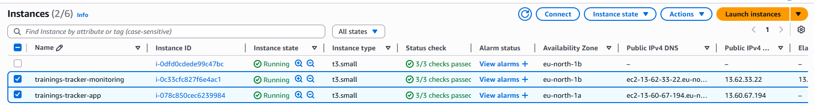

**Other resources:**
- ALB `trainings-tracker-alb` — HTTP:80 → EC2:3000
- RDS MySQL `trainings-tracker-mysql` — db.t3.micro, private subnet
- Elastic IP on monitoring EC2 — stable Grafana URL
- S3 `trainings-tracker-tf-state` — Terraform remote state
- ECR `trainings-tracker/backend` — Docker image registry

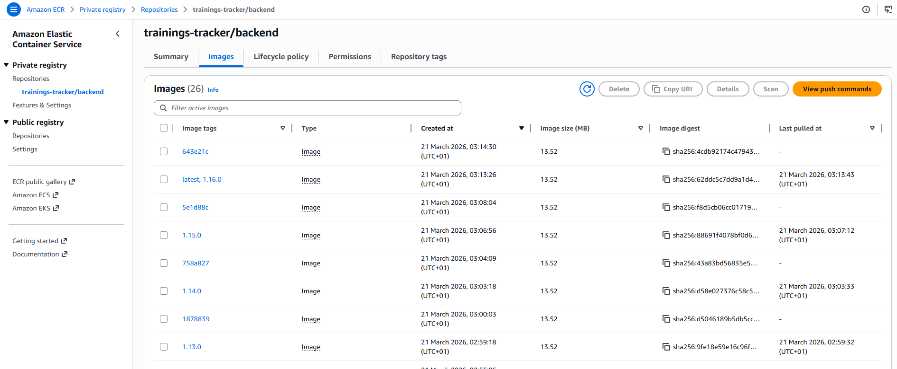

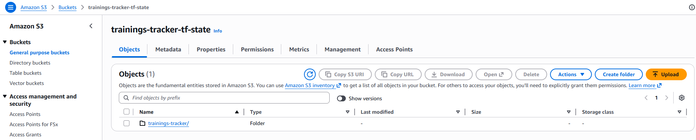

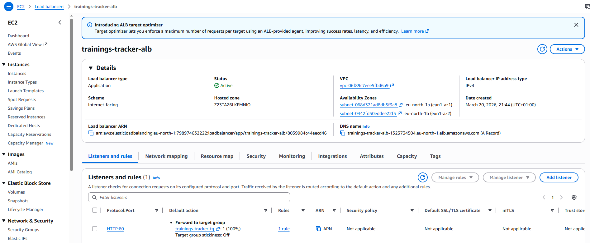

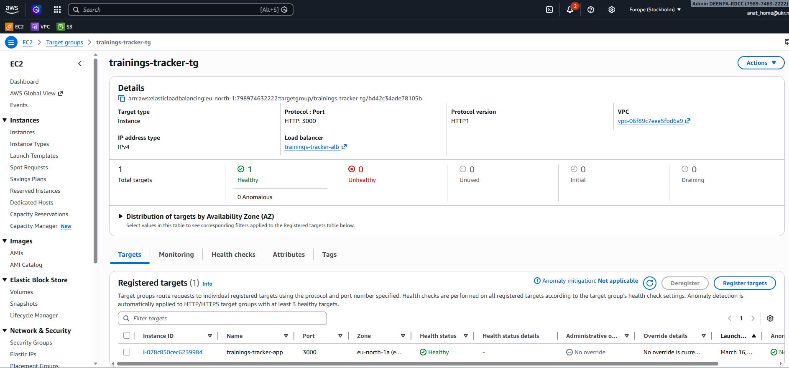

<details>
<summary>📝 Note to myself: Terraform setup and commands</summary>

### First time setup (bootstrap)

Before running Terraform for the first time, run the bootstrap script once to create the S3 bucket and ECR repo:

```bash
bash scripts/bootstrap.sh
```

This creates:
- S3 bucket `trainings-tracker-tf-state` for Terraform remote state
- ECR repository `trainings-tracker/backend` for Docker images

These are created manually because Terraform can't store its own state before the bucket exists (chicken-and-egg), and ECR shouldn't be destroyed by `terraform destroy`.

### Terraform commands (run from `terraform/` directory)

```bash
# First time or after backend config changes
terraform init

# Format code
terraform fmt

# Validate syntax
terraform validate

# Preview changes
terraform plan

# Apply (creates/updates resources)
terraform apply

# Destroy everything
terraform destroy
```

### Remote state locking

Uses native S3 locking (`use_lockfile = true`) introduced in Terraform 1.10. No DynamoDB table needed. The lock file is stored alongside the state in S3.

### After terraform apply

Copy the outputs — you'll need them for Ansible vars and GitHub secrets:
- `app_instance_public_ip` → GitHub secret `EC2_HOST`
- `app_url` → GitHub secret `ALB_DNS` (strip the `http://`)
- `rds_endpoint` → GitHub secret `DB_HOST` and Ansible `vars.yml`
- `monitoring_instance_private_ip` → Ansible `vars.yml` `monitoring_private_ip`
- `app_instance_private_ip` → Ansible `vars.yml` `app_private_ip`
- `grafana_url` → bookmark for Grafana access

### Key design decisions

- App EC2 has an IAM role with `AmazonEC2ContainerRegistryReadOnly` — no stored AWS credentials needed to pull Docker images
- RDS is in private subnets — not reachable from the internet, only from the app EC2 via security group rule
- ALB spans both public subnets (required by AWS) — stable DNS entry point for the API
- Monitoring EC2 has an Elastic IP — Grafana URL stays stable across restarts

</details>

---

### Ansible

Ansible configures both EC2 instances after Terraform provisions them. Uses dynamic inventory via `amazon.aws.aws_ec2` plugin — automatically discovers instances by the `Project: trainings-tracker` tag.

All playbooks and roles live in [`infra/ansible/`](infra/ansible/).

| File / Directory | Description |
|---|---|
| [`site.yml`](infra/ansible/site.yml) | Main entry point — runs all roles against both EC2s in order |
| [`main.yml`](infra/ansible/main.yml) | Docker installation tasks (used by the docker role) |
| [`ansible.cfg`](infra/ansible/ansible.cfg) | Ansible config — sets inventory path, SSH key path, disables host key checking |
| [`inventory/aws_ec2.yml`](infra/ansible/inventory/aws_ec2.yml) | Dynamic inventory config — discovers EC2s by `Project: trainings-tracker` tag, sets correct SSH user per instance (ec2-user vs ubuntu) |
| [`group_vars/all/vars.yml`](infra/ansible/group_vars/all/vars.yml) | Non-secret variables — AWS region, ECR registry URL, app port, DB connection details, monitoring/app private IPs |
| [`group_vars/all/vault.yml`](infra/ansible/group_vars/all/vault.yml) | Ansible Vault encrypted secrets — DB password, JWT secret |
| [`roles/docker/`](infra/ansible/roles/docker/) | Installs Docker and docker-compose on the app EC2 |
| [`roles/node_exporter/`](infra/ansible/roles/node_exporter/) | Downloads and installs Node Exporter as a systemd service — exposes VM metrics on `:9100` |
| [`roles/promtail/`](infra/ansible/roles/promtail/) | Downloads and installs Promtail as a systemd service — ships Docker container logs to Loki |
| [`roles/app/`](infra/ansible/roles/app/) | Logs into ECR, deploys docker-compose with the backend container, passes DB and JWT secrets as env vars |
| [`roles/monitoring/`](infra/ansible/roles/monitoring/) | Deploys Prometheus, Grafana and Loki via Docker Compose on the monitoring EC2, writes prometheus.yml and loki-config.yml from templates |

```bash
# Run from ansible/ directory
ansible-playbook site.yml --ask-vault-pass
```

<details>
<summary>📝 Note to myself: Ansible setup</summary>

### Prerequisites

```bash
pip install boto3 botocore ansible
ansible-galaxy collection install amazon.aws
```

### SSH key

The key pair `anat-trainings-tracker-key.pem` must exist at `~/.ssh/anat-trainings-tracker-key.pem` with correct permissions:

```bash
chmod 400 ~/.ssh/anat-trainings-tracker-key.pem
```

On Windows use icacls:
```
icacls anat-trainings-tracker-key.pem /inheritance:r /grant:r "%USERNAME%:R"
```

### Dynamic inventory

The inventory plugin auto-discovers EC2 instances tagged with `Project: trainings-tracker`. It sets the correct SSH user per instance:
- `ec2-user` for Amazon Linux (app EC2)
- `ubuntu` for Ubuntu (monitoring EC2)

To test the inventory:
```bash
ansible-inventory --list
```

### Vault

Secrets (`db_password`, `jwt_secret`) are stored in `group_vars/all/vault.yml` encrypted with Ansible Vault.

To edit:
```bash
ansible-vault edit group_vars/all/vault.yml
```

To run playbook with vault:
```bash
ansible-playbook site.yml --ask-vault-pass
```

### Vars that need updating after terraform apply

In `group_vars/all/vars.yml`:
- `db_host` — RDS endpoint from Terraform output
- `monitoring_private_ip` — from Terraform output
- `app_private_ip` — from Terraform output

</details>

---

## CI/CD

Two GitHub Actions workflows handle the full delivery pipeline, both located in [`be-git/.github/workflows/`](be-git/.github/workflows/).

### Flow

```
Push to any branch
        │
        ▼
Open PR → r_d_final_project_prod
        │
        ▼ pr.yml triggers automatically
  lint + test + build
  push image to ECR tagged :commit-hash
        │
        ▼
Click Merge (direct push to prod branch is blocked)
        │
        ▼ main.yml triggers automatically
  bump minor version via semver.py
  commit VERSION file + create Git tag
  build + push to ECR :version + :latest
        │
        ▼
Manual approval gate (GitHub environment: production)
        │
        ▼
SSH to EC2 → stop old container → pull new image → run app
        │
        ▼
Print app URL to job summary
```

> Direct push to `r_d_final_project_prod` is blocked at the repository level — all changes must go through a PR.

### [`pr.yml`](be-git/.github/workflows/pr.yml) — PR pipeline

Triggers on every pull request targeting `r_d_final_project_prod`. Acts as a quality gate before merging.

Does not react to **.md files changes.

| Step | What it does |
|---|---|
| Checkout | Fetches the branch code |
| Set up Go | Installs Go 1.21 with dependency caching |
| Run golangci-lint | Static analysis — catches unused variables, deprecated APIs, unchecked errors. Config in `backend/.golangci.yml` |
| Run tests | Runs `go test ./...` — all unit tests must pass |
| Build binary | Compiles the Go binary for Linux to verify there are no build errors |
| Configure AWS credentials | Authenticates to AWS using `AWS_ACCESS_KEY_ID` and `AWS_SECRET_ACCESS_KEY` secrets |
| Login to ECR | Gets a temporary ECR auth token |
| Build and push Docker image | Builds the image from `backend/Dockerfile` and pushes to ECR tagged with the short commit hash (e.g. `:a1b2c3d`) |

### [`main.yml`](be-git/.github/workflows/main.yml) — Main pipeline

Triggers on every push/merge to `r_d_final_project_prod`. Runs the full release and deployment.

| Step | What it does |
|---|---|
| Checkout | Full clone with all tags (`fetch-depth: 0`) — needed to read full Git history for tagging |
| Set up Python | Installs Python 3.11 for the semver script |
| Bump version | Runs [`scripts/semver.py`](be-git/scripts/semver.py) — reads `VERSION` file, increments minor version (e.g. `1.5.0` → `1.6.0`), writes it back |
| Commit and tag | Commits the updated `VERSION` file back to the branch as `ci: bump version to v1.6.0`, creates a Git tag `v1.6.0`, pushes both |
| Configure AWS credentials | Authenticates to AWS |
| Login to ECR | Gets a temporary ECR auth token |
| Build and push Docker image | Builds the image and pushes two tags: the version number (`:1.6.0`) and `:latest` |
| Deploy to EC2 *(manual approval)* | Waits for a reviewer to approve in GitHub Actions UI, then SSHs into the app EC2 and runs the deployment script |
| Print app URL | Writes the app URL and version to the GitHub Actions job summary |

**The deployment script (runs on EC2 via SSH):**
```bash
# Re-authenticate Docker with ECR (token expires after 12h)
aws ecr get-login-password | docker login ...

# Pull the specific versioned image
docker pull <ecr>/<repo>:1.6.0

# Remove old container (|| true so it doesn't fail if none exists)
docker stop trainings-tracker-api || true
docker rm trainings-tracker-api || true

# Start new container with all env vars injected
docker run -d --name trainings-tracker-api ...

# Verify it started
docker ps | grep trainings-tracker-api
```

### Image tagging strategy

Every Docker image pushed to ECR is tagged in a way that makes it traceable back to the exact code that built it:

| Event | Tag | Example | Purpose |
|---|---|---|---|
| PR opened/updated | Short commit hash | `:a1b2c3d` | Snapshot of the PR — testable, throwaway |
| Merge to prod | Semver version | `:1.6.0` | Immutable release — what gets deployed |
| Merge to prod | Latest | `:latest` | Always points to the most recent release |

The version is managed by [`scripts/semver.py`](be-git/scripts/semver.py) — it reads the `VERSION` file and bumps the minor version on every merge. The pipeline tags the image with that version before pushing and creates a matching Git tag so every image can be traced back to an exact commit.

**Current downtime during deployment: ~30-60 seconds** (time between `docker stop` and new container being ready). This is acceptable for a course project. In production, blue-green deployment via the ALB would bring this to zero — start the new container, wait for the health check to pass, switch the ALB target, then stop the old one. Since the app is stateless (JWT auth, all data in RDS), users would not lose any sessions during the switch.

### PR pipeline

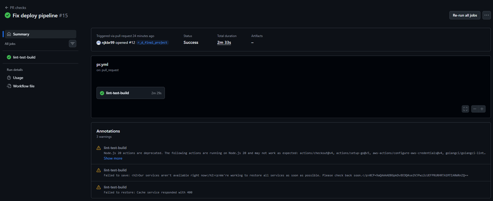

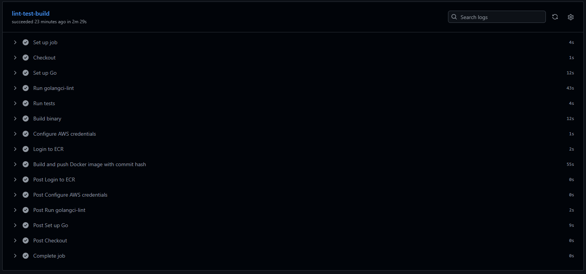

### Main pipeline

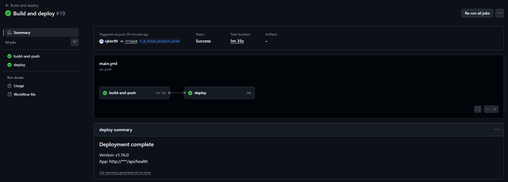

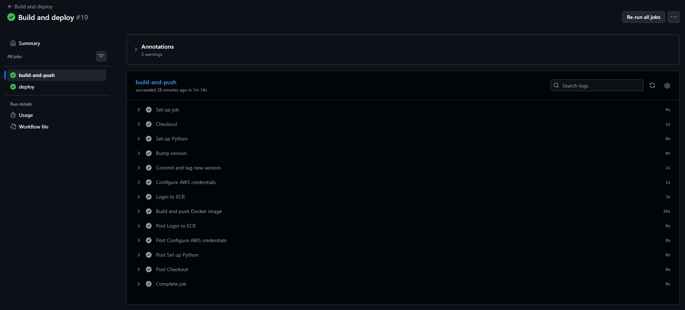

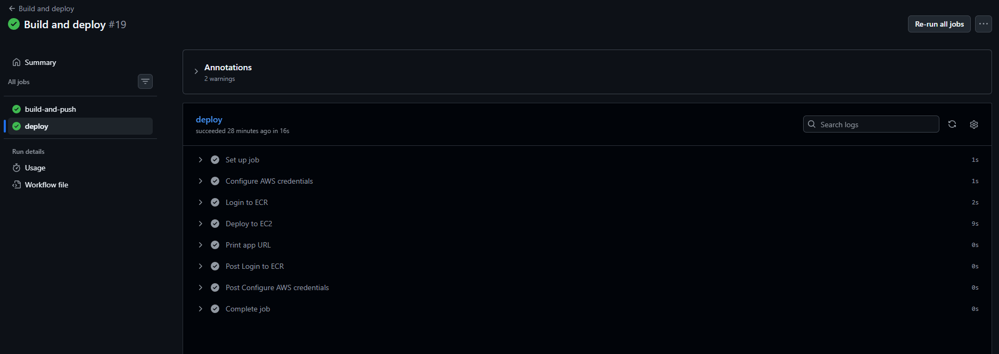

<details>
<summary>📝 Note to myself: GitHub Actions setup</summary>

### Required GitHub secrets

| Secret | Value |
|---|---|
| `AWS_ACCESS_KEY_ID` | IAM user access key |
| `AWS_SECRET_ACCESS_KEY` | IAM user secret key |
| `EC2_HOST` | App EC2 public IP (from Terraform output) |
| `EC2_SSH_KEY` | Full contents of `anat-trainings-tracker-key.pem` |
| `DB_HOST` | RDS endpoint (from Terraform output) |
| `DB_USER` | RDS username |
| `DB_PASSWORD` | RDS password |
| `JWT_SECRET` | JWT signing secret |
| `ALB_DNS` | ALB DNS name without `http://` (from Terraform output `app_url`) |

### Branch protection

In GitHub repo settings → Branches → Add rule for `r_d_final_project_prod`:
- ✅ Require a pull request before merging
- ✅ Require status checks to pass → select `lint-test-build`

### Manual approval gate

The `deploy` job uses `environment: production`. Set this up in GitHub repo settings → Environments → production → add yourself as a required reviewer. The pipeline pauses after build and waits for approval before deploying.

### Passing variables into appleboy/ssh-action

The deploy step uses `appleboy/ssh-action` with `allenvs: true`. This is the only reliable way to pass GitHub Actions env vars (especially `needs` outputs like `VERSION`) into the remote SSH script. Without `allenvs: true`, variables like `$VERSION` and `$ECR_REGISTRY` are empty on the remote side and the docker run command breaks.

### Why not Jenkins or GitLab runners

The requirements list Jenkins/GitLab runners as options. This project uses GitHub Actions SaaS runners — no self-hosted runner needed, no extra EC2 to provision or maintain.

</details>

P.S. Apparently GitHub Actions variable interpolation inside `appleboy/ssh-action` is not a solved problem that pops up first in search results.

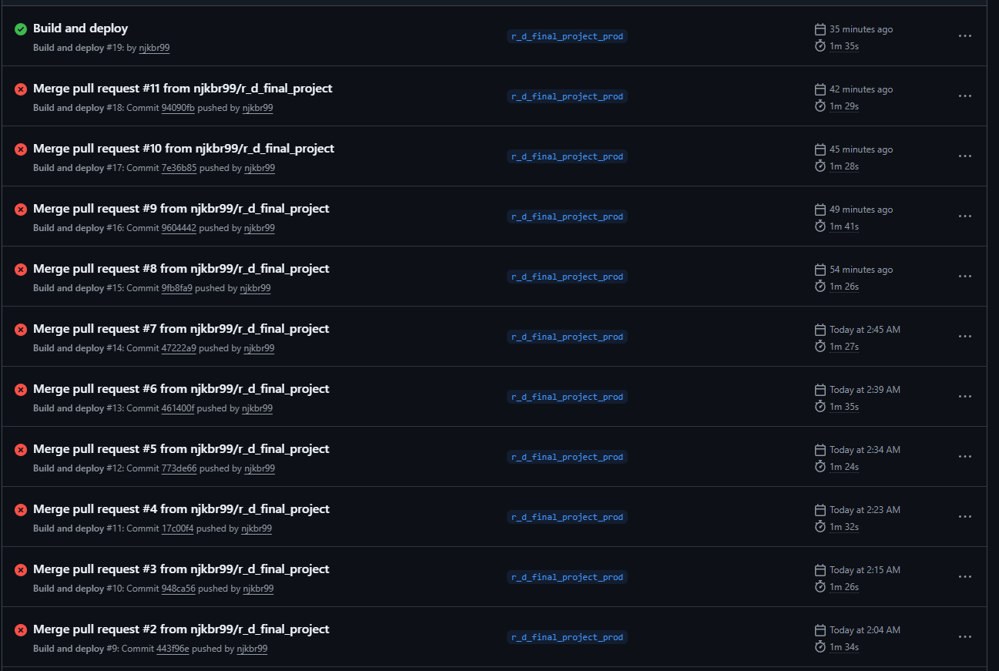

---

## Monitoring

Monitoring runs on the dedicated `anat-trainings-tracker-monitoring` EC2 (Ubuntu 24.04) via Docker Compose.

| Service | Port | Purpose |
|---|---|---|
| Prometheus | :9090 | Scrapes and stores metrics |
| Grafana | :3000 | Dashboards and visualization |
| Loki | :3100 | Log aggregation and storage |

On the app EC2, two systemd services run alongside the app container:
- **Node Exporter** `:9100` — VM metrics (CPU, memory, disk, network)
- **Promtail** `:9080` — ships Docker container logs to Loki

### Grafana — metrics dashboard

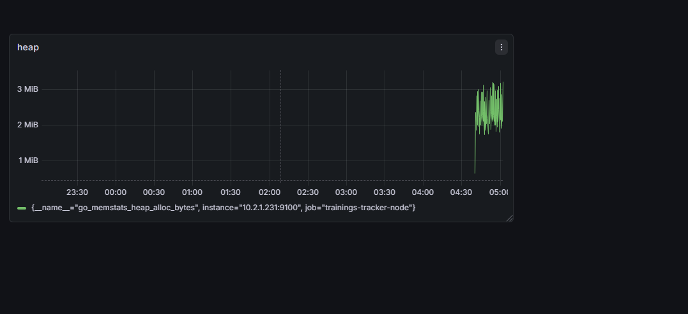

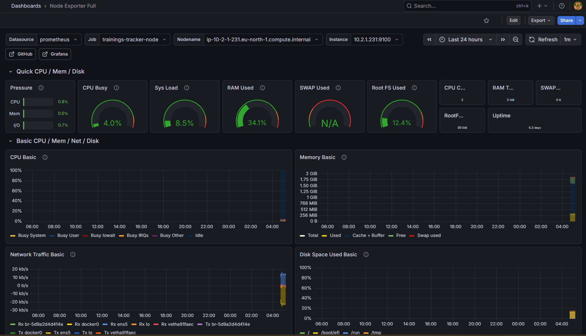

### Prometheus targets

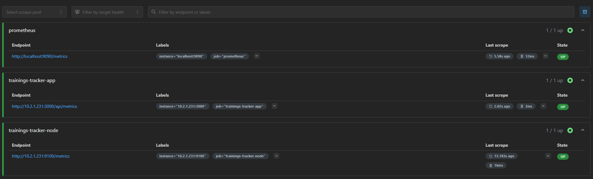

### AWS — LB logs

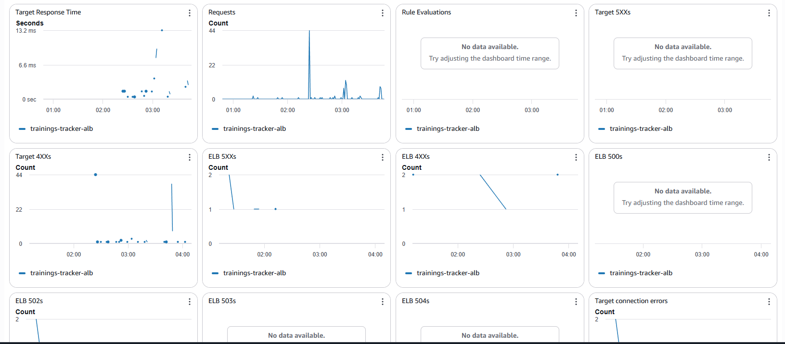

<details>
<summary>📝 Note to myself: Monitoring setup and access</summary>

### Access URLs

- Grafana: `http://<monitoring-eip>:3000` (default login: admin / admin123 — change this in production)
- Prometheus: `http://<monitoring-eip>:9090`

The monitoring EIP is stable — it won't change on EC2 restart. Get it from `terraform output grafana_url`.

### What Prometheus scrapes

Defined in [`infra/ansible/roles/monitoring/templates/prometheus.yml.j2`](infra/ansible/roles/monitoring/templates/prometheus.yml.j2):
- `localhost:9090` — Prometheus itself
- `<app-private-ip>:9100` — Node Exporter (VM metrics)
- `<app-private-ip>:3000/api/metrics` — App metrics endpoint

### Log flow

```
App container stdout
      ↓
Docker JSON logs (/var/lib/docker/containers/*/*-json.log)
      ↓
Promtail (reads log files, runs as systemd on app EC2)
      ↓
Loki :3100 (on monitoring EC2, via private IP)
      ↓
Grafana (Loki datasource → Explore view)
```

### Data persistence

All monitoring data is stored in Docker named volumes on the monitoring EC2:
- `prometheus_data` — metrics history
- `grafana_data` — dashboards and settings
- `loki_data` — log history

⚠️ If the monitoring EC2 is terminated and recreated, all history is lost. For production, mount an EBS volume or use remote storage (S3 for Loki, Thanos for Prometheus).

### Restarting the monitoring stack

```bash
ssh ubuntu@<monitoring-eip>
cd /opt/monitoring
docker-compose restart
```

</details>

---

## App Demo

> The frontend is a React Native mobile app built with Expo Go. It is not deployed anywhere — to run it, Expo Go has been installed on my phone and pointed at the API base URL. Expo Go can also generate a web version of the app for browser testing.

### Before deployment — initial state

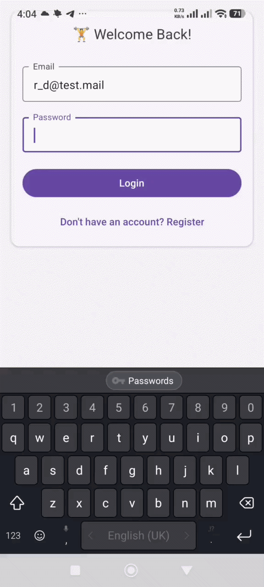

### After test deployment — new version live

<!-- TODO: Add GIF of app after CI/CD deployment showing updated version is running -->


This ensures that DB is setup correctly and the app is running.

---

## How to Run From Scratch

> Full setup from zero to running app.

### Prerequisites

- AWS CLI configured (`aws configure`)
- Terraform >= 1.10
- Ansible + `amazon.aws` collection (`pip install ansible boto3 botocore && ansible-galaxy collection install amazon.aws`)
- SSH key pair created in AWS EC2 → Key Pairs as `anat-trainings-tracker-key`, downloaded to `~/.ssh/`

### Step 1 — Bootstrap (once only)

```bash
cd infra
bash scripts/bootstrap.sh
```

### Step 2 — Provision infrastructure

```bash
cd infra/terraform
cp terraform.tfvars.example terraform.tfvars
# fill in terraform.tfvars with your IP, DB password, key pair name
terraform init
terraform plan
terraform apply
```

Note the outputs — you'll need them in the next steps.

### Step 3 — Configure instances

Update `infra/ansible/group_vars/all/vars.yml` with IPs and RDS endpoint from Terraform outputs, then:

```bash
cd infra/ansible
ansible-playbook site.yml --ask-vault-pass
```

### Step 4 — Configure GitHub secrets

Add all secrets listed in the CI/CD section above to the GitHub repository settings → Secrets and variables → Actions.

### Step 5 — Deploy the app

Push a change to a feature branch → open a PR to `r_d_final_project_prod` → wait for checks to pass → merge → approve the deployment in GitHub Actions.

### Step 6 — Verify

```bash
# App health check
curl http://<alb-dns>/api/health

# Grafana
open http://<monitoring-eip>:3000
```

### Teardown

```bash
cd infra/terraform
terraform destroy
```

> ⚠️ S3 bucket and ECR repository are NOT destroyed — they were created by `bootstrap.sh` and must be deleted manually via the AWS console if needed.