# Jenkins Freestyle Job - Setup Guide

This guide demonstrates how to set up and run a Jenkins Freestyle job that builds a Maven project from a Git repository.

## Prerequisites

- Docker and Docker Compose installed on your system
- A forked repository of the Spring Boot project

## Step 1: Launch Jenkins with Docker Compose

The `docker-compose.yml` file is already provided in this directory. Start the containers:
```bash
docker compose up -d
```

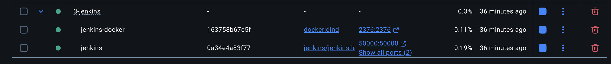

## Step 2: Initial Jenkins Setup

1. Open your browser and navigate to `http://localhost:8082` (or the port you specified in `docker-compose.yml`)

2. Follow the on-screen instructions to unlock Jenkins

**Tip:** If you started the containers with `-d` flag, you can retrieve the initial admin password from the logs:
```bash
docker logs jenkins
```
Look for the password in the output between the asterisks. Or
```bash
docker exec jenkins cat /var/jenkins_home/secrets/initialAdminPassword
```

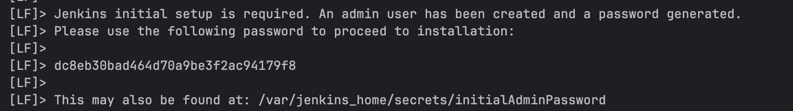

3. Install suggested plugins

4. Create your first admin user

5. Keep the default Jenkins URL and click "Save and Finish"

## Step 3: Configure Maven Tool

1. From the Jenkins dashboard, go to **Manage Jenkins** → **Tools**

2. Scroll down to the **Maven installations** section (at the bottom)

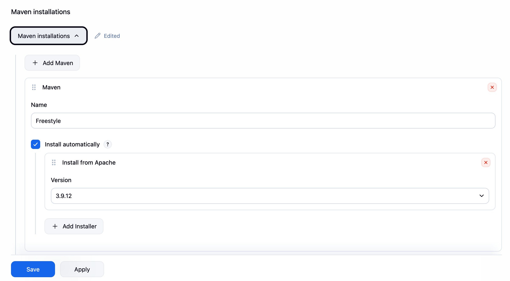

3. Click **Add Maven**

4. Configure Maven:
    - **Name:** Freestyle (or any name you prefer)
    - Check **Install automatically**
    - Select a Maven version from the dropdown (e.g., 3.9.9)

5. Click **Save**

## Step 4: Create the Freestyle Job

1. From the Jenkins dashboard, click **New Item**

2. Enter the job name: `Simple Freestyle Job`

3. Select **Freestyle project**

4. Click **OK**

## Step 5: Configure Source Code Management

1. In the job configuration page, scroll to **Source Code Management**

2. Select **Git**

3. Enter your repository URL: `https://github.com/njkbr99/gs-spring-boot`

4. Change the default branch to `main`

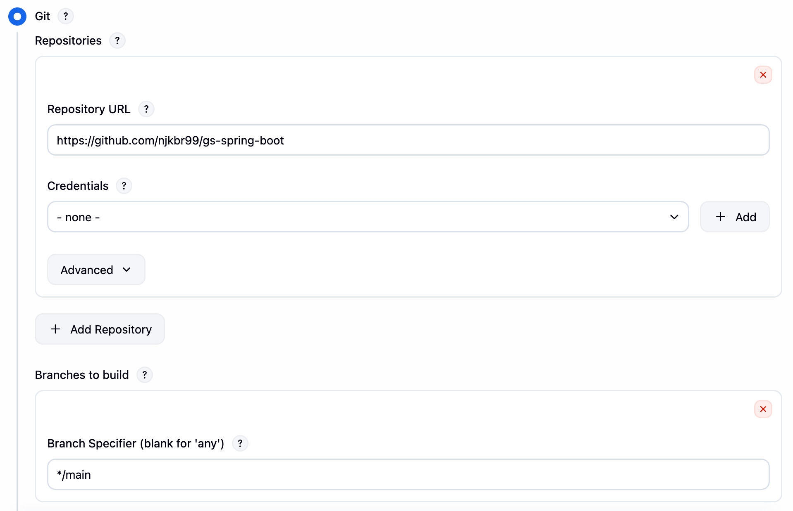

5. Leave credentials empty for public repositories

## Step 6: Configure Build Steps

1. Scroll to the **Build** section

2. Click **Add build step** → **Invoke top-level Maven targets**

3. Configure Maven build:
    - **Maven Version:** Select "Freestyle" (the Maven installation you configured earlier)
    - **Goals:** `clean install`
    - Click **Advanced**
    - **POM:** `complete/pom.xml`

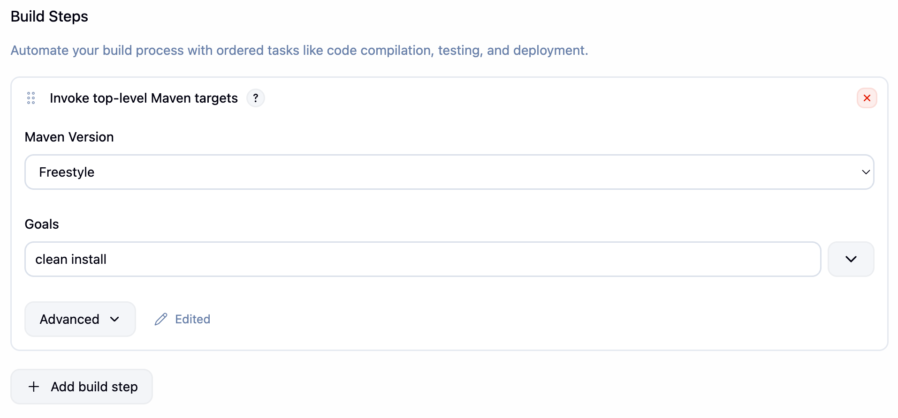

## Step 7: Configure Post-build Actions

1. Scroll to **Post-build Actions**

2. Click **Add post-build action** → **Archive the artifacts**

3. In **Files to archive**, enter: `complete/target/*.jar`

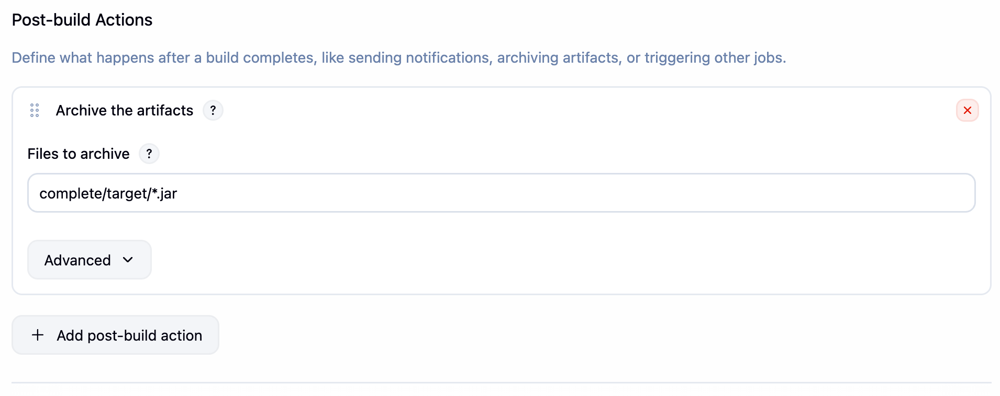

4. Click **Save**

## Step 8: Run the Build

1. From the job page, click **Build Now**

2. Watch the build progress in the **Build History** section

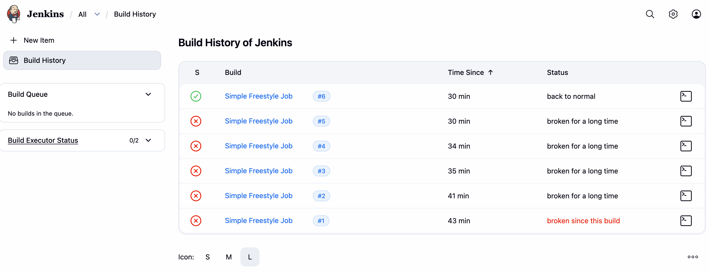

3. Click on the build number (e.g., #1) to view build details

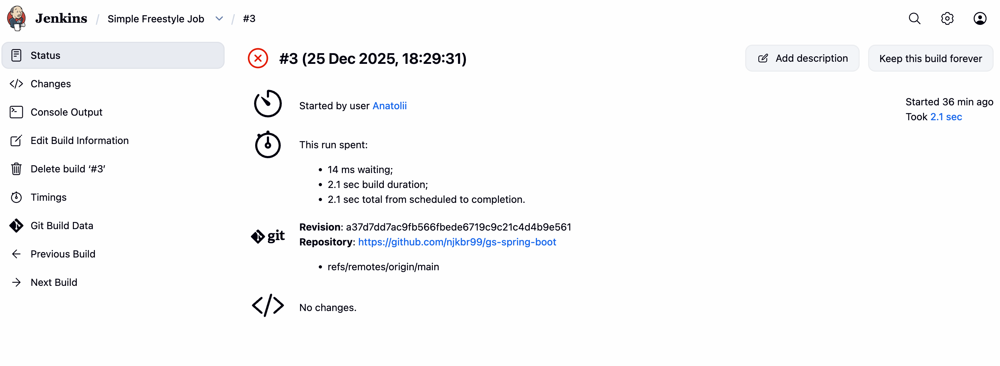

4. Click **Console Output** to see the full build log

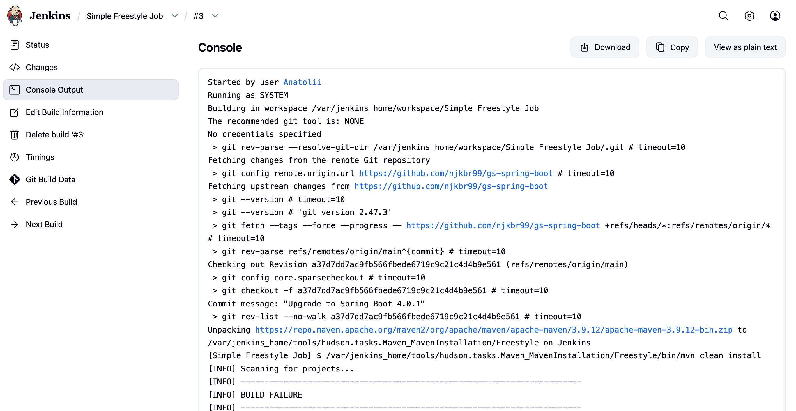
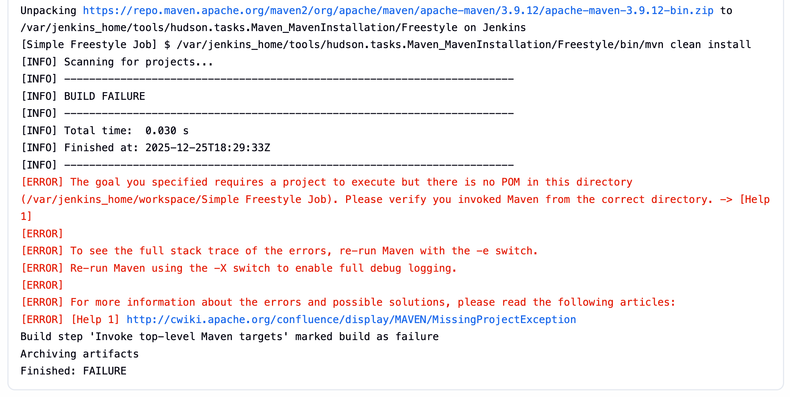

## Step 9: Verify Build Artifacts

1. From the build details page, you should see **Build Artifacts** section

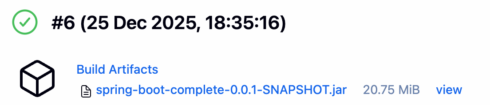

2. The archived `.jar` file is now available for download

## Build Results

After a successful build, you should see:

- **Build Status:** SUCCESS
- **Artifacts:** `spring-boot-complete-0.0.1-SNAPSHOT.jar` (or similar)
- **Console output** showing Maven successfully compiled and packaged the application

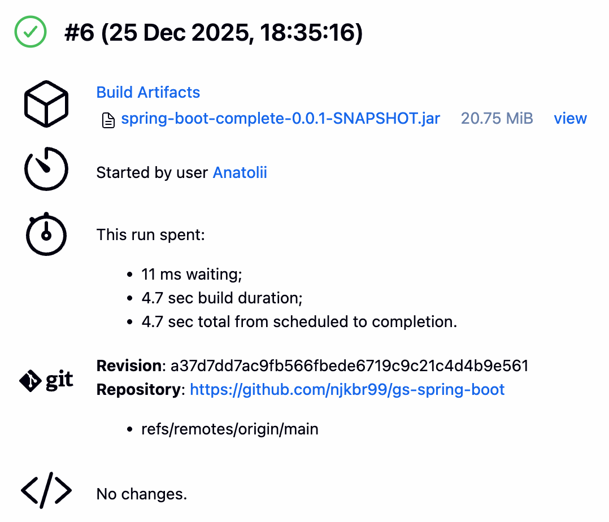

## Faced Troubleshooting

### Issue: "command not found: docker-compose"

**Solution:** Use `docker compose` (with space) instead of `docker-compose` (with hyphen). Modern Docker Desktop uses Docker Compose V2.

### Issue: "Cannot run program 'mvn'"

**Solution:** Ensure you've configured Maven in the Tools section and selected it in the build step's "Maven Version" dropdown. Leaving it to 'default' fails during the build, trying to execute Maven before it is installed.

### Issue: "No POM in this directory"

**Solution:** Add the correct path to `pom.xml` in the build step's Advanced settings. For this project, use `complete/pom.xml`.

### Issue: "doesn't match anything: even 'target' doesn't exist"

**Solution:** Update the artifact path to match the POM location: `complete/target/*.jar`

## Conclusion

We have successfully:
- Set up Jenkins using Docker Compose
- Configured Maven as a build tool
- Created a Freestyle job that pulls code from Git
- Built a Maven project
- Archived the resulting artifacts

The build artifact (JAR file) is now ready for deployment or further testing.