# VirtualBox - VM Setup Guide

This guide demonstrates how to create, configure, and manage a virtual machine using VirtualBox.

## Prerequisites

- VirtualBox installed from the official website (https://www.virtualbox.org/)
- Ubuntu ISO image (LTS version) downloaded from the official Ubuntu website

## Step 1: Create a New Virtual Machine

1. Open VirtualBox and click **New** to create a new virtual machine

2. Configure basic VM settings:
   - **Name:** TestVM
   - **Type:** Linux
   - **Version:** Ubuntu (64-bit)

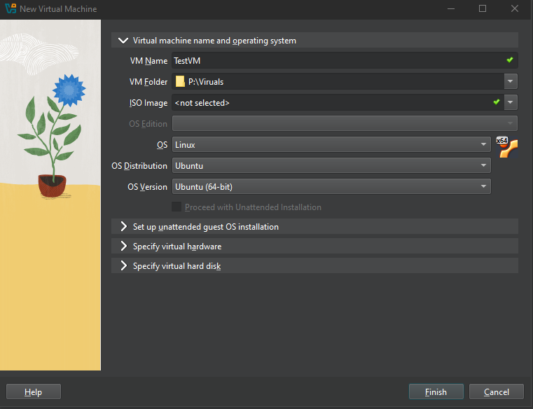

3. Set CPU and memory:
   - **Memory:** 2048 MB (2 GB)
   - **Processors:** 2 cores

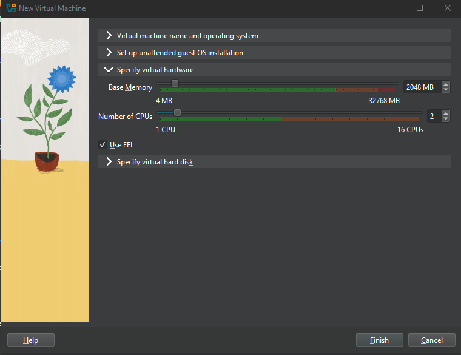

4. Create a virtual hard disk:
   - **Size:** 20 GB
   - **Format:** VDI (VirtualBox Disk Image)

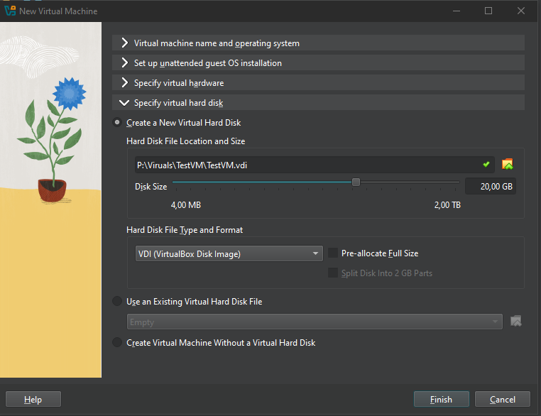

## Step 2: Configure VM Settings

Before starting the VM, configure additional settings:

1. Go to **Settings** → **Network**
   - Set **Adapter 1** to **Bridged Adapter** (to get an IP address from your local network)

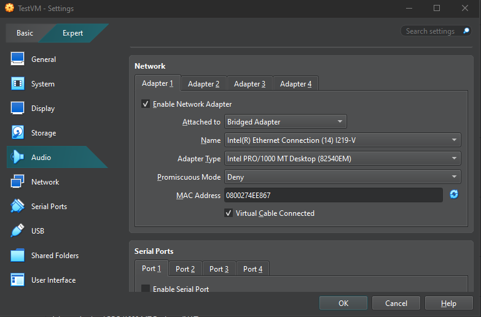

2. Go to **Settings** → **Storage**
   - Select the **Controller: IDE**
   - Click the empty optical drive
   - Click the disk icon → **Choose a disk file**
   - Select your Ubuntu ISO image

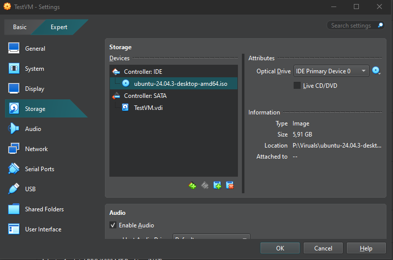

## Step 3: Install Ubuntu Operating System

1. Start the VM by clicking **Start**

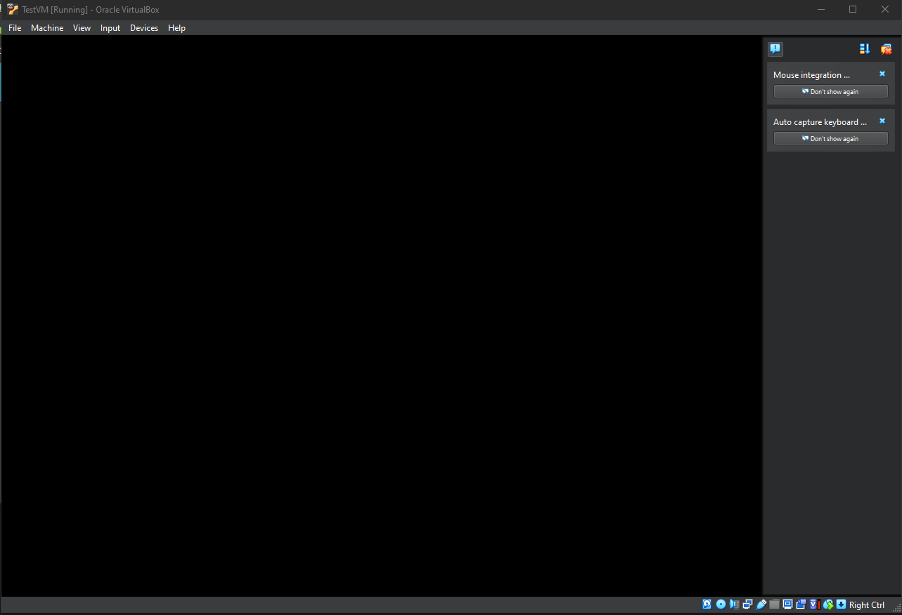

**Note:** If you encounter a black screen, increase video memory to 128 MB in **Settings** → **Display** → **Video Memory**

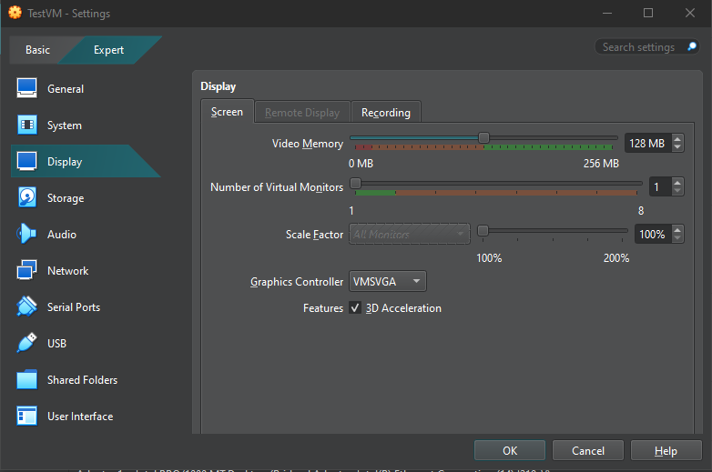

2. Follow the Ubuntu installation wizard

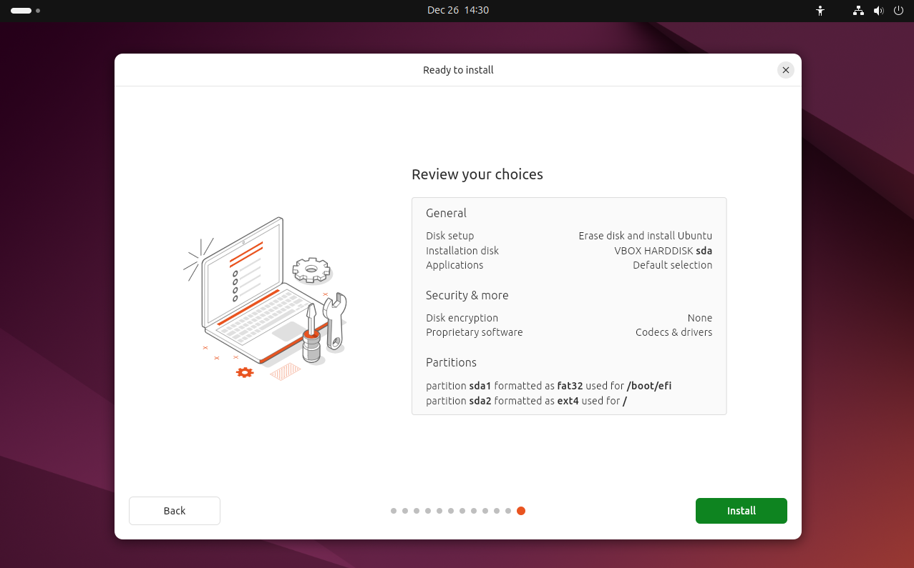

**Troubleshooting:** If the installation freezes during "Copying files":

- Enable **Use Host I/O Cache** in **Settings** → **Storage** → **Controller: SATA** → **Attributes**

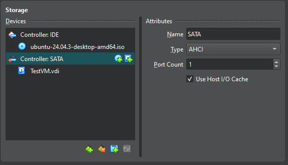

- Disable **3D Acceleration** in **Settings** → **Display**

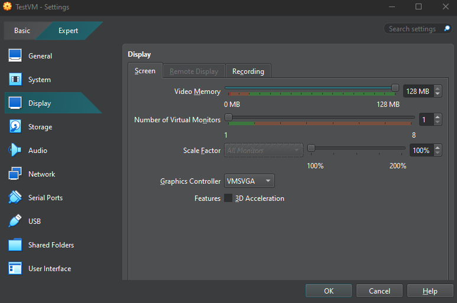

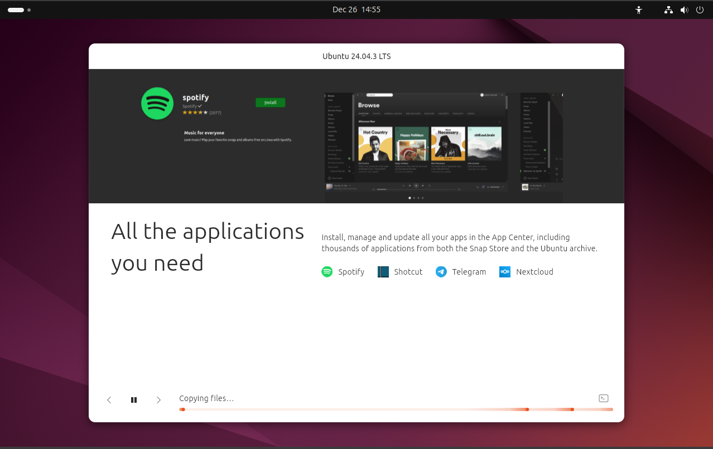

**Solution:** If the issue persists, use **Ubuntu 22.04 LTS** instead of 24.04. The installation should work without issues.


3. Complete the installation and reboot the VM

## Step 4: Create and Test Snapshots

1. After setting up the system, create a snapshot:
   - Go to **Machine** → **Take Snapshot**

2. Start the VM and create a test file on the desktop

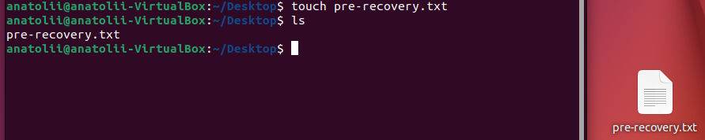

3. Restore the snapshot:
   - Power off the VM
   - Go to **Machine** → **Snapshots**
   - Select the created previously snapshot
   - Click **Restore**

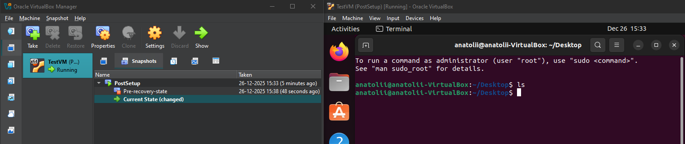

4. Start the VM and verify that the file you created is gone

## Step 5: Resize Virtual Hard Disk

1. Power off the VM completely

2. In VirtualBox main window, on the left menu, select **Media**

3. Select your VM's disk, click **Properties**

4. At the bottom, adjust the **Size** slider to the new size (e.g., 30 GB)

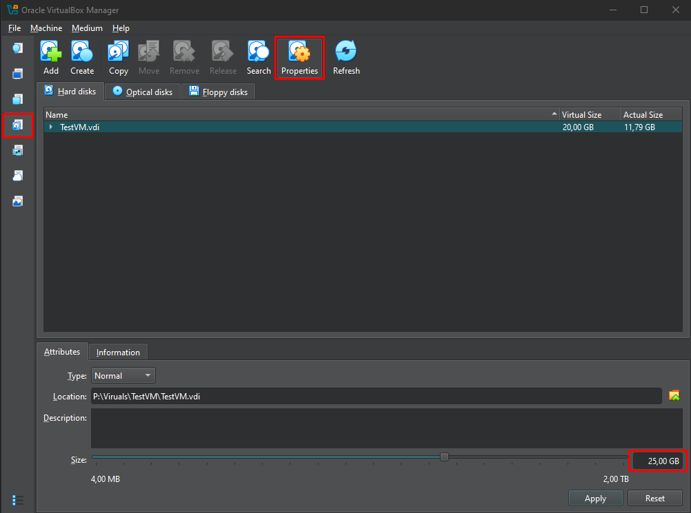

5. Click **Apply**

**Note:** If you have snapshots, each snapshot may have its own disk file. You may need to:
   - Adjust size for each snapshot-related disk individually, OR
   - Clone the VM without snapshots to consolidate to a single disk

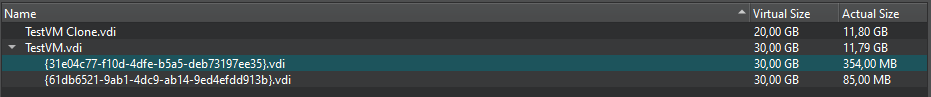

**Tip:** To identify which disk is currently used by the VM, check the UUID by hovering over the disk in **Settings** → **Storage**

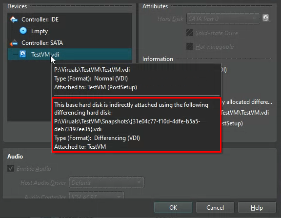

6. After resizing, start the VM and extend the filesystem inside Ubuntu:

```bash
# Check current disk layout
lsblk

# Extend the partition (replace sda2 with your partition)
sudo growpart /dev/sda 2

# Resize the filesystem
sudo resize2fs /dev/sda2

# Verify the new size
df -h
```

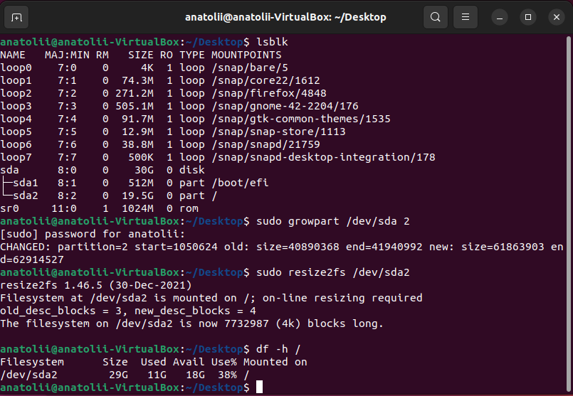

## Step 6: Change CPU and Memory Settings

1. Power off the VM

2. Go to **Settings** → **System**
   - In **Motherboard** tab: Increase **Base Memory** to 4096 MB (4 GB)
   - In **Processor** tab: Increase **Processor(s)** to 4 cores

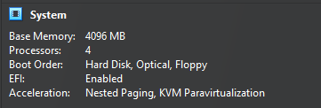

3. Click **OK** and start the VM

4. Verify the changes inside Ubuntu:

```bash
# Check memory
free -h

# Check CPU cores
nproc
```

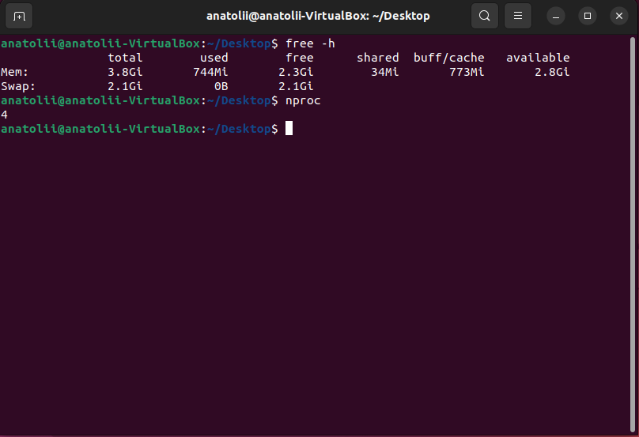

## Step 7: Remove the Virtual Machine

1. Power off the VM properly from within the operating system

2. In VirtualBox, right-click the VM and select **Remove**

3. Choose **Delete all files** to remove the VM along with all associated files (virtual hard disk, snapshots, etc.)

## Faced Troubleshooting

### Issue: Black screen on first VM start

**Solution:** Increase video memory to 128 MB in **Settings** → **Display** → **Video Memory**

### Issue: Installation freezes on "Copying files"

**Attempted Solutions:**
- Enable **Use Host I/O Cache** in Storage Controller settings
- Disable **3D Acceleration** in Display settings

**Final Solution:** Use Ubuntu 22.04 LTS instead of 24.04. The older LTS version installs successfully without any issues.

### Issue: Disk space not updated in VM after resizing

**Cause:** When snapshots exist, the VM may still be using an older disk file.

**Solutions:**
1. In Media, expand the disk settings if it has snapshots
2. Resize each snapshot-related disk individually in Media Manager

After resizing in VirtualBox, always extend the filesystem inside the guest OS using `growpart` and `resize2fs`.

### Issue: Cannot identify which disk file is currently in use

**Solution:** Hover over the disk in **Settings** → **Storage** to see its UUID. Match this UUID with the disk files in Media Manager.

## Conclusion

We have successfully:
- Installed VirtualBox and created a new virtual machine
- Configured VM parameters (CPU, memory, network, storage)
- Installed Ubuntu operating system
- Created and restored snapshots to save/restore VM state
- Resized the virtual hard disk and extended the filesystem
- Modified VM resources (CPU cores and RAM)
- Properly removed the VM and associated files

The VM is now fully configured and ready for use in development or testing environments.
