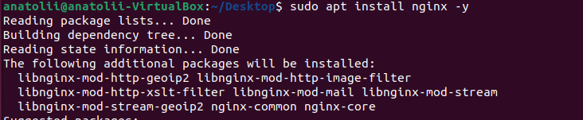
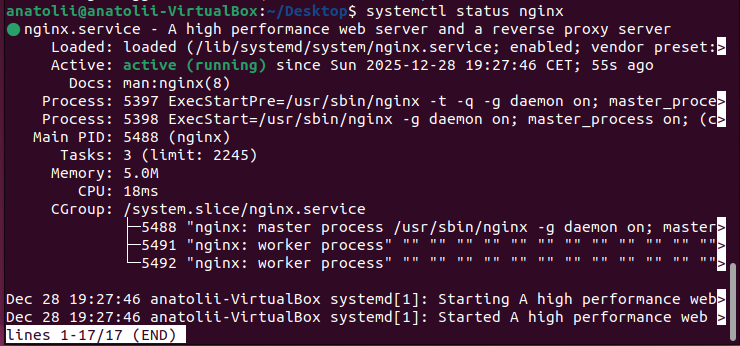
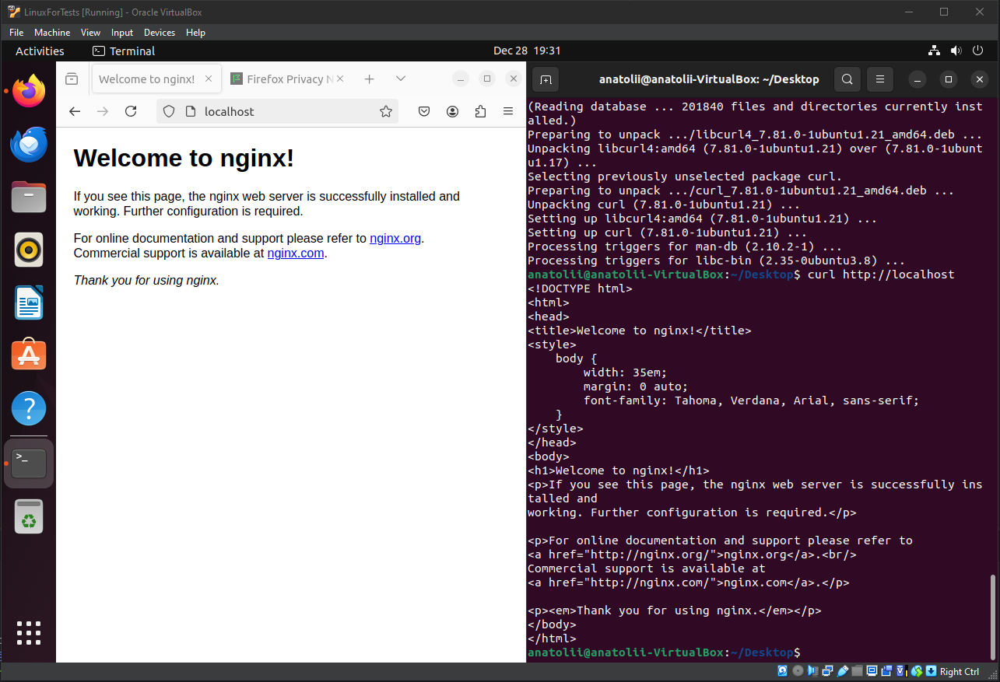
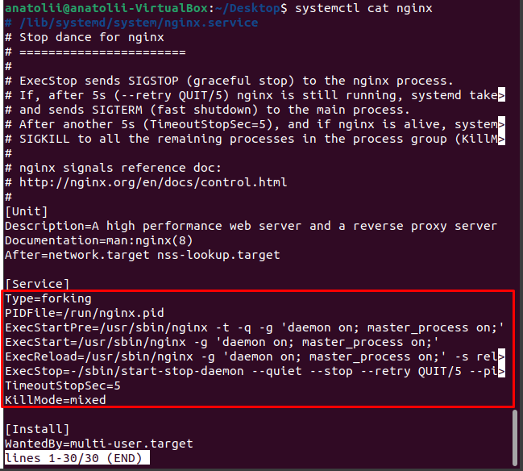
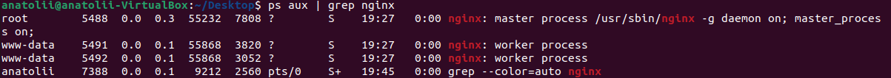
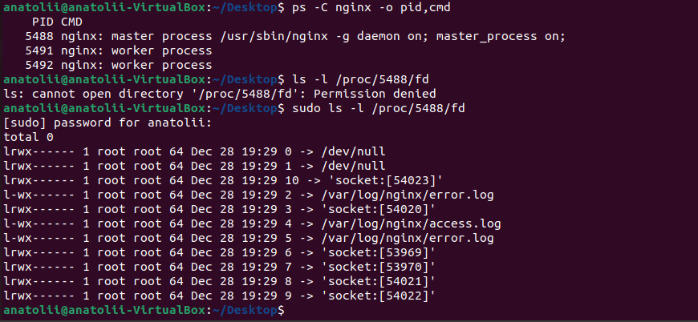
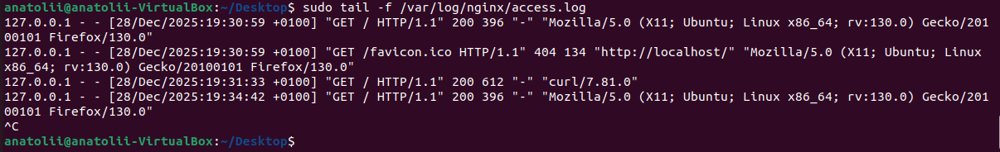
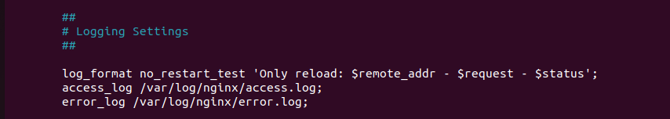
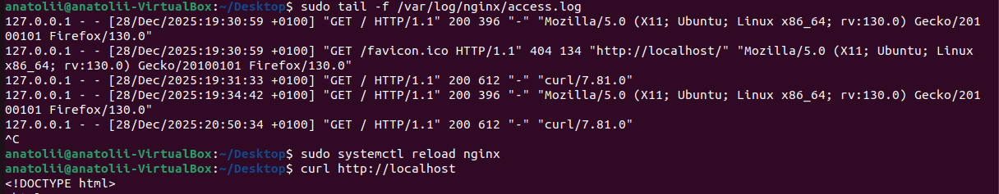
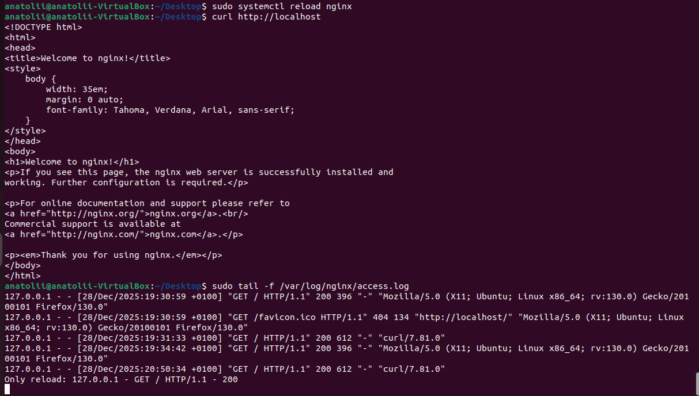

# Nginx Installation and Service Analysis (Ubuntu 22.04)

This guide demonstrates how to install and validate the Nginx web server on an Ubuntu 22.04 virtual machine, analyze how the service is managed by the operating system, inspect its processes and file descriptors, work with logs, and apply configuration changes without restarting the server.

The goal of this homework is not only to install Nginx, but to understand **how and why** it behaves as a Linux service.

---

## Prerequisites

- Virtual machine running **Ubuntu 22.04 LTS**
- Internet access from the VM
- User with `sudo` privileges

---

## Step 1: Install Nginx

Update package lists and install Nginx:

```bash
sudo apt update
sudo apt install nginx -y
```

During installation, the Nginx core package and required modules are installed automatically.



---

## Step 2: Verify Nginx Service Status

Check that the service is running and enabled:

```bash
systemctl status nginx
```

Expected result:

- Service state: `active (running)`
- Service manager: `systemd`
- One master process and multiple worker processes



---

## Step 3: Validate Installation via Localhost

Open a browser inside the VM and navigate to:

```
http://localhost
```

Or use curl:

```bash
curl http://localhost
```

Expected result:

- Default "Welcome to nginx!" page



**This confirms that:**

- Nginx is running
- The service is listening on port 80
- HTTP requests are successfully processed

---

## Step 4: Inspect How the Service Is Started and Managed

Display the systemd unit file used to manage Nginx:

```bash
systemctl cat nginx
```



### Key Observations and Why They Matter

#### 1. Type=forking

This tells systemd that Nginx forks itself into the background:

- The initial process started by systemd exits after spawning the real daemon

**Why this is important:**

- systemd must know how to track the real service
- without `Type=forking`, systemd could think Nginx exited or failed
- allows proper monitoring, restarts, and dependency handling

#### 2. Master Process Architecture

Nginx runs using a **master / worker model**:

- **Master process** runs as root
- **Worker processes** run as `www-data`

**Why this is important:**

**Master process:**
- reads and validates configuration
- binds to privileged ports (e.g. 80)
- manages worker lifecycle

**Worker processes:**
- handle client requests
- run with reduced privileges for security

This design improves:
- **security** (principle of least privilege)
- **performance** (event-driven workers)
- **reliability** (workers can be restarted independently)

#### 3. Reload via ExecReload (Signals)

From the unit file:

```ini
ExecReload=/usr/sbin/nginx -g 'daemon on; master_process on;' -s reload
```

This sends a reload signal (`SIGHUP`) to the master process.

**Why this is important:**

- Configuration can be reloaded without restarting the service
- Existing connections are not dropped
- New worker processes start with updated configuration
- Old workers finish handling current requests and exit gracefully

This enables **zero-downtime configuration changes**, which is critical in production systems.

---

## Step 5: Analyze Nginx Processes

List running Nginx processes:

```bash
ps aux | grep nginx
```

Or in structured form:

```bash
ps -C nginx -o pid,cmd
```



**Observed:**

- One master process
- Multiple worker processes

This confirms the architecture observed in the systemd unit file.

---

## Step 6: Inspect File Descriptors Used by Nginx

Identify the master process PID and inspect its file descriptors:

```bash
sudo ls -l /proc/<PID>/fd
```



**Observed file descriptors include:**

- `/dev/null` - standard input/output
- Socket descriptors - listening sockets and active connections
- `/var/log/nginx/access.log` - access log file
- `/var/log/nginx/error.log` - error log file
- epoll-related descriptors - kernel event notification

**Why this is important:**

- Confirms that Nginx itself opens and writes to log files
- Shows how sockets and event-driven I/O are handled
- Demonstrates real OS-level resource usage of the service

---

## Step 7: Reading Nginx Logs

Default log locations:

```
/var/log/nginx/access.log
/var/log/nginx/error.log
```

Follow access logs in real time:

```bash
sudo tail -f /var/log/nginx/access.log
```



---

## Step 8: Modify Log Format and Apply Changes with Reload Only

### 8.1 Define a Custom Log Format

Edit the main configuration file:

```bash
sudo nano /etc/nginx/nginx.conf
```

Inside the `http {}` block, add:

```nginx
log_format no_restart_test 'Only reload: $remote_addr - $request - $status';
```



**Why here:**

- `log_format` is a global directive
- It must be defined before any server uses it

### 8.2 Apply the Log Format to the Default Site

Edit the default virtual host:

```bash
sudo nano /etc/nginx/sites-available/default
```

Inside the `server {}` block:

```nginx
access_log /var/log/nginx/access.log no_restart_test;
```


### 8.3 Validate Configuration

```bash
sudo nginx -t
```

Expected result:

```
syntax is ok
test is successful
```

### 8.4 Reload Nginx (No Restart)

Apply changes without restarting the service:

```bash
sudo systemctl reload nginx
```



### 8.5 Verify Log Output

Generate a request:

```bash
curl http://localhost
```

Check the access log:

```bash
sudo tail -n 5 /var/log/nginx/access.log
```

Expected output:

```
Only reload: 127.0.0.1 - GET / HTTP/1.1 - 200
```



**This confirms:**

- Configuration change was applied
- Reload was sufficient
- No service restart occurred

---

## Conclusion

In this homework, we have:

- Installed and validated Nginx on Ubuntu 22.04
- Examined how the service is managed by systemd
- Understood why `Type=forking`, master processes, and reload signals matter
- Analyzed running processes and file descriptors
- Confirmed that Nginx itself writes access and error logs
- Modified logging behavior and applied changes safely using reload
