# Bash Automation, systemd Services, and Log Rotation (Ubuntu 22.04)

This guide demonstrates automation and monitoring tasks performed on the Ubuntu 22.04 virtual machine created in the previous homework.
The focus of this work is on **Bash scripting**, **cron jobs**, **custom systemd services and timers**, **resource monitoring**, and **Nginx log rotation**.

---

## Prerequisites

- Virtual machine running **Ubuntu 22.04 LTS**
- Nginx installed and running
- User with `sudo` privileges
- Basic familiarity with Bash and Linux command-line tools

---

## Task 1: Daily Backup Script with Cron

### Goal

Automatically create a daily backup of `/home/user/data` into `/home/user/backup` and run it every day at **02:00 AM** using cron.

---

### Step 1.1: Create Backup Script

A Bash script was created to archive the contents of `/home/user/data` into a compressed `.tar.gz` file named with the current date.

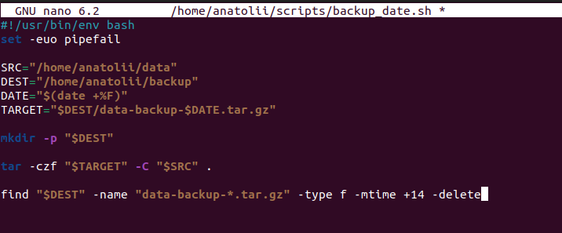

The script:
- Uses strict Bash mode (`set -euo pipefail`)
- Creates the backup directory if it does not exist
- Creates date-based archive names
- Removes backups older than 14 days

---

### Step 1.2: Execute Backup Script Manually

The script was executed manually to verify correct behavior before automation.


Backup files appear in `/home/user/backup` after execution.

---

### Step 1.3: Configure Cron Job

A cron job was added to run the backup script daily at **02:00 AM**.

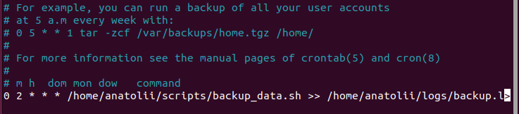

Cron entry:
```cron
0 2 * * * /home/user/scripts/backup_data.sh >> /home/user/logs/backup.log 2>&1
```

This ensures automated backups without user interaction.

---

## Task 2: Website Availability Check with systemd Service

### Goal

Create a Bash script that checks website availability and logs the result, then run it automatically using a custom systemd service and timer.

---

### Step 2.1: Create Website Check Script

A script was created that:

- Sends an HTTP request using curl
- Extracts the HTTP status code
- Writes timestamped results to a log file

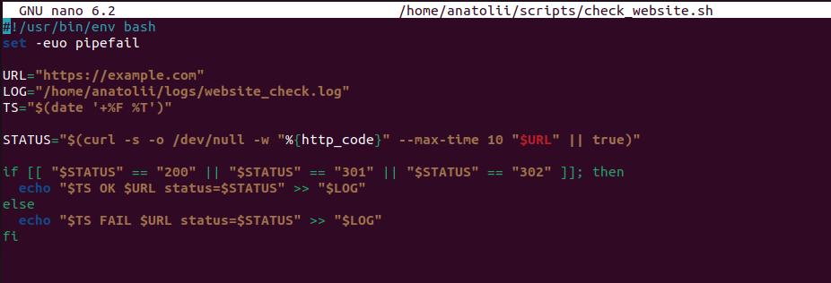

---

### Step 2.2: Test Script Manually

The script was executed manually to confirm correct logging behavior.

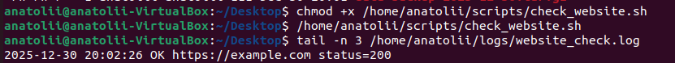

---

### Step 2.3: Create systemd Service

A custom systemd service unit was created to run the website check script.

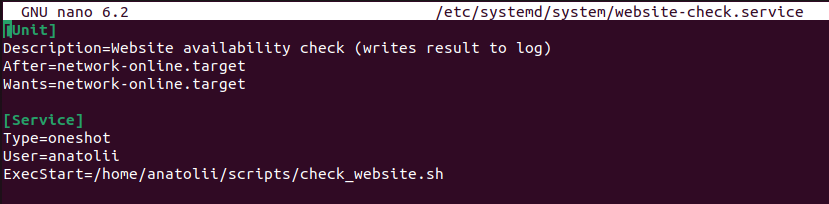

The service is defined as:

- Type=oneshot
- Executed as a regular user
- Dependent on network availability

Manual execution of the service confirms it works correctly:

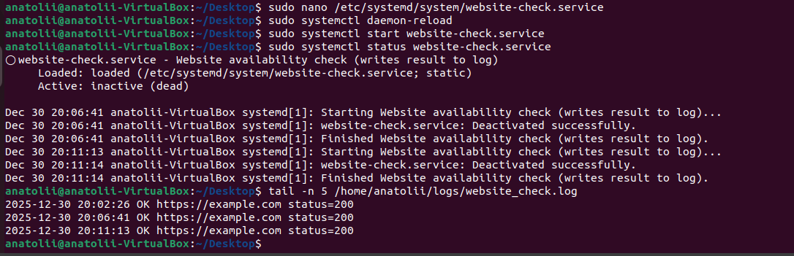

---

### Step 2.4: Create and Enable systemd Timer

A systemd timer was created to run the service automatically at fixed intervals.

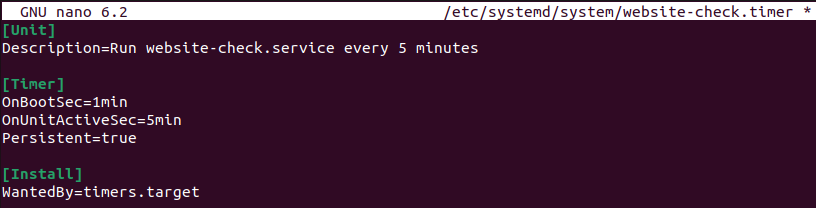

The timer was enabled and started:

```bash
sudo systemctl enable --now website-check.timer
```

---

### Step 2.5: Verify Automatic Execution and Logs

Log entries confirm that the service is executed automatically by systemd.

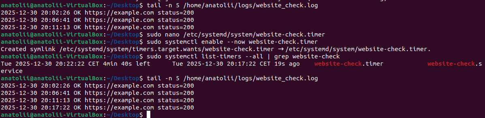

---

## Task 3: System Resource Monitoring Script

### Goal

Monitor system resource usage and save the results to a log file.

---

### Step 3.1: Create Resource Monitoring Script

A Bash script was created to log:

- Uptime
- CPU usage
- Memory usage
- Disk usage
- System load

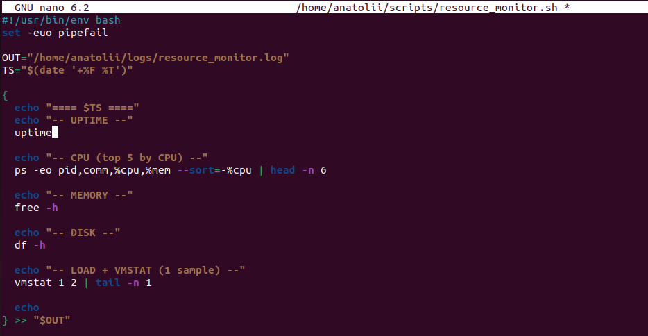

---

### Step 3.2: Execute Script Manually

The script was executed manually to validate output format and correctness.

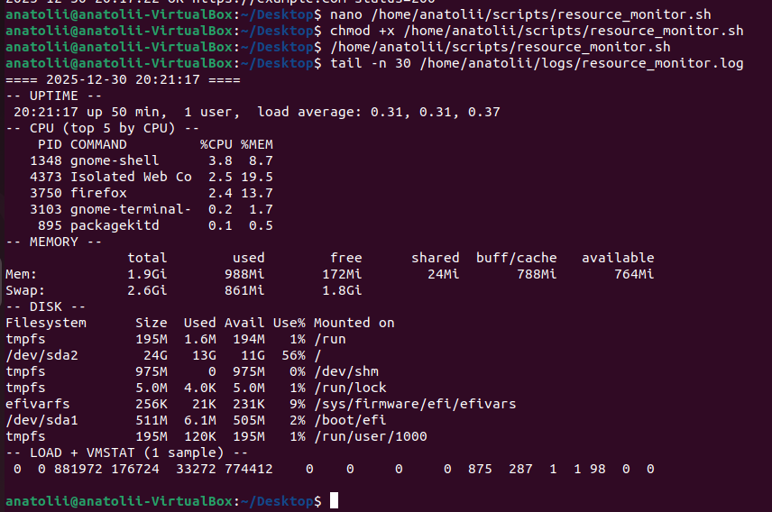

---

### Step 3.3: Automate Monitoring with Cron

A cron job was added to execute the monitoring script automatically.


---

### Step 3.4: Verify Automatic Execution

Log entries confirm that the script runs automatically at scheduled intervals.

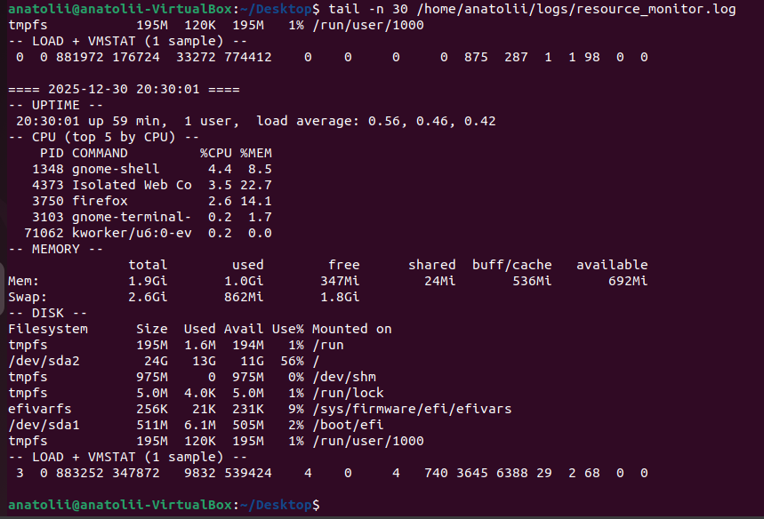

---

## Task 4: Nginx Access Log Rotation

### Goal

Configure rotation of the Nginx access log to prevent unlimited log file growth.

---

### Step 4.1: Check Existing Logrotate Configuration

The existing Nginx logrotate configuration was inspected.

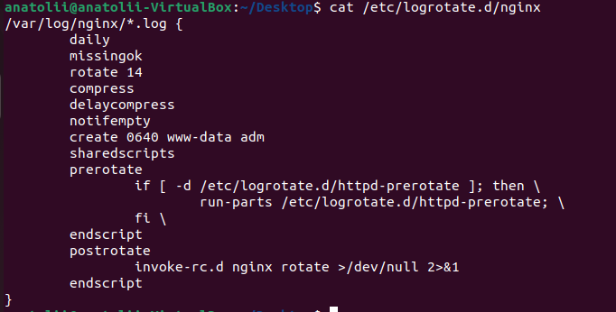

---

### Step 4.2: Verify Logrotate Version

The installed version of logrotate was checked.

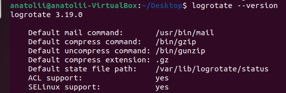

---

### Step 4.3: Force Log Rotation (Test)

Log rotation was forced manually to test the configuration.

```bash
sudo logrotate -f /etc/logrotate.d/nginx
```

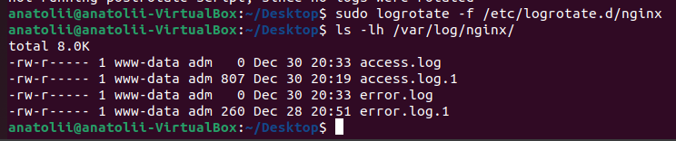

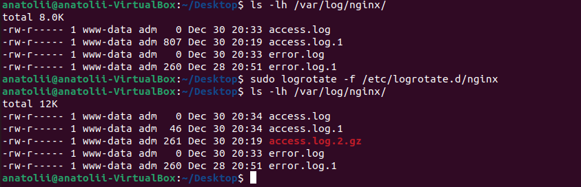

---

### Step 4.4: Verify Rotated Logs

Rotated log files appeared in `/var/log/nginx`, confirming successful rotation.

---

## Conclusion

In this homework, we successfully:

- Created a daily automated backup using Bash and cron
- Implemented a custom systemd service and timer for website availability checks
- Developed a system resource monitoring script and automated it
- Configured (learned, but did not change the existing one) and tested Nginx access log rotation using logrotate

These automation techniques are fundamental for maintaining reliable and efficient Linux systems in production environments.
