# Network Communication with netcat, Firewall Behavior, and Protocol Analysis

This homework demonstrates practical networking concepts using **two Ubuntu virtual machines** connected in a local network.
The goal is to understand and compare **TCP and UDP communication**, observe **firewall behavior**, and explain protocol differences based on real experiments.

---

## Environment Overview

- Two Ubuntu 22.04 virtual machines created using VirtualBox
- Networking mode: **Host-only Adapter**
- Local network: `192.168.56.0/24`

### VM identities
- **VM1** (server): `192.168.56.101`
- **VM2** (client): `192.168.56.102`

---

## Step 1: Network Configuration

Both virtual machines were configured to use the same **Host-only network adapter**, ensuring:
- VM ↔ VM communication
- No external internet interference
- Predictable and isolated network behavior

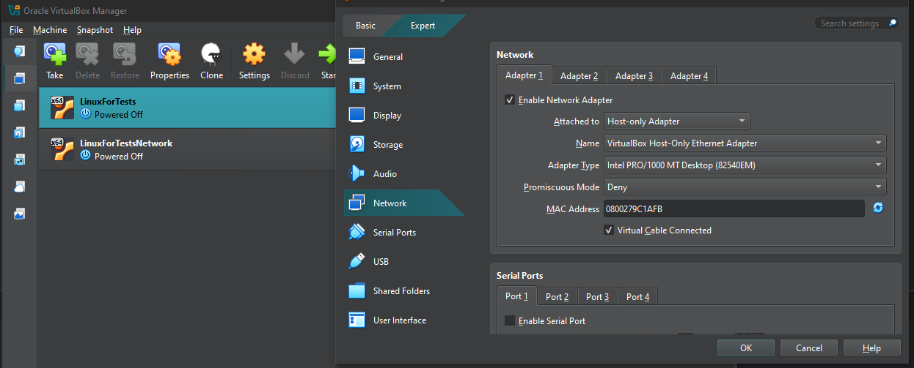

---

## Step 2: Hostname Configuration

The hostname was changed **only on the cloned VM (VM2)** to clearly distinguish machines in:
- terminal prompts
- logs
- screenshots
- explanations

This avoids ambiguity when demonstrating client/server roles.

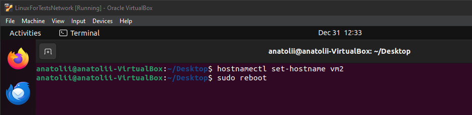

---

## Step 3: Connectivity Verification (Ping)

Basic connectivity was verified using ICMP:

```bash
ping -c 3 <other_vm_ip>
```

The `-c 3` option was used to:
- send a fixed number of packets
- avoid infinite execution
- produce clean, deterministic output for screenshots

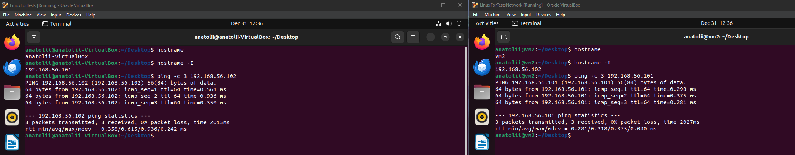

---

## Step 4: TCP Communication with netcat

### TCP Listener (VM1)
```bash
nc -l -p 5000
```

### TCP Client (VM2)
```bash
nc 192.168.56.101 5000
```

Messages were successfully exchanged in both directions, demonstrating:
- TCP connection establishment
- Full-duplex communication
- Reliable delivery

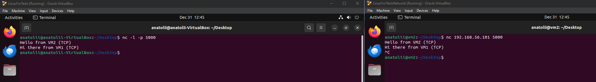

### TCP Connection Teardown Observation

When the client exited (Ctrl+C), the server session also terminated automatically.

This happens because:
- TCP is connection-oriented
- Closing one side tears down the connection state

---

## Step 5: UDP Communication with netcat

### UDP Listener (VM1)
```bash
nc -u -l -p 5001
```

### UDP Sender (VM2)
```bash
nc -u 192.168.56.101 5001
```

Messages were delivered only one way (sender → receiver).

Important observation:
- The sender does not receive any response
- UDP does not automatically provide two-way communication
- This behavior is correct and expected.

### Listener Lifetime in UDP

By default, the UDP listener may stop after receiving the first datagram.

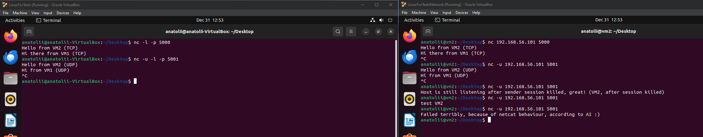

To keep the listener alive, the `-k` option was used:

```bash
nc -u -l -k -p 5001
```

This allowed multiple UDP datagrams to be received over time.

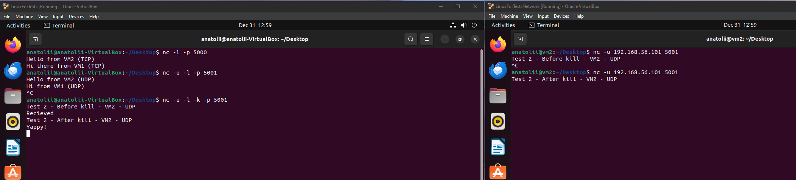

### Sender Behavior When Listener Stops

When the UDP listener stops listening, the sender automatically quits after detecting the lost connection.

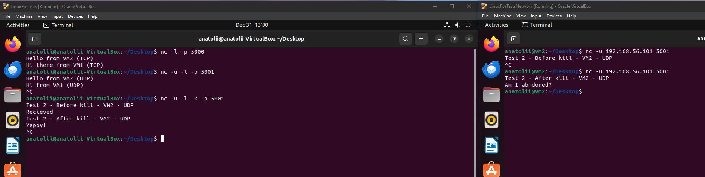

---

## Step 6: Firewall Testing with TCP

The firewall (ufw) was enabled on VM1, and TCP port 5000 was blocked:

```bash
sudo ufw enable
sudo ufw deny 5000/tcp
```

### Observation
- TCP connection from VM2 did not succeed
- The client hung without an error
- Messages were not delivered

This happens because:
- `ufw deny` drops packets silently
- TCP handshake never completes
- The client waits until timeout

This is still a TCP failure, just not a loud one.

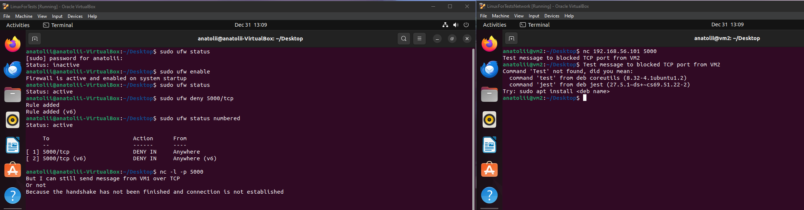

### DROP vs REJECT (Cleaner Failure)

To demonstrate a loud failure, the rule was changed to reject:

```bash
sudo ufw reject 5000/tcp
```

Now the client immediately received:
```
connection refused
```

This difference is due to firewall policy, not the TCP protocol itself.

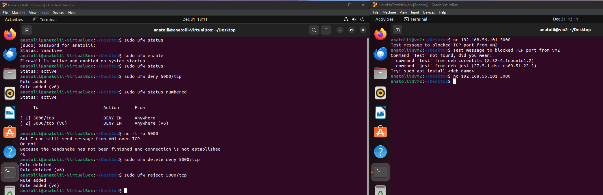

---

## Step 7: Firewall Testing with UDP

UDP port 5001 was blocked on VM1:

```bash
sudo ufw deny 5001/udp
```

When VM2 sent UDP packets:
- The sender exited normally
- No error was shown
- The receiver received nothing

This demonstrates that:
- UDP has no handshake
- No delivery confirmation exists
- Packet loss is invisible to the sender

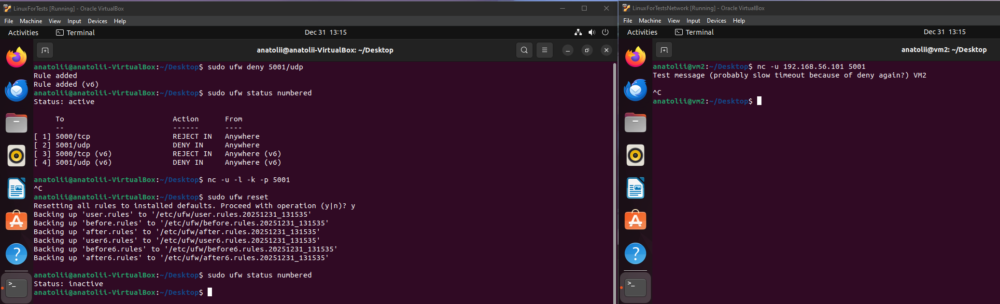

---

## Key Protocol Differences (Observed)

| Feature | TCP | UDP |
|---------|-----|-----|
| Connection setup | Required | None |
| Two-way communication | Automatic | Must be built explicitly |
| Firewall block behavior | Detectable (timeout / reject) | Silent |
| Reliability | Guaranteed | Best-effort |
| Session state | Maintained | None |

---

## Conclusion

In this homework, we:
- Built a local network using two virtual machines
- Demonstrated TCP and UDP communication using netcat
- Observed protocol behavior during connection teardown
- Analyzed firewall effects on TCP and UDP
- Explained why UDP is one-way by default
- Compared firewall DROP vs REJECT behavior

All observations were made through real experiments, not theory, providing a clear and practical understanding of networking fundamentals.

---

# DNS Configuration and Testing (dnsmasq)

This section documents the setup, debugging, and practical usage of a local DNS server using **dnsmasq**.
The goal was to understand **how DNS actually works in practice**, how clients resolve names, and how DNS integrates with modern Linux systems.

The setup uses two virtual machines:

- **VM1** – DNS server (dnsmasq)
- **VM2** – DNS client and service host (nginx)

Both VMs are connected via a **VirtualBox Host-Only network**.

---

## Step 1: Disabling systemd-resolved on the DNS server (VM1)

By default, Ubuntu uses **systemd-resolved**, which binds to port 53.
Since dnsmasq also needs port 53, systemd-resolved must be disabled on **VM1 only**.

```bash
sudo systemctl disable --now systemd-resolved
```

This frees port 53 so dnsmasq can bind to it.

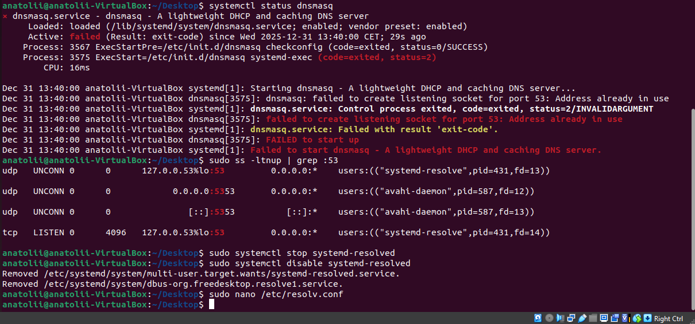

**Key concept:**
Only the DNS server needs to disable systemd-resolved. Clients should keep it enabled.

---

## Step 2: Initial DNS configuration file creation

A custom DNS configuration file `/etc/dnsmasq.d/lab.conf` was created on VM1.

Initially, the configuration included:

```conf
listen-address=192.168.56.101
```

This tells dnsmasq to listen only on the host-only network interface.

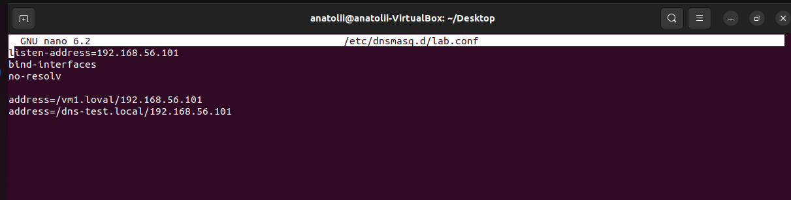

**Key concept:**
Services should bind only to the interfaces they actually need.
Here, dnsmasq is intentionally limited to the internal network.

---

## Step 3: Running dnsmasq and verifying it listens correctly

After configuring dnsmasq, the service is started and verified:

```bash
sudo systemctl status dnsmasq
```
The listening interface is checked to ensure dnsmasq is bound only to the host-only network:

```bash
ss -lntup | grep :53
```

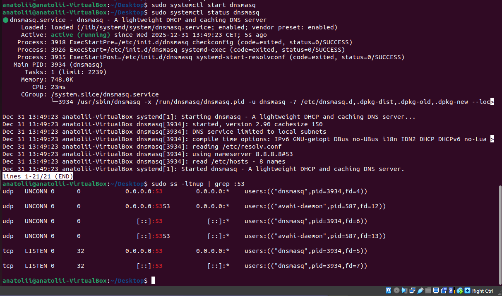

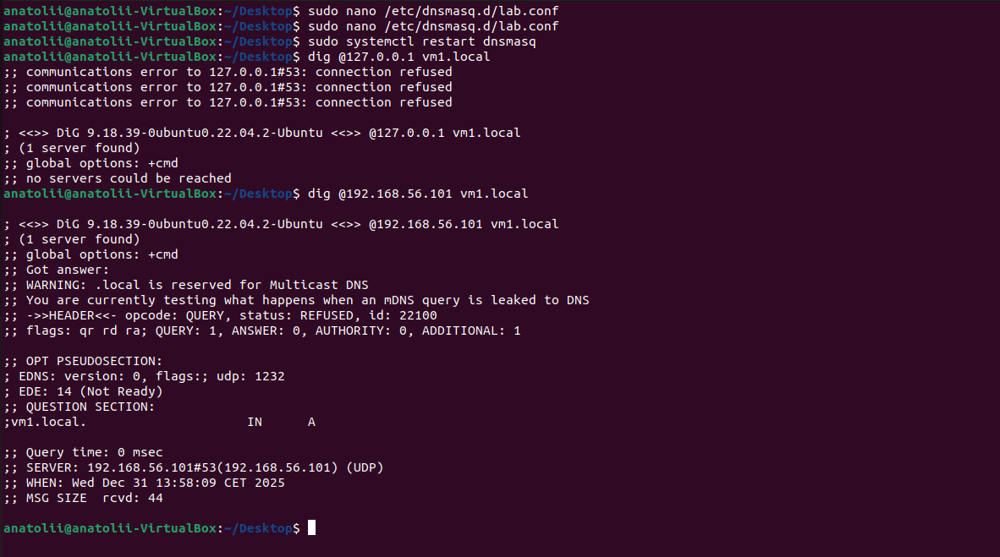

---

## Step 4: Why .local did not work and switching to .lab

During testing, `.local` produced warnings and inconsistent behavior because:

- `.local` is reserved for mDNS (multicast DNS)
- It is handled by avahi, not classic DNS

Therefore, the domain was changed to `.lab`, which is safe for internal DNS use.

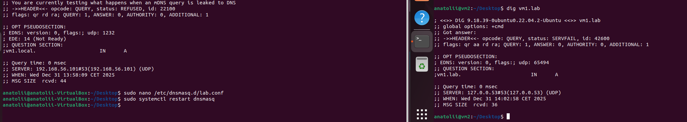

**Key concept:**
Choosing the correct DNS suffix matters.
`.local` ≠ classic DNS.

---

## Step 5: Updating VM1 configuration to accept local queries

The dnsmasq configuration was updated to properly handle queries from the local network.

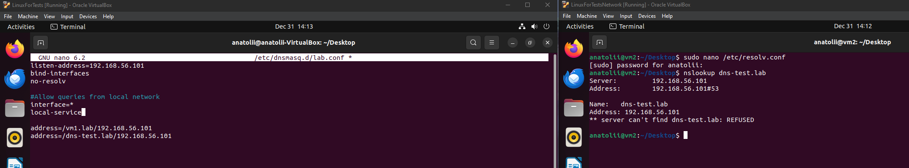

---

## Step 6: DNS works, but returns the wrong record

At one point, DNS resolution worked, but returned an unexpected result.

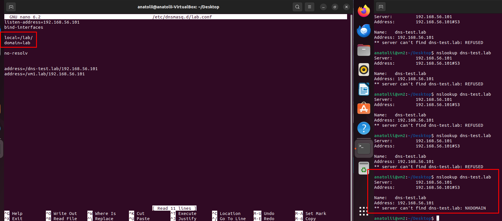

This demonstrated an important lesson:

**DNS infrastructure can be correct while DNS data is wrong.**

The fix involved correcting the record and removing the `domain=lab` line from the configuration, which was not needed.

---

## Step 7: Initial DNS test failure - VM2 using localhost

Initial attempts to query DNS from VM2 failed because VM2 was still using its localhost resolver instead of the DNS server on VM1.

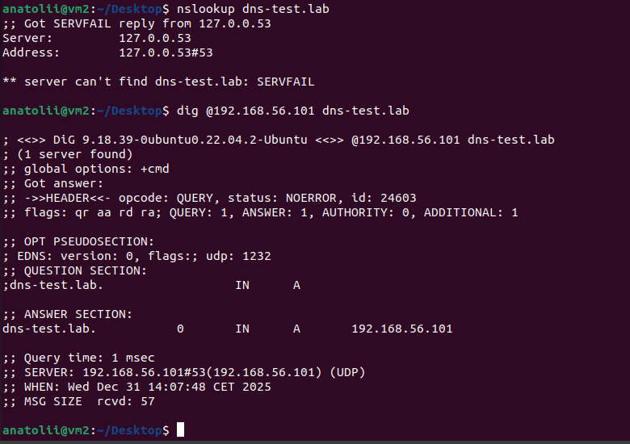

This shows that without proper DNS client configuration, the system defaults to local resolution, which cannot resolve custom internal domains.

---

## Step 8: Why /etc/resolv.conf edits did not persist on VM2

During the setup of VM2 as a DNS client, manual edits to `/etc/resolv.conf` were attempted to configure the DNS server.

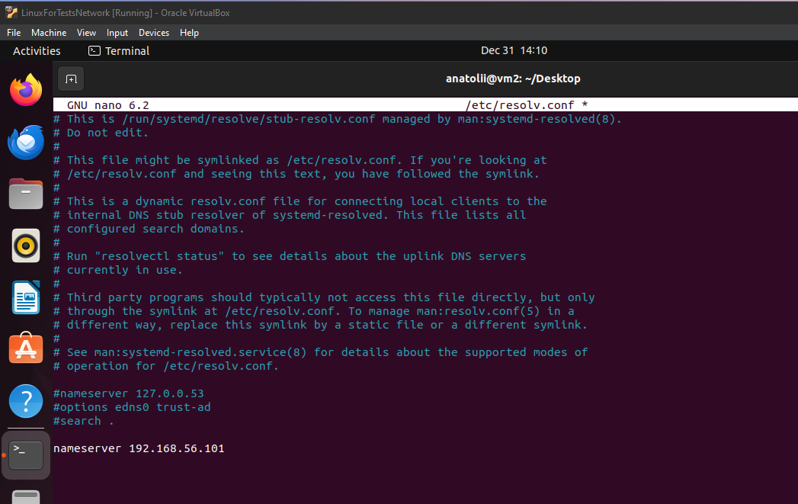

However, these manual edits were lost after restarting `systemd-resolved`.

This happens because:

- `/etc/resolv.conf` is managed by systemd-resolved
- It is regenerated automatically

**Key concept:**
On modern Ubuntu, `/etc/resolv.conf` is not the configuration source — it is a generated view.

---

## Step 9: Correct client-side DNS configuration using resolvectl (VM2)

Instead of editing `/etc/resolv.conf`, DNS was configured properly:

```bash
sudo resolvectl dns enp0s3 192.168.56.101
sudo resolvectl domain enp0s3 lab
```

Now VM2 uses VM1 as its DNS server in a persistent, supported way.

DNS queries now flow correctly:

```
Application → systemd-resolved → dnsmasq (VM1) → response
```

---

## Step 10: Verifying the DNS client configuration

The DNS configuration on VM2 is verified using `resolvectl`:

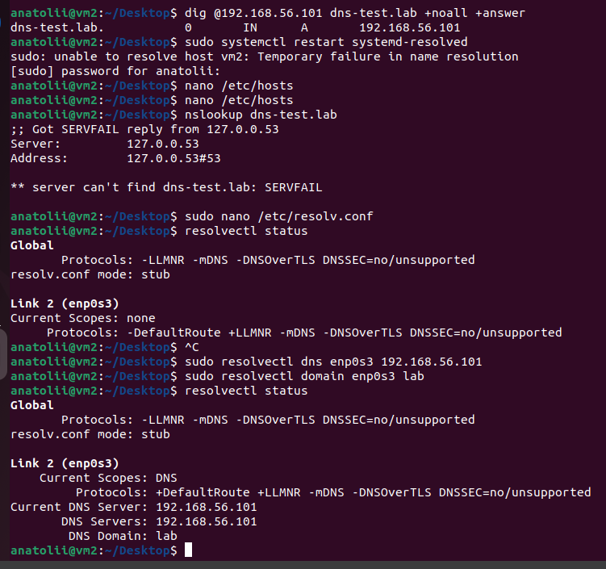

This confirms that VM2 is properly connected to the DNS server on VM1. (except nslookup, which still results in NXDOMAIN)

---

# Real-World DNS Usage: site.lab with nginx

This section demonstrates practical DNS usage by setting up a web service accessible via DNS name instead of IP address.

---

## Step 1: Updating DNS records to point to a real service (site.lab)

To demonstrate real usage, a new DNS record was added to `/etc/dnsmasq.d/lab.conf` on VM1:

```conf
host-record=site.lab,192.168.56.102
```

Now DNS is no longer theoretical — it points to a real service on VM2.

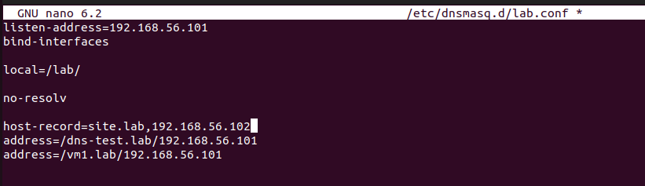

---

## Step 2: Hosting a service on VM2 (nginx)

On VM2, nginx is installed and a simple HTML page is created:

```bash
echo "<h1>Hello from VM2</h1>" | sudo tee /var/www/html/index.html
```

This VM acts as a real backend service.

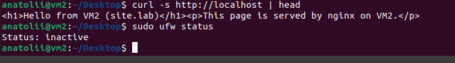

---

## Step 3: Verifying DNS resolution for site.lab

The DNS resolution is tested using `dig` to confirm that the DNS server correctly resolves `site.lab`:

```bash
dig @192.168.56.101 site.lab
```

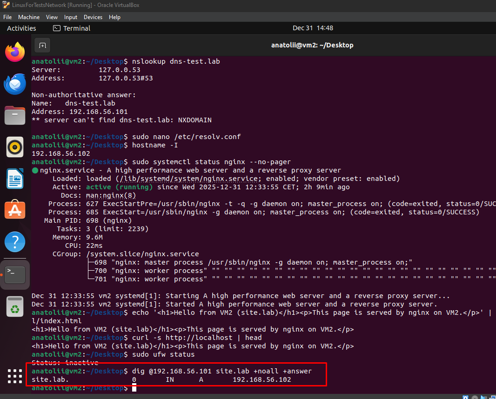

This confirms that the DNS server on VM1 correctly returns the IP address for `site.lab`.

---

## Step 4: Accessing the service using DNS instead of IP

Finally, the real test: accessing the service by name, not by IP.

```bash
curl -s http://site.lab | head
```

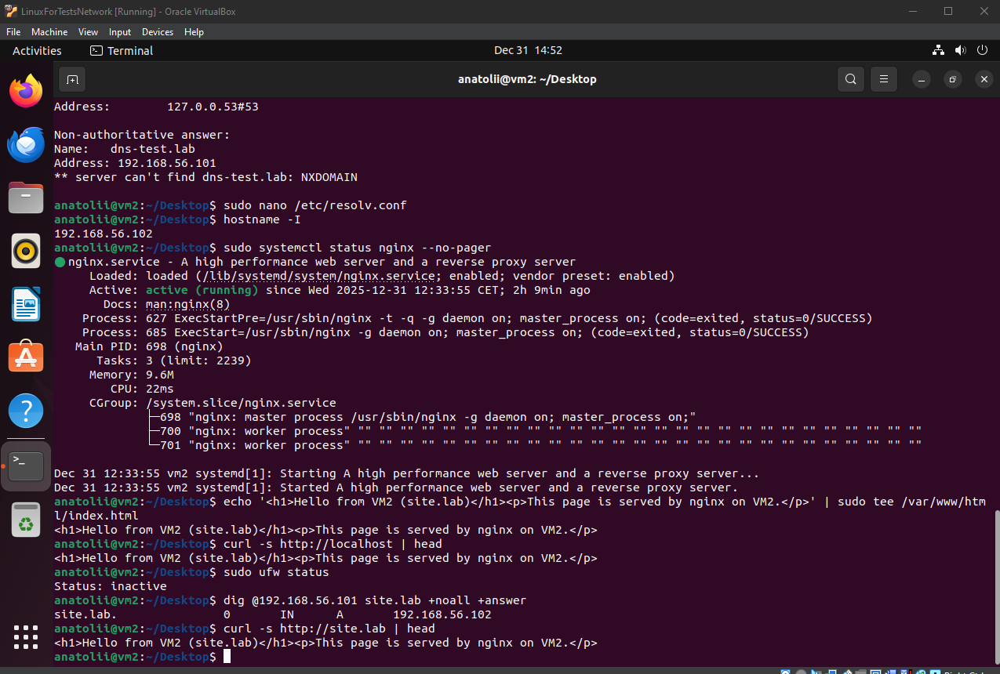

This demonstrates the real purpose of DNS:
**decoupling services from IP addresses**.

VM2 successfully accessed the nginx service without knowing its IP address, relying entirely on DNS resolution through VM1.

---

## Key Takeaways

- DNS maps names to IPs, not files or services
- `.local` is reserved for mDNS and should not be used for classic DNS
- `dig` tests DNS servers directly
- `resolvectl` tests the system resolver path
- `/etc/resolv.conf` is not meant to be edited manually on modern Ubuntu
- Internal DNS is critical for real systems, not just labs

This setup mirrors real-world usage of internal DNS in development, staging, VPNs, and container environments.

---

## Conclusion

We successfully:

- Deployed an internal DNS server using dnsmasq
- Debugged resolver conflicts, domain suffix issues, and record errors
- Integrated DNS correctly with systemd-resolved
- Used DNS to access a real web service by name instead of IP

---

# Task 3: Subnetting Explanation and Design

This section explains the subnetting task from first principles.
The goal is not only to list the resulting subnets, but to **understand what each network means, how subnet sizes are chosen, and why specific subnet boundaries are used**.

---

## 1. What does `10.0.0.0/8` mean?

An IPv4 address consists of **32 bits**.

The notation `/8` means:
- **8 bits** are used for the **network part**
- **24 bits** are used for **host addresses**

Binary representation:

```
10.0.0.0 = 00001010 . 00000000 . 00000000 . 00000000
/8         ^^^^^^^^
```

This defines the network:

```
10.0.0.0 – 10.255.255.255
```

This range belongs to the **private IP address space (RFC 1918)** and is commonly used for internal company networks.

---

## 2. What is a subnet?

A **subnet** is a smaller logical network created from a larger network.

Subnetting allows:
- better organization of hosts
- isolation of network segments
- efficient IP address usage
- easier routing and security control

In this task, we are subnetting the large `10.0.0.0/8` network into smaller networks.

---

## 3. What is `10.0.1.0/24`?

The `/24` prefix means:
- 24 network bits
- 8 host bits

Binary form:

```
10.0.1.0 = 00001010 . 00000000 . 00000001 . 00000000
/24        ^^^^^^^^^^^^^^^^^^^^^^^^^^^^^^^^
```

This subnet covers:

```
10.0.1.0 – 10.0.1.255
```

Usable host addresses:
```
10.0.1.1 – 10.0.1.254
```

This subnet is already allocated and **cannot be reused**.

---

## 4. What is `10.0.0.32/26`?

The `/26` prefix means:
- 26 network bits
- 6 host bits

Number of usable hosts:
```
2⁶ − 2 = 62
```

Subnet size:
```
2⁶ = 64 IP addresses
```

This subnet covers:

```
10.0.0.32 – 10.0.0.95
```

This block is also already in use and must be avoided.

---

## 5. Choosing the subnet size for the task

The requirement is:
- **5 to 11 hosts per subnet**
- **10 subnets total**

Possible subnet sizes:

| Prefix | Usable Hosts |
|--------|--------------|
| /29    | 6 ❌ (not enough for 11) |
| /28    | 14 ✅ |
| /27    | 30 ❌ (wastes addresses) |

The best choice is:

**/28 — provides 14 usable host addresses**

---

## 6. What does `/28` mean?

The `/28` prefix means:
- 28 bits for the network
- 4 bits for hosts

Number of IPs per subnet:
```
2⁴ = 16
```

Usable hosts:
```
2⁴ − 2 = 14
```

**Why subtract 2?**

In every subnet:
- The **first IP address** is reserved as the **network address** (identifies the subnet itself)
- The **last IP address** is reserved as the **broadcast address** (used to send packets to all hosts in the subnet)

Only the addresses in between can be assigned to actual hosts.

This perfectly satisfies the requirement.

---

## 7. Calculating subnet boundaries and the step size

Now that we know each `/28` subnet contains **16 IP addresses**, we can calculate where each subnet begins.

The **step size** is determined by the subnet size:
- Subnet size = **16 IP addresses**
- Therefore, each new subnet starts **16 IPs after the previous one**

This means subnet network addresses will look like:

```
10.0.0.96/28
10.0.0.112/28
10.0.0.128/28
...
```

The calculation:
```
96 + 16 = 112
112 + 16 = 128
128 + 16 = 144
```

Each number represents a valid **network boundary** for a `/28` subnet, ensuring no overlap between subnets.

---

## 8. Why start at `10.0.0.96`?

Previously allocated ranges occupy:

```
10.0.0.32 – 10.0.0.95 (from 10.0.0.32/26)
```

The next available address after this range is:

```
10.0.0.96
```

This makes `10.0.0.96/28` the **first valid free subnet** that does not overlap with existing allocations.

---

## 9. Visual Summary (Subnet Layout)

```
10.0.0.0/8
│
├── 10.0.0.0 – 10.0.0.31 (free)
├── 10.0.0.32 – 10.0.0.95 (used: /26)
├── 10.0.0.96/28 ← subnet #1
├── 10.0.0.112/28 ← subnet #2
├── 10.0.0.128/28 ← subnet #3
├── 10.0.0.144/28
├── 10.0.0.160/28
├── 10.0.0.176/28
├── 10.0.0.192/28
├── 10.0.0.208/28
├── 10.0.0.224/28
├── 10.0.0.240/28
└── 10.0.1.0/24 (used)
```

---

## 10. Final Subnet List

| Subnet # | Network |
|----------|---------|
| 1        | 10.0.0.96/28 |
| 2        | 10.0.0.112/28 |
| 3        | 10.0.0.128/28 |
| 4        | 10.0.0.144/28 |
| 5        | 10.0.0.160/28 |
| 6        | 10.0.0.176/28 |
| 7        | 10.0.0.192/28 |
| 8        | 10.0.0.208/28 |
| 9        | 10.0.0.224/28 |
| 10       | 10.0.0.240/28 |

Each subnet provides **14 usable IP addresses**, satisfying the requirement of **5–11 hosts per subnet**, while avoiding overlap with existing networks.
